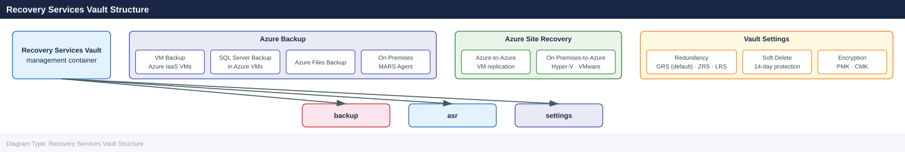

---
tags:
  - azure
description: "The Recovery Services Vault is the top-level management container for both Azure Backup and Azure Site Recovery. It stores backup data, holds replication..."
---
# Recovery Services Vault

<div class="kb-summary">
The Recovery Services Vault is the top-level management container for both Azure Backup and Azure Site Recovery. It stores backup data, holds replication configuration, and controls access, redundancy, and security settings.

*Applies to: Azure*
</div>

---

## Recovery Services Vault Structure



## Vault Creation

```bash
# Create a Recovery Services Vault
az backup vault create \
  --resource-group <rg> \
  --name <vault-name> \
  --location <region>

# Create a vault with tags
az backup vault create \
  --resource-group <rg> \
  --name <vault-name> \
  --location eastus \
  --tags env=prod owner=platform-team

# List all vaults in the current subscription
az backup vault list --output table

# Show vault details
az backup vault show \
  --resource-group <rg> \
  --name <vault-name>
```


```text title="Expected output"
{
  "id": "/subscriptions/12a34b56-c789-0d12-e345-f67890123456/resourceGroups/prod-backup-rg/providers/Microsoft.RecoveryServices/vaults/prod-vault-001",
  "location": "eastus",
  "name": "prod-vault-001",
  "properties": {
    "provisioningState": "Succeeded",
    "publicNetworkAccess": "Enabled"
  },
  "resourceGroup": "prod-backup-rg",
  "tags": {
    "env": "prod",
    "owner": "platform-team"
  },
  "type": "Microsoft.RecoveryServices/vaults"
}

ResourceGroup           Name                Location    Type
----------------------  ------------------  ----------  --------------------------------
prod-backup-rg         prod-vault-001      eastus      Microsoft.RecoveryServices/vaults
dr-backup-rg           dr-vault-west       westus2     Microsoft.RecoveryServices/vaults
dev-backup-rg          dev-vault-002       eastus      Microsoft.RecoveryServices/vaults

{
  "id": "/subscriptions/12a34b56-c789-0d12-e345-f67890123456/resourceGroups/prod-backup-rg/providers/Microsoft.RecoveryServices/vaults/prod-vault-001",
  "location": "eastus",
  "name": "prod-vault-001",
  "properties": {
    "provisioningState": "Succeeded",
    "publicNetworkAccess": "Enabled",
    "redundancySettings": {
      "standardTierStorageRedundancy": "GeoRedundant"
    }
  },
  "resourceGroup": "prod-backup-rg",
  "tags": {
    "env": "prod",
    "owner": "platform-team"
  }
}
```

!!! warning "Common errors"
    | Error | Fix |
    |---|---|
    | `ResourceGroupNotFound` | Verify the resource group exists in the target subscription with `az group list` and use the correct `--resource-group` name. |
    | `VaultAlreadyExists` | Choose a unique vault name within the resource group, as Recovery Services Vault names must be globally unique. |
    | `InvalidLocation` | Ensure the `--location` value is a valid Azure region (e.g., eastus, westus2, northeurope) by running `az account list-locations`. |
---

## Storage Redundancy Settings

Set redundancy before registering any backup items. Changing it afterward requires removing all protected items.

```bash
# View current redundancy setting
az backup vault backup-properties show \
  --resource-group <rg> \
  --name <vault-name> \
  --query "properties.storageModelType" --output tsv

# Set storage redundancy to Geo-Redundant (recommended for production)
az backup vault backup-properties set \
  --resource-group <rg> \
  --name <vault-name> \
  --backup-storage-redundancy GeoRedundant

# Set to Zone-Redundant (AZ-protected, same region)
az backup vault backup-properties set \
  --resource-group <rg> \
  --name <vault-name> \
  --backup-storage-redundancy ZoneRedundant
```


```text title="Expected output"
GeoRedundant
(no output — command completes silently)
(no output — command completes silently)
```

!!! warning "Common errors"
    | Error | Fix |
    |---|---|
    | `ResourceNotFound : The Resource 'Microsoft.RecoveryServices/vaults/<vault-name>' under resource group '<rg>' was not found.` | Verify the vault name and resource group name are correct and exist in your subscription. |
    | `InvalidApiVersionParameter : The api-version '2021-07-01' is not supported by this operation. Please use api version '2023-01-01' or newer.` | Update your Azure CLI to the latest version with `az upgrade`. |
    | `BadRequest : Storage model type cannot be changed after vault creation.` | Storage redundancy is immutable after vault creation; delete and recreate the vault with the desired redundancy setting. |
| Redundancy | RTO / RPO | Cross-Region Restore | Cost |
|---|---|---|---|
| LocallyRedundant (LRS) | Lowest | No | Lowest |
| ZoneRedundant (ZRS) | Low | No | Medium |
| GeoRedundant (GRS) | Low | Yes (opt-in) | Higher |

---

## Soft Delete

Soft delete retains deleted backup data for 14 days, protecting against accidental or malicious deletion.

```bash
# Check if soft delete is enabled
az backup vault backup-properties show \
  --resource-group <rg> \
  --name <vault-name> \
  --query "properties.softDeleteFeatureState" --output tsv

# Enable soft delete (default: Enabled)
az backup vault backup-properties set \
  --resource-group <rg> \
  --name <vault-name> \
  --soft-delete-feature-state Enable

# Disable soft delete (requires explicit confirmation — high risk)
az backup vault backup-properties set \
  --resource-group <rg> \
  --name <vault-name> \
  --soft-delete-feature-state Disable
```


```text title="Expected output"
Enabled
(no output — command completes silently)
Are you sure you want to disable soft delete for vault 'prod-vault-eastus'? This cannot be undone. (y/n): y
(no output — command completes silently)
```

!!! warning "Common errors"
    | Error | Fix |
    |---|---|
    | `ResourceNotFound: The Resource 'Microsoft.RecoveryServices/vaults/<vault-name>' under resource group '<rg>' was not found.` | Verify the resource group name and vault name are correct and exist in the target subscription. |
    | `AuthorizationFailed: The client '<user-id>' with object id '<object-id>' does not have authorization to perform action 'Microsoft.RecoveryServices/vaults/backupconfig/read' over scope '/subscriptions/<sub-id>/resourceGroups/<rg>/providers/Microsoft.RecoveryServices/vaults/<vault-name>'.` | Ensure your user account has the Backup Operator or higher role assigned on the Recovery Services Vault. |
---

## Cross-Region Restore

Cross-Region Restore (CRR) lets you restore backup data to the paired secondary region without an ASR failover.

```bash
# Enable Cross-Region Restore on a GRS vault
az backup vault backup-properties set \
  --resource-group <rg> \
  --name <vault-name> \
  --cross-region-restore-flag true

# List backup items in the secondary region
az backup item list \
  --resource-group <rg> \
  --vault-name <vault-name> \
  --use-secondary-region \
  --output table

# List recovery points in secondary region
az backup recoverypoint list \
  --resource-group <rg> \
  --vault-name <vault-name> \
  --container-name <container-name> \
  --item-name <vm-name> \
  --backup-management-type AzureIaasVM \
  --workload-type VM \
  --use-secondary-region \
  --output table
```


```text title="Expected output"
{
  "properties": {
    "crossRegionRestoreFlag": true
  }
}
Name                           ResourceGroup      Location       Type
-----------------------------  -----------------  -------------  ----------------
prod-vm-01                     backup-rg-primary  eastus2        AzureIaasVM
prod-vm-02                     backup-rg-primary  eastus2        AzureIaasVM
prod-db-server-01              backup-rg-primary  eastus2        AzureIaasVM
...

RecoveryPointTime          RecoveryPointType    RecoveryPointId
-------------------------  -------------------  ------------------------------------
2024-01-15T14:32:00Z       CrashConsistent      rp-20240115-143200-abc123def456
2024-01-14T22:15:00Z       AppConsistent        rp-20240114-221500-xyz789uvw012
2024-01-13T10:45:00Z       CrashConsistent      rp-20240113-104500-mno345pqr678
2024-01-12T06:20:00Z       CrashConsistent      rp-20240112-062000-stu901vwx234
```

!!! warning "Common errors"
    | Error | Fix |
    |---|---|
    | `ResourceNotFound : The resource 'Microsoft.RecoveryServices/vaults/<vault-name>' could not be found.` | Verify the vault name and resource group name are correct and the vault exists in the specified region. |
    | `BadRequest : Cross-region restore is not supported for this vault type or replication setting.` | Ensure the vault is configured with Geo-Redundant Storage (GRS) replication, not Locally Redundant Storage (LRS). |
    | `InvalidParameter : The container name '<container-name>' does not exist in the secondary region.` | Confirm the backup item has completed at least one backup cycle and recovery points are available in the secondary region before querying. |
---

## Access Control

```bash
# List current role assignments on the vault
az role assignment list \
  --scope <vault-resource-id> \
  --output table

# Assign Backup Operator role to a service principal
az role assignment create \
  --assignee <principal-id> \
  --role "Backup Operator" \
  --scope <vault-resource-id>

# Assign Backup Reader role (read-only)
az role assignment create \
  --assignee <principal-id> \
  --role "Backup Reader" \
  --scope <vault-resource-id>
```


```text title="Expected output"
RoleDefinitionName          PrincipalName                             PrincipalType    Scope
--------------------------  ----------------------------------------  ---------------  -------------------------------------------------------
Owner                       admin@contoso.onmicrosoft.com             User             /subscriptions/12a34b56-c789-0d12-e345-f67890ab1234/resourceGroups/prod-rg/providers/Microsoft.RecoveryServices/vaults/prod-vault
Backup Operator             backup-automation@contoso.onmicrosoft.com ServicePrincipal /subscriptions/12a34b56-c789-0d12-e345-f67890ab1234/resourceGroups/prod-rg/providers/Microsoft.RecoveryServices/vaults/prod-vault
Backup Reader               audit-service@contoso.onmicrosoft.com     ServicePrincipal /subscriptions/12a34b56-c789-0d12-e345-f67890ab1234/resourceGroups/prod-rg/providers/Microsoft.RecoveryServices/vaults/prod-vault

{
  "canDelegate": false,
  "id": "/subscriptions/12a34b56-c789-0d12-e345-f67890ab1234/resourceGroups/prod-rg/providers/Microsoft.RecoveryServices/vaults/prod-vault/providers/Microsoft.Authorization/roleAssignments/a1b2c3d4-e5f6-7890-abcd-ef1234567890",
  "name": "a1b2c3d4-e5f6-7890-abcd-ef1234567890",
  "principalId": "98765432-1098-7654-3210-fedcba987654",
  "principalType": "ServicePrincipal",
  "roleDefinitionId": "/subscriptions/12a34b56-c789-0d12-e345-f67890ab1234/providers/Microsoft.Authorization/roleDefinitions/a6093b01-ce74-4aeb-9dc0-eb67947c9108",
  "scope": "/subscriptions/12a34b56-c789-0d12-e345-f67890ab1234/resourceGroups/prod-rg/providers/Microsoft.RecoveryServices/vaults/prod-vault"
}

{
  "canDelegate": false,
  "id": "/subscriptions/12a34b56-c789-0d12-e345-f67890ab1234/resourceGroups/prod-rg/providers/Microsoft.RecoveryServices/vaults/prod-vault/providers/Microsoft.Authorization/roleAssignments/b2c3d4e5-f6a7-8901-bcde-f12345678901",
  "name": "b2c3d4e5-f6a7-8901-bcde-f12345678901",
  "principalId": "87654321-0987-6543-2109-edcba9876543",
  "principalType": "ServicePrincipal",
  "roleDefinitionId": "/subscriptions/12a34b56-c789-0d12-e345-f67890ab1234/providers/Microsoft.Authorization/roleDefinitions/a795c7a0-d4a2-40c1
```
| Built-in Role | Permissions |
|---|---|
| Backup Contributor | Full backup management, no vault delete |
| Backup Operator | Manage protection, trigger jobs, no policy changes |
| Backup Reader | View-only — no changes |

---

## Vault Deletion

```bash
# A vault must have no backup items before deletion
# List remaining items
az backup item list \
  --resource-group <rg> \
  --vault-name <vault-name> \
  --output table

# Delete the vault once empty
az backup vault delete \
  --resource-group <rg> \
  --name <vault-name> \
  --yes
```


```text title="Expected output"
Name                          Type                Status
-----------------------------  ------------------  --------
vm-prod-01                     AzureIaaSVMBackupItem  Protected
sql-db-backup                  SQLDatabaseBackup   Protected
fileshare-weekly              AzureFileShareBackup  Protected

Operation request received. Deletion in progress...
Vault 'recovery-vault-prod' in resource group 'rg-backup-dr' has been deleted successfully.
```

!!! warning "Common errors"
    | Error | Fix |
    |---|---|
    | `BadRequest: The vault 'recovery-vault-prod' cannot be deleted as it still contains backup items.` | Run `az backup item list` to identify remaining items and delete or stop protection on each before retrying vault deletion. |
    | `ResourceNotFound: The Resource 'Microsoft.RecoveryServices/vaults/recovery-vault-prod' under resource group 'rg-backup-dr' was not found.` | Verify the vault name and resource group are correct using `az backup vault list --resource-group <rg>`. |
---

## Diagnostic Settings

```bash
# Enable diagnostics to send logs to a Log Analytics workspace
az monitor diagnostic-settings create \
  --name vault-diagnostics \
  --resource <vault-resource-id> \
  --workspace <workspace-id> \
  --logs '[{"category":"AzureBackupReport","enabled":true},{"category":"CoreAzureBackup","enabled":true}]'

# List existing diagnostic settings on the vault
az monitor diagnostic-settings list \
  --resource <vault-resource-id> \
  --output table
```


```text title="Expected output"
{
  "id": "/subscriptions/a1b2c3d4-e5f6-4a7b-8c9d-0e1f2a3b4c5d/resourcegroups/prod-backup-rg/providers/microsoft.recoveryservices/vaults/prod-vault-01/providers/microsoft.insights/diagnosticsettings/vault-diagnostics",
  "location": null,
  "name": "vault-diagnostics",
  "resourceGroup": "prod-backup-rg",
  "storageAccountId": null,
  "workspaceId": "/subscriptions/a1b2c3d4-e5f6-4a7b-8c9d-0e1f2a3b4c5d/resourcegroups/prod-backup-rg/providers/microsoft.operationalinsights/workspaces/prod-logs-ws",
  "logs": [
    {
      "category": "AzureBackupReport",
      "enabled": true,
      "retentionPolicy": {
        "days": 0,
        "enabled": false
      }
    },
    {
      "category": "CoreAzureBackup",
      "enabled": true,
      "retentionPolicy": {
        "days": 0,
        "enabled": false
      }
    }
  ]
}

Name                    ResourceGroup      WorkspaceId
----------------------  -----------------  -----------------------------------------------
vault-diagnostics       prod-backup-rg     /subscriptions/.../workspaces/prod-logs-ws
```

!!! warning "Common errors"
    | Error | Fix |
    |---|---|
    | `The resource '<vault-resource-id>' does not have type 'Microsoft.RecoveryServices/vaults'` | Replace `<vault-resource-id>` with the full resource ID of your Recovery Services vault (format: `/subscriptions/{subId}/resourceGroups/{rgName}/providers/Microsoft.RecoveryServices/vaults/{vaultName}`). |
    | `The workspace '<workspace-id>' does not exist or you do not have permission to access it` | Verify the Log Analytics workspace ID is correct and your user has Contributor role on both the vault and workspace resources. |
    | `BadRequest: The diagnostic setting name 'vault-diagnostics' already exists` | Use a unique name for the diagnostic setting or delete the existing one with `az monitor diagnostic-settings delete --name vault-diagnostics --resource <vault-resource-id>`. |