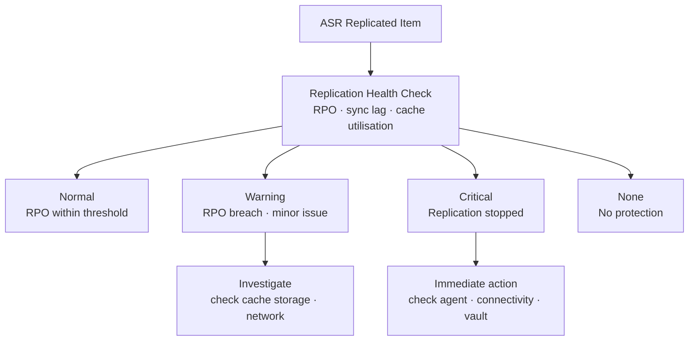

---
tags:
  - azure
---
# Replication Health

<div class="kb-summary">
Monitoring ASR replication health is critical for validating that DR protection is active and within acceptable RPO thresholds. Health states reflect the ongoing synchronisation between source and target regions.

*Applies to: Azure*
</div>

---

```vegalite
{
  "$schema": "https://vega.github.io/schema/vega-lite/v5.json",
  "title": {
    "text": "Replication Health \u2014 Thresholds",
    "fontSize": 13,
    "fontWeight": "normal"
  },
  "width": 480,
  "height": {
    "step": 26
  },
  "data": {
    "values": [
      {
        "metric": "ResyncProgressPercentage",
        "zone": "Safe",
        "val": 0
      },
      {
        "metric": "ResyncProgressPercentage",
        "zone": "Alert",
        "val": 100
      }
    ]
  },
  "mark": {
    "type": "bar",
    "cornerRadiusEnd": 3
  },
  "encoding": {
    "y": {
      "field": "metric",
      "type": "nominal",
      "axis": {
        "title": null,
        "labelLimit": 200
      },
      "sort": null
    },
    "x": {
      "field": "val",
      "type": "quantitative",
      "stack": "normalize",
      "axis": {
        "title": "Threshold boundary",
        "format": ".0%"
      }
    },
    "color": {
      "field": "zone",
      "type": "nominal",
      "scale": {
        "domain": [
          "Safe",
          "Alert"
        ],
        "range": [
          "#15803d",
          "#dc2626"
        ]
      },
      "legend": {
        "title": "Zone"
      }
    },
    "order": {
      "field": "zone",
      "sort": [
        "Safe",
        "Alert"
      ]
    },
    "tooltip": [
      {
        "field": "metric",
        "type": "nominal",
        "title": "Metric"
      },
      {
        "field": "zone",
        "type": "nominal",
        "title": "Zone"
      },
      {
        "field": "val",
        "type": "quantitative",
        "title": "Segment %",
        "format": ".0f"
      }
    ]
  }
}
```

## Replication Health Monitoring Flow



## Health States and Meanings

| State | Meaning | Action Required |
|---|---|---|
| Normal | Replication is healthy, RPO within threshold | None |
| Warning | RPO breached or minor issue detected | Investigate RPO, check cache storage |
| Critical | Replication stopped or severely degraded | Immediate remediation needed |
| None | Replication not configured | Enable protection |

---

## Checking Replication Health via REST

```bash
# List all replicated items with health and RPO
az rest --method GET \
  --uri "https://management.azure.com/subscriptions/<sub-id>/resourceGroups/<dr-rg>/providers/Microsoft.RecoveryServices/vaults/<vault-name>/replicationProtectedItems?api-version=2022-10-01" \
  --query "value[].{Name:name, Health:properties.replicationHealth, RPO:properties.rpoInSeconds, ActiveLocation:properties.activeLocation}" \
  --output table

# Show detailed health for a single item
az rest --method GET \
  --uri "https://management.azure.com/subscriptions/<sub-id>/resourceGroups/<dr-rg>/providers/Microsoft.RecoveryServices/vaults/<vault-name>/replicationProtectedItems/<item-name>?api-version=2022-10-01" \
  --query "properties.{Health:replicationHealth, RPO:rpoInSeconds, TestFailoverState:testFailoverState, LastSync:lastSuccessfulTestFailoverTime}" \
  --output json
```

---

## RPO Warnings

RPO (Recovery Point Objective) warnings appear when the time since the last synchronised recovery point exceeds the policy threshold.

```bash
# Identify items with RPO warnings (RPO > 300 seconds = 5 minutes)
az rest --method GET \
  --uri "https://management.azure.com/subscriptions/<sub-id>/resourceGroups/<dr-rg>/providers/Microsoft.RecoveryServices/vaults/<vault-name>/replicationProtectedItems?api-version=2022-10-01" \
  --query "value[?properties.rpoInSeconds > \`300\`].{Name:name, RPO:properties.rpoInSeconds, Health:properties.replicationHealth}" \
  --output table
```

Common RPO warning causes:

| Cause | Symptom | Resolution |
|---|---|---|
| Cache storage account throttling | RPO > 30 min, high churn VMs | Increase cache storage account tier |
| Network bandwidth saturation | Slow delta sync | Check ExpressRoute / VPN throughput |
| VM under heavy write load | Rapid RPO growth | Reduce write churn, review disk types |
| Mobility service outdated | Health = Warning | Update the Mobility service extension |
| Process server overloaded | Multiple VMs degraded | Scale out process servers |

---

## Triggering a Resync

If replication is stuck or health is critical, a resync forces a full re-synchronisation from the source.

```bash
# Trigger resync for a protected item
az rest --method POST \
  --uri "https://management.azure.com/subscriptions/<sub-id>/resourceGroups/<dr-rg>/providers/Microsoft.RecoveryServices/vaults/<vault-name>/replicationFabrics/<fabric>/replicationProtectionContainers/<container>/replicationProtectedItems/<item-name>/resync?api-version=2022-10-01" \
  --body '{}'

# Monitor resync job
az rest --method GET \
  --uri "https://management.azure.com/subscriptions/<sub-id>/resourceGroups/<dr-rg>/providers/Microsoft.RecoveryServices/vaults/<vault-name>/replicationJobs?api-version=2022-10-01" \
  --query "value[?properties.jobType=='Resync'].{Name:name, State:properties.state, Progress:properties.stateDescription}" \
  --output table
```

---

## Monitoring via Azure Monitor Alerts

```bash
# Create an alert for replication health degradation
az monitor metrics alert create \
  --name asr-replication-health-alert \
  --resource-group <rg> \
  --scopes <vault-resource-id> \
  --condition "avg ReplicationHealthErrors > 0" \
  --window-size 5m \
  --evaluation-frequency 1m \
  --severity 2 \
  --description "ASR replication health degraded"

# List all metric alerts for the vault
az monitor metrics alert list \
  --resource-group <rg> \
  --output table
```

---

## Replication Jobs Monitoring

```bash
# List replication jobs in the past 24 hours
az rest --method GET \
  --uri "https://management.azure.com/subscriptions/<sub-id>/resourceGroups/<dr-rg>/providers/Microsoft.RecoveryServices/vaults/<vault-name>/replicationJobs?api-version=2022-10-01" \
  --query "value[].{Name:name, Type:properties.jobType, State:properties.state, StartTime:properties.startTime, EndTime:properties.endTime}" \
  --output table

# List failed replication jobs only
az rest --method GET \
  --uri "https://management.azure.com/subscriptions/<sub-id>/resourceGroups/<dr-rg>/providers/Microsoft.RecoveryServices/vaults/<vault-name>/replicationJobs?api-version=2022-10-01" \
  --query "value[?properties.state=='Failed'].{Name:name, Type:properties.jobType, Error:properties.errors[0].details[0].message}" \
  --output table
```

---

## Replication Health Dashboard Metrics

Key metrics to surface in an Azure Monitor workbook or dashboard:

| Metric | Alert Threshold | Dashboard Widget |
|---|---|---|
| `RPOInSeconds` | > 300 | Line chart, 1h window |
| `ReplicationHealthErrors` | > 0 | Alert count tile |
| `ReplicationDataUploadRate` | < expected baseline | Area chart |
| `ResyncProgressPercentage` | Stuck at < 100% | Progress tile |
