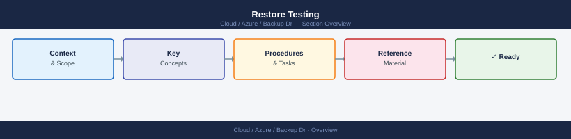

---
tags:
  - azure
---
# Restore Testing


<div class="kb-summary">
Restore testing validates that backup data is usable and that recovery procedures work as documented.

*Applies to: Azure*
</div>



---

## Restore a VM to a New VM (Full Restore)

```bash
# Restore disks and reconstruct a new VM from the restored template
az backup restore restore-disks \
  --resource-group <rg> \
  --vault-name <vault-name> \
  --container-name <container-name> \
  --item-name <vm-name> \
  --rp-name <recovery-point-id> \
  --storage-account <staging-storage-account-name> \
  --target-resource-group <target-rg>

# After restore-disks completes, deploy the VM from the restored template JSON
# (The template is written to the staging storage account by the restore job)
az deployment group create \
  --resource-group <target-rg> \
  --template-uri "<sas-url-to-template.json>"
```

---

## Restore to Original Location (Overwrite Existing VM)

This is a destructive operation. Only use after confirming the source VM is deallocated.

```bash
# Deallocate source VM before in-place restore
az vm deallocate \
  --resource-group <rg> \
  --name <vm-name>

# Restore to original location
az backup restore restore-disks \
  --resource-group <rg> \
  --vault-name <vault-name> \
  --container-name <container-name> \
  --item-name <vm-name> \
  --rp-name <recovery-point-id> \
  --storage-account <staging-storage-account-name> \
  --restore-to-staging-storage-account false
```

---

## File-Level Recovery

Azure Backup supports mounting a recovery point to the running VM for file-level browsing.

```bash
# Get a restore script for file-level recovery (script is downloaded from portal or REST)
# Use the portal "File Recovery" blade to generate and download the script
# Script is executed on the target VM to mount the backup snapshot as a local disk

# After file recovery, unmount using the cleanup script or portal
```

| Recovery Method | Use Case | Data Loss Risk |
|---|---|---|
| Disk restore to alternate location | Test validation, safe DR drill | None to source |
| Full VM restore (new VM) | Environment rebuild, cloning | None to source |
| Original location restore | Corruption recovery | Overwrites live disks |
| File-level recovery | Single file/folder recovery | None to source |

---

## Validating a Restored VM

```bash
# Confirm restored VM is in running state
az vm show \
  --resource-group <staging-rg> \
  --name <restored-vm-name> \
  --show-details \
  --query "powerState" --output tsv

# Check boot diagnostics for startup errors
az vm boot-diagnostics get-boot-log \
  --resource-group <staging-rg> \
  --name <restored-vm-name>

# Run a command on the restored VM to verify OS health
az vm run-command invoke \
  --resource-group <staging-rg> \
  --name <restored-vm-name> \
  --command-id RunShellScript \
  --scripts "df -h && systemctl is-active <service-name>"
```

---

## Restore Test Checklist

| Step | Expected Outcome | Validated |
|---|---|---|
| Recovery point selected | Within expected retention window | |
| Restore job completed | Status = Completed | |
| Restored VM booted successfully | powerState = VM running | |
| Boot diagnostics clean | No kernel panic / BSOD | |
| Application service started | Service active | |
| Data integrity check passed | Checksums / queries match | |
| Restored resources cleaned up | Staging RG deleted post-test | |
| Test results documented | Runbook updated | |
