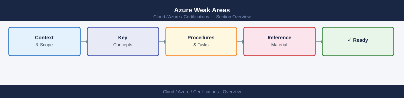

---
tags:
  - azure
  - certifications
---
# Azure Weak Areas


<div class="kb-summary">
Azure Weak Areas reference covering NSG vs ASG, VNet Peering vs VPN Gateway, RBAC vs Azure Policy, Storage Account Redundancy Options, Managed Disk Types and 1 more sections.
</div>



```d2
direction: right

center: "Azure" {shape: hexagon}
nsg_vs_asg: "NSG vs ASG" {shape: rectangle}
vnet_peering_vs_vpn_gateway: "VNet Peering vs VPN Gateway" {shape: rectangle}
rbac_vs_azure_policy: "RBAC vs Azure Policy" {shape: rectangle}
storage_account_redundancy_options: "Storage Account Redundancy Options" {shape: rectangle}
managed_disk_types: "Managed Disk Types" {shape: rectangle}
study_checklist: "Study Checklist" {shape: rectangle}

center -> nsg_vs_asg
center -> vnet_peering_vs_vpn_gateway
center -> rbac_vs_azure_policy
center -> storage_account_redundancy_options
center -> managed_disk_types
center -> study_checklist
```

## NSG vs ASG

| Feature | NSG (Network Security Group) | ASG (Application Security Group) |
|---|---|---|
| Purpose | Define inbound/outbound traffic rules | Group NICs/VMs for use as rule source/destination |
| Applied to | Subnet or NIC | Referenced inside NSG rules |
| Standalone | Yes | No — only used as NSG rule member |
| Dynamic membership | No (explicit NIC association) | Yes (associate NIC to ASG) |
| Simplification | Can have many rules with IP ranges | Replace IP ranges with logical group names |

Exam pattern: "Simplify NSG rules so you don't need to update IP addresses when VMs change" → Use ASGs. NSG rules reference the ASG; when a VM's NIC joins the ASG, it automatically inherits the rule.

## VNet Peering vs VPN Gateway

| Feature | VNet Peering | VPN Gateway |
|---|---|---|
| Traffic path | Microsoft backbone (no internet) | IPsec/IKE tunnel |
| Latency | Very low | Higher (encryption overhead) |
| Bandwidth | Depends on VM SKU | Up to 10 Gbps (VpnGw5) |
| Cost | Per GB transferred | Hourly gateway cost + data transfer |
| Transitivity | Non-transitive | Can enable with transit routing and BGP |
| Cross-region | Yes (Global VNet Peering) | Yes |
| On-premises connectivity | No | Yes |
| Setup complexity | Simple | Requires GatewaySubnet, Public IP, shared key |

Exam gotcha: VNet Peering is non-transitive. VNet A peered with VNet B, VNet B peered with VNet C, does NOT allow A to reach C. Use Azure Virtual WAN or a hub-and-spoke with Azure Firewall for transitive routing.

## RBAC vs Azure Policy

| Aspect | Azure RBAC | Azure Policy |
|---|---|---|
| Controls | What you CAN DO (permissions) | What IS ALLOWED to exist (compliance) |
| Deny capability | No explicit deny (deny assignment is separate) | Yes (Deny effect prevents non-compliant resource creation) |
| Scope | Management Group → Subscription → RG → Resource | Same hierarchy |
| Example | Grant Contributor role to a VM admin | Deny creation of VMs with public IP |
| Evaluation | At action time | At resource create/modify time |

Key insight: RBAC and Policy are complementary. RBAC grants permissions; Policy governs resource properties. Both are needed for full governance.

## Storage Account Redundancy Options

| Option | Copies | Locations | Protection Against |
|---|---|---|---|
| LRS (Locally Redundant) | 3 | Single datacenter | Hardware failure in one rack |
| ZRS (Zone Redundant) | 3 | 3 AZs in one region | AZ failure |
| GRS (Geo-Redundant) | 6 (3+3) | 2 regions (paired) | Regional failure; secondary is read-only unless failover |
| GZRS (Geo-Zone Redundant) | 6 | 3 AZs primary + paired region | AZ + regional failure |
| RA-GRS / RA-GZRS | Same as GRS/GZRS | Same | Same + secondary is always readable |

Exam pattern: "Tolerate region failure AND always read from secondary" → RA-GRS or RA-GZRS.

## Managed Disk Types

| Type | IOPS Max | Throughput Max | Use Case |
|---|---|---|---|
| Standard HDD | 500 | 60 MB/s | Dev/test, low-priority workloads |
| Standard SSD | 6,000 | 750 MB/s | Web servers, lightly used apps |
| Premium SSD (v1) | 20,000 | 900 MB/s | Production databases, ERP |
| Premium SSD v2 | 80,000 | 1,200 MB/s | Latency-sensitive workloads |
| Ultra Disk | 400,000 | 4,000 MB/s | SAP HANA, top-tier OLTP |

## Study Checklist

- [ ] Draw a VNet Peering transitivity diagram and explain the limitation
- [ ] Explain ASG with a worked example (3 VMs, 2 ASGs, 1 NSG rule)
- [ ] List all 5 storage redundancy options with copy counts
- [ ] Describe one scenario each for RBAC and Policy as the correct answer
- [ ] Know when to use Premium SSD v2 vs Ultra Disk
- [ ] Practice 5 weak-area scenario questions without looking at notes
