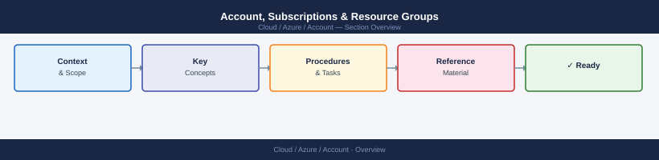

---
tags:
  - azure
---
# Account, Subscriptions & Resource Groups


<div class="kb-summary">
Azure account CLI: `az account set`, `az group create/list/delete`, `az subscription list`, `az policy assignment create`, and resource lock management.

*Applies to: Azure*
</div>



> Part of the Azure CLI Reference.

---

```bash
# Login
az login
az login --service-principal -u <app_id> -p <password> --tenant <tenant>
az login --identity   # Managed identity

# Subscriptions
az account list --output table
az account show
az account set --subscription <id_or_name>

# Identity
az ad signed-in-user show
```

```bash
az group list
az group list --output table
az group show --name <rg>
az group create --name <rg> --location eastus
az group delete --name <rg> --yes
az group list --query "[].{Name:name,Location:location,State:properties.provisioningState}" --output table
```

## See also

- [Azure CLI Reference](../index.md)
- [Azure Identity](../../identity/index.md)
- [Azure Governance](../../governance/index.md)
