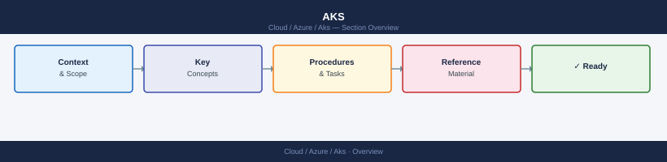

---
tags:
  - azure
---
# AKS


<div class="kb-summary">
AKS CLI reference — az aks commands for cluster list and show, credential retrieval, node pool management, node count scaling, Kubernetes version upgrades, and cluster diagnostics.

*Applies to: Azure*
</div>



> Part of the Azure CLI Reference.

---

```bash
# Clusters
az aks list --output table
az aks show --resource-group <rg> --name <cluster>

# Credentials
az aks get-credentials --resource-group <rg> --name <cluster>
az aks get-credentials --resource-group <rg> --name <cluster> --admin

# Scale
az aks scale --resource-group <rg> --name <cluster> --node-count 5

# Upgrade
az aks get-upgrades --resource-group <rg> --name <cluster>
az aks upgrade --resource-group <rg> --name <cluster> --kubernetes-version <version>

# Node pools
az aks nodepool list --resource-group <rg> --cluster-name <cluster>
```

```d2
direction: right

center: "Azure" {shape: hexagon}
component_a: "Component A" {shape: rectangle}
component_b: "Component B" {shape: rectangle}
component_c: "Component C" {shape: rectangle}

center -> component_a
center -> component_b
center -> component_c
```

## See also

- [Azure CLI Reference](../index.md)
- [Azure Compute](../../compute/index.md)
