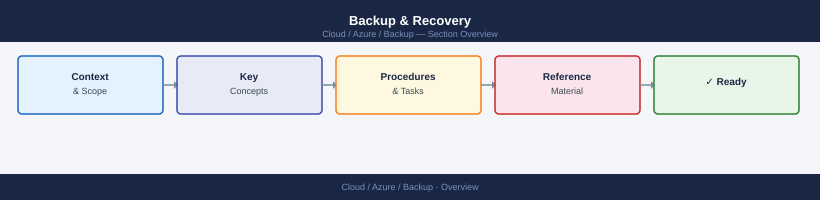

---
tags:
  - azure
---
# Backup & Recovery


<div class="kb-summary">
Azure backup CLI: `az backup vault create`, `az backup policy set`, `az backup job list`, `az backup restore restore-disks`, and Recovery Services vault management.

*Applies to: Azure*
</div>



> Part of the Azure CLI Reference.

---

```bash
# Recovery Services vaults
az backup vault list --output table
az backup vault show --resource-group <rg> --name <vault>

# Backup items
az backup item list --resource-group <rg> --vault-name <vault> --output table

# Jobs
az backup job list --resource-group <rg> --vault-name <vault> --output table
az backup job wait --resource-group <rg> --vault-name <vault> --name <job_id>

# On-demand backup
az backup protection backup-now --resource-group <rg> --vault-name <vault> \
  --container-name <container> --item-name <item> --retain-until <date>
```

```d2
direction: right

center: "Azure" {shape: hexagon}
component_a: "Component A" {shape: rectangle}
component_b: "Component B" {shape: rectangle}
component_c: "Component C" {shape: rectangle}

center -> component_a
center -> component_b
center -> component_c
```

## See also

- [Azure CLI Reference](../index.md)
- [Azure Storage](../../storage/index.md)
