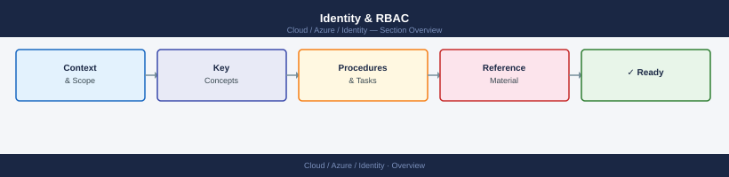

---
tags:
  - azure
---
# Identity & RBAC


<div class="kb-summary">
Azure identity CLI: `az ad user/group/sp`, `az role assignment create`, `az policy definition create`, `az keyvault set-policy`, and managed identity assignment.

*Applies to: Azure*
</div>



> Part of the Azure CLI Reference.

---

```bash
# Users
az ad user list --output table
az ad user show --id <user_upn>
az ad user create --display-name "Name" --user-principal-name user@domain.com --password <pass>

# Groups
az ad group list --output table
az ad group show --group <group>
az ad group member list --group <group>

# Service principals
az ad sp list --output table
az ad sp show --id <app_id>
az ad sp create-for-rbac --name <name> --role Contributor --scopes /subscriptions/<sub_id>

# App registrations
az ad app list --output table
az ad app show --id <app_id>
```

```bash
# Role assignments
az role assignment list --assignee <user_or_sp>
az role assignment list --scope /subscriptions/<sub_id>/resourceGroups/<rg>
az role assignment create --assignee <user_or_sp> --role "Contributor" --scope <resource_id>
az role assignment delete --assignee <user_or_sp> --role "Contributor" --scope <resource_id>

# Role definitions
az role definition list --output table
az role definition show --name "Contributor"
```

```d2
direction: right

center: "Azure" {shape: hexagon}
component_a: "Component A" {shape: rectangle}
component_b: "Component B" {shape: rectangle}
component_c: "Component C" {shape: rectangle}

center -> component_a
center -> component_b
center -> component_c
```

## See also

- [Azure CLI Reference](../index.md)
- [Azure Security](../../security/index.md)
- [Azure Identity](../../identity/index.md)
