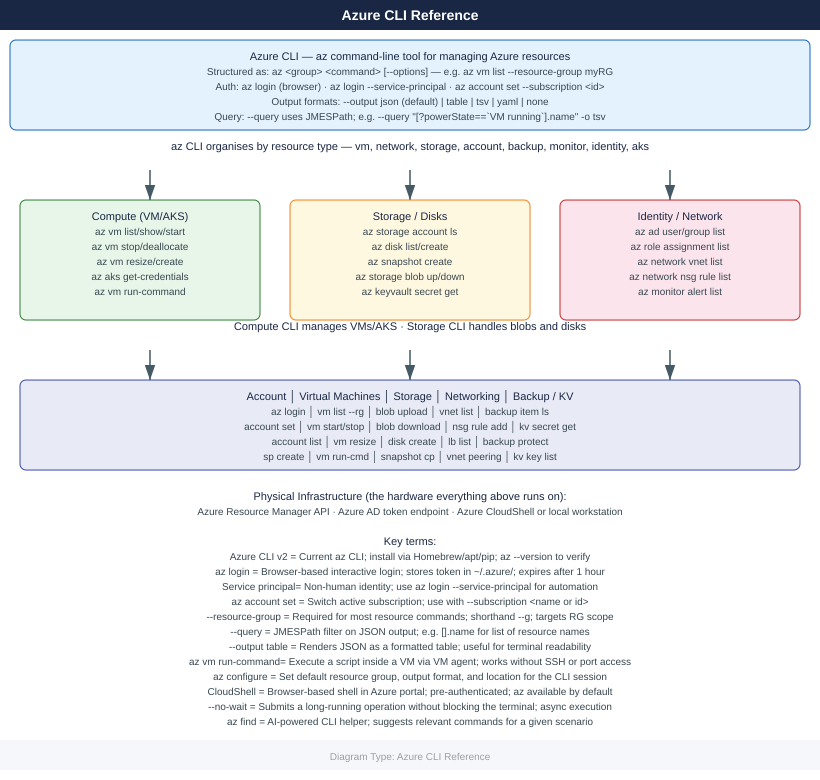

---
tags:
  - azure
---
# Azure CLI Reference

<div class="kb-summary">
Commonly used Azure CLI (`az`) commands for managing compute, storage, networking, identity, and monitoring. The Azure CLI is a cross-platform tool that talks directly to Azure APIs — everything you can do in the portal, you can automate with `az`.

*Applies to: Azure*
</div>

> Requires `az login` or service principal credentials. Use `az account set --subscription <id>` to target a specific subscription.



<div class="kb-grid kb-grid-3">

<a class="kb-card" href="account/">
  <strong>Account</strong>
  <span>Login, subscription management, and service principal commands.</span>
</a>

<a class="kb-card" href="virtual-machines/">
  <strong>Virtual Machines</strong>
  <span>VM lifecycle, resize, run-command, and AKS credentials.</span>
</a>

<a class="kb-card" href="storage/">
  <strong>Storage</strong>
  <span>Storage accounts, containers, and blob upload/download.</span>
</a>

<a class="kb-card" href="disks/">
  <strong>Disks</strong>
  <span>Managed disk and snapshot management commands.</span>
</a>

<a class="kb-card" href="networking/">
  <strong>Networking</strong>
  <span>VNet, subnets, NSGs, public IPs, and load balancers.</span>
</a>

<a class="kb-card" href="identity/">
  <strong>Identity & RBAC</strong>
  <span>Users, groups, service principals, and role assignments.</span>
</a>

<a class="kb-card" href="monitor/">
  <strong>Monitor & Alerts</strong>
  <span>Activity log, metrics, alerts, and diagnostic settings.</span>
</a>

<a class="kb-card" href="key-vault/">
  <strong>Key Vault</strong>
  <span>Secrets, keys, and certificate management commands.</span>
</a>

<a class="kb-card" href="aks/">
  <strong>AKS</strong>
  <span>Cluster management, node pools, and upgrade commands.</span>
</a>

<a class="kb-card" href="backup/">
  <strong>Backup & Recovery</strong>
  <span>Recovery Services vault, backup items, and job commands.</span>
</a>

</div>

---

## Storage Accounts & Blobs

Azure Blob Storage stores unstructured data (files, backups, images) in containers within a storage account. SAS tokens grant time-limited access without sharing account keys.

```bash
# Storage accounts
az storage account list --output table
az storage account show --resource-group <rg> --name <account>
az storage account create --resource-group <rg> --name <account> --sku Standard_LRS --kind StorageV2
az storage account delete --resource-group <rg> --name <account> --yes

# Containers
az storage container list --account-name <account>
az storage container create --account-name <account> --name <container>

# Blobs
az storage blob list --account-name <account> --container-name <container>
az storage blob upload --account-name <account> --container-name <container> \
  --file <local_file> --name <blob_name>
az storage blob download --account-name <account> --container-name <container> \
  --name <blob_name> --file <local_file>
az storage blob delete --account-name <account> --container-name <container> --name <blob_name>

# SAS token (time-limited access URL)
az storage container generate-sas --account-name <account> --name <container> \
  --permissions rwdl --expiry 2025-12-31
```


```text title="Expected output"
Name                            ResourceGroup      Location    SkuName      Kind       AccessTier
-----------------------------   ----------------   ----------  -----------  ---------  ----------
prodstg001                      prod-rg            eastus      Standard_LRS StorageV2  Hot
devstg002                       dev-rg             westus2     Standard_GRS StorageV2  Cool
...

(no output — command completes silently)

(no output — command completes silently)

Name
----
app-logs
backups
user-data

(no output — command completes silently)

Name                 Content Length    Last Modified
-------------------  ----------------  -------------------------
config.json          2048              2025-01-15T10:32:45+00:00
backup-2025-01-15    5242880           2025-01-15T09:15:22+00:00
...

Finished[#############################################] 100.0000%

Finished[#############################################] 100.0000%

(no output — command completes silently)

sv=2023-11-09&ss=rwdl&srt=c&sp=rwdl&se=2025-12-31T23:59:59Z&st=2025-01-15T00:00:00Z&spr=https&sig=AbCdEfGhIjKlMnOpQrStUvWxYz1234567890==
```

!!! warning "Common errors"
    **`ResourceNotFoundError: The specified resource group does not exist.`** — Verify the resource group name with `az group list` and ensure it exists in the correct subscription.
    **`StorageAccountAlreadyTaken: The storage account named '<account>' is already taken.`** — Storage account names must be globally unique across Azure; append a timestamp or random suffix and retry.
    **`AuthorizationFailed: The client '<client_id>' with object id '<object_id>' does not have authorization to perform action 'Microsoft.Storage/storageAccounts/read'.`** — Ensure your Azure CLI account has Storage Account Contributor or Reader role assigned via `az role assignment create`.
---

## Networking

Manage virtual networks, subnets, network security groups (NSGs), public IPs, and load balancers. VNets are the private network space in Azure — subnets segment them further.

```bash
# VNets
az network vnet list --output table
az network vnet show --resource-group <rg> --name <vnet>
az network vnet create --resource-group <rg> --name <vnet> --address-prefixes 10.0.0.0/16

# Subnets
az network vnet subnet list --resource-group <rg> --vnet-name <vnet> --output table
az network vnet subnet create --resource-group <rg> --vnet-name <vnet> \
  --name <subnet> --address-prefixes 10.0.1.0/24

# Network Security Groups (NSGs — virtual firewalls)
az network nsg list --resource-group <rg> --output table
az network nsg create --resource-group <rg> --name <nsg>
az network nsg rule create --resource-group <rg> --nsg-name <nsg> --name Allow-SSH \
  --priority 100 --protocol Tcp --destination-port-range 22 --access Allow

# Public IPs
az network public-ip list --output table
az network public-ip create --resource-group <rg> --name <pip> --allocation-method Static

# Load balancer
az network lb list --output table
```


```text title="Expected output"
Name                ResourceGroup        Location    ProvisioningState
------------------  -------------------  ----------  -------------------
prod-vnet-eastus    prod-network-rg      eastus      Succeeded
staging-vnet-westus staging-network-rg   westus      Succeeded
dev-vnet-eastus     dev-network-rg       eastus      Succeeded

Name              AddressPrefix    ProvisioningState
----------------  ---------------  -------------------
prod-subnet-web   10.0.1.0/24      Succeeded
prod-subnet-db    10.0.2.0/24      Succeeded

Name              ResourceGroup        Location    ProvisioningState
------------------  -------------------  ----------  -------------------
prod-nsg-web      prod-network-rg      eastus      Succeeded
prod-nsg-db       prod-network-rg      eastus      Succeeded

Name                  ResourceGroup        PublicIPAllocationMethod    IpAddress
--------------------  -------------------  --------------------------  ---------------
prod-pip-lb           prod-network-rg      Static                      203.0.113.45
staging-pip-nat       staging-network-rg   Dynamic                     198.51.100.12

Name              ResourceGroup        Location    ProvisioningState
------------------  -------------------  ----------  -------------------
prod-lb-eastus    prod-network-rg      eastus      Succeeded
```

!!! warning "Common errors"
    **`ResourceGroupNotFound: Resource group '<rg>' could not be found.`** — Verify the resource group name with `az group list` and ensure you are in the correct subscription with `az account show`.
    **`InvalidArgumentsUsage: unrecognized arguments: --address-prefixes`** — Use `--address-prefix` (singular) instead of `--address-prefixes` for the `az network vnet create` command.
    **`AuthorizationFailed: The client '<user>' with object id '<uuid>' does not have authorization to perform action 'Microsoft.Network/virtualNetworks/write' on resource '<vnet-id>'.`** — Request the Network Contributor role for your user account in the target resource group.
---

## Identity & RBAC

Manage Azure Active Directory users, groups, service principals, and role-based access control. Service principals are non-human identities used by apps and automation.

```bash
# Users
az ad user list --output table
az ad user show --id <user_upn>
az ad user create --display-name "Name" --user-principal-name user@domain.com --password <pass>

# Groups
az ad group list --output table
az ad group show --group <group>
az ad group member list --group <group>

# Service principals (automation identities)
az ad sp list --output table
az ad sp show --id <app_id>
az ad sp create-for-rbac --name <name> --role Contributor --scopes /subscriptions/<sub_id>

# App registrations
az ad app list --output table
az ad app show --id <app_id>

# Role assignments (RBAC — who can do what on which resource)
az role assignment list --assignee <user_or_sp>
az role assignment list --scope /subscriptions/<sub_id>/resourceGroups/<rg>
az role assignment create --assignee <user_or_sp> --role "Contributor" --scope <resource_id>
az role assignment delete --assignee <user_or_sp> --role "Contributor" --scope <resource_id>

# Role definitions
az role definition list --output table
az role definition show --name "Contributor"
```


```text title="Expected output"
# Users
DisplayName                 UserPrincipalName                    ObjectId
--------------------------  ------------------------------------  ------------------------------------
Alice Johnson               alice.johnson@contoso.com             a1b2c3d4-e5f6-47a8-9b0c-1d2e3f4a5b6c
Bob Smith                   bob.smith@contoso.com                 b2c3d4e5-f6a7-48b9-0c1d-2e3f4a5b6c7d
Charlie Brown               charlie.brown@contoso.com             c3d4e5f6-a7b8-49ca-1d2e-3f4a5b6c7d8e

DisplayName    Description                                ObjectId
-----------    -----------                                -----------
Engineering    Engineering team members                   d4e5f6a7-b8c9-4adb-2e3f-4a5b6c7d8e9f
Finance        Finance and accounting staff               e5f6a7b8-c9da-4bec-3f4a-5b6c7d8e9f0a

UserPrincipalName
-----------------
alice.johnson@contoso.com
bob.smith@contoso.com

AppId                                    DisplayName              ObjectId
------------------------------------     -----------------------  ------------------------------------
f6a7b8c9-d0e1-4cfd-4a5b-6c7d8e9f0a1b    AutomationSP             f6a7b8c9-d0e1-4cfd-4a5b-6c7d8e9f0a1b
a7b8c9d0-e1f2-4d0e-5b6c-7d8e9f0a1b2c    DeploymentBot            a7b8c9d0-e1f2-4d0e-5b6c-7d8e9f0a1b2c

AppId                                    DisplayName
------------------------------------     -----------------------
b8c9d0e1-f2a3-4e1f-6c7d-8e9f0a1b2c3d    WebAppRegistration
c9d0e1f2-a3b4-4f20-7d8e-9f0a1b2c3d4e    MobileAppRegistration

RoleAssignmentId                                                   Scope                                                    RoleDefinitionName    PrincipalName
---------------------------------------------------------------    -------------------------------------------------------  --------------------  ----------------------
/subscriptions/12345678-1234-1234-1234-123456789012/providers/    /subscriptions/12345678-1234-1234-1234-123456789012    Contributor           alice.johnson@contoso.com
Microsoft.Authorization/roleAssignments/a1b2c3d4-e5f6-47a8-9b0c

RoleDefinitionId                                                   Name                 Type
---------------------------------------------------------------    ----------------     ------
/subscriptions/12345678-1234-1234-1234-123456789012/providers/    Contributor          BuiltInRole
Microsoft.Authorization/roleDefinitions/b24988ac-6180-42a0-ab88
/subscriptions/12345678
```
---

## Monitor & Alerts

Query the activity log (who did what), pull resource metrics (CPU, network), and manage alerts and diagnostic settings.

```bash
# Activity log (audit trail of all operations)
az monitor activity-log list --max-events 50
az monitor activity-log list --resource-group <rg> --offset 24h

# Metrics (CPU, network, disk IOPS, etc.)
az monitor metrics list --resource <resource_id> --metric "Percentage CPU"
az monitor metrics list-definitions --resource <resource_id>

# Alerts
az monitor alert list --resource-group <rg>
az monitor action-group list

# Diagnostic settings (route logs and metrics to Log Analytics, storage, or Event Hub)
az monitor diagnostic-settings list --resource <resource_id>
az monitor diagnostic-settings create --name <name> --resource <resource_id> \
  --workspace <workspace_id> --metrics '[{"category":"AllMetrics","enabled":true}]'
```


```text title="Expected output"
[
  {
    "authorization": {
      "action": "Microsoft.Compute/virtualMachines/write",
      "principal": "user@contoso.com",
      "scope": "/subscriptions/12a34b56-c789-0d12-e345-f67890abcdef/resourceGroups/prod-rg/providers/Microsoft.Compute/virtualMachines/web-vm-01"
    },
    "caller": "user@contoso.com",
    "eventTimestamp": "2024-01-15T14:32:18.123456Z",
    "operationName": {
      "localizedValue": "Create or Update Virtual Machine",
      "value": "Microsoft.Compute/virtualMachines/write"
    },
    "resourceGroupName": "prod-rg",
    "status": {
      "localizedValue": "Succeeded",
      "value": "Succeeded"
    }
  },
  ...
]

[
  {
    "name": "Percentage CPU",
    "type": "Microsoft.Insights/metrics",
    "unit": "Percent",
    "displayDescription": "The percentage of allocated compute units that are currently in use by the Virtual Machine(s)",
    "resourceId": "/subscriptions/12a34b56-c789-0d12-e345-f67890abcdef/resourceGroups/prod-rg/providers/Microsoft.Compute/virtualMachines/web-vm-01"
  },
  {
    "name": "Network In",
    "type": "Microsoft.Insights/metrics",
    "unit": "Bytes",
    "displayDescription": "The number of billable bytes received on all network interfaces by the Virtual Machine(s)"
  }
]

[
  {
    "id": "/subscriptions/12a34b56-c789-0d12-e345-f67890abcdef/resourceGroups/prod-rg/providers/microsoft.insights/metricAlerts/cpu-alert-01",
    "name": "cpu-alert-01",
    "enabled": true,
    "severity": 2,
    "description": "Alert when CPU exceeds 80%"
  }
]

[
  {
    "id": "/subscriptions/12a34b56-c789-0d12-e345-f67890abcdef/resourceGroups/prod-rg/providers/Microsoft.Insights/actionGroups/default-ag",
    "name": "default-ag",
    "type": "Microsoft.Insights/actionGroups",
    "enabled": true
  }
]

[
  {
    "id": "/subscriptions/12a34b56-c789-0d12-e345-f67890abcdef/resourceGroups/prod-rg/providers/Microsoft.Insights/diagnosticSettings/send-to-law",
    "name": "send-to-law",
    "workspaceId": "/subscriptions/12a34b56-c789-0d12-e345-f67890abcdef/resourceGroups/prod-rg/providers/Microsoft.OperationalInsights/workspaces/central-law",
    "metrics": [
      {
        "category": "AllMetrics",
        "enabled": true
      }
```
---

## Key Vault

Azure Key Vault stores secrets (passwords, connection strings), cryptographic keys, and certificates centrally — applications retrieve them at runtime instead of embedding them in code.

```bash
# Vaults
az keyvault list --output table
az keyvault show --name <vault>

# Secrets
az keyvault secret list --vault-name <vault>
az keyvault secret show --vault-name <vault> --name <secret>
az keyvault secret set --vault-name <vault> --name <secret> --value <value>
az keyvault secret delete --vault-name <vault> --name <secret>

# Keys
az keyvault key list --vault-name <vault>
az keyvault key show --vault-name <vault> --name <key>

# Certificates
az keyvault certificate list --vault-name <vault>
az keyvault certificate show --vault-name <vault> --name <cert>
```


```text title="Expected output"
Name                             Location    Resource Group
---------------------------------  ----------  ----------------
prod-vault-eastus                 eastus      prod-rg
staging-vault-westus2             westus2     staging-rg
dev-vault-eastus                  eastus      dev-rg

{
  "id": "/subscriptions/12345678-1234-1234-1234-123456789012/resourceGroups/prod-rg/providers/Microsoft.KeyVault/vaults/prod-vault-eastus",
  "location": "eastus",
  "name": "prod-vault-eastus",
  "properties": {
    "accessPolicies": [],
    "enablePurgeProtection": true,
    "enableSoftDelete": true
  }
}

Secrets:
Name                 Created             Updated             Enabled
-------------------  ------------------  ------------------  ---------
db-password          2024-01-15T10:22Z   2024-01-20T14:33Z   True
api-key              2024-01-10T08:15Z   2024-01-18T09:44Z   True
tls-cert             2024-01-12T16:50Z   2024-01-19T11:22Z   True

{
  "attributes": {
    "created": 1705317720,
    "enabled": true,
    "updated": 1705689840
  },
  "id": "https://prod-vault-eastus.vault.azure.net/secrets/db-password/a1b2c3d4e5f6g7h8i9j0k1l2m3n4o5p6",
  "value": "***"
}

Secret 'db-password' has been set.

Secret 'api-key' has been deleted.

Keys:
Name                 Key Type    Key Size    Enabled
-------------------  ----------  ----------  ---------
encryption-key       RSA         2048        True
signing-key          RSA         4096        True

{
  "key": {
    "crv": null,
    "d": null,
    "dp": null,
    "dq": null,
    "e": "AQAB",
    "k": null,
    "key_ops": ["sign", "verify"],
    "kid": "https://prod-vault-eastus.vault.azure.net/keys/signing-key/a1b2c3d4e5f6g7h8i9j0k1l2m3n4o5p6",
    "kty": "RSA",
    "n": "0vx7agoebGcQSuuPiLJXZptN9nndrQmbXEps2aiAFbWhM78LhWx4cbbfAAtVT86zwu1RK7aPFFxuhDR1L6tSoc_BJECPebWKRXjBZCiFV4n3oknjhMstn64tZ_2W-5JsGY4Hc5n9yBXArwl93lqt7_RN5w6Cf0h4QyQ5v-65YGjQR0_FDW2QvzqY368QQMicAtaSqzs
```
---

## AKS

Azure Kubernetes Service (AKS) is Azure's managed Kubernetes offering. It manages the control plane — you manage workloads with `kubectl` after fetching credentials with `az aks get-credentials`.

```bash
# Clusters
az aks list --output table
az aks show --resource-group <rg> --name <cluster>

# Credentials (configures kubectl to point to this cluster)
az aks get-credentials --resource-group <rg> --name <cluster>
az aks get-credentials --resource-group <rg> --name <cluster> --admin

# Scale node pool
az aks scale --resource-group <rg> --name <cluster> --node-count 5

# Upgrade
az aks get-upgrades --resource-group <rg> --name <cluster>
az aks upgrade --resource-group <rg> --name <cluster> --kubernetes-version <version>

# Node pools
az aks nodepool list --resource-group <rg> --cluster-name <cluster>
```


```text title="Expected output"
NAME                LOCATION       RESOURCE GROUP      KUBERNETES VERSION    NODE COUNT    POWERSTATE
prod-cluster-01     eastus         infrastructure      1.27.7                3             Running
staging-cluster     eastus2        infrastructure      1.26.5                2             Running
dev-cluster         westus         development         1.25.11               1             Running

Merged kubeconfig credentials for prod-cluster-01.
Admin credentials configured for prod-cluster-01.

(no output — command completes silently)

Upgrades available:
  Kubernetes 1.28.0
  Kubernetes 1.28.1
  Kubernetes 1.28.3

Starting upgrade to Kubernetes 1.28.3...
Upgrade in progress. This may take several minutes.

NAME              VM SIZE       NODE COUNT    PROVISIONING STATE
nodepool1         Standard_D2s  3             Succeeded
gpu-pool          Standard_NC6  2             Succeeded
```

!!! warning "Common errors"
    **`Error: The resource group '<rg>' could not be found.`** — Verify the resource group name is correct and exists in your subscription with `az group list`.
    **`Error: The cluster '<cluster>' could not be found in resource group '<rg>'.`** — Confirm the cluster name spelling and that it belongs to the specified resource group using `az aks list --resource-group <rg>`.
    **`Error: Kubernetes version '<version>' is not available for upgrade.`** — Run `az aks get-upgrades --resource-group <rg> --name <cluster>` to list only supported target versions.
---

## Backup & Recovery

Azure Backup stores recovery points in Recovery Services vaults. Use these commands to check backup status, review jobs, and trigger on-demand backups.

```bash
# Recovery Services vaults
az backup vault list --output table
az backup vault show --resource-group <rg> --name <vault>

# Backup items (protected resources)
az backup item list --resource-group <rg> --vault-name <vault> --output table

# Jobs
az backup job list --resource-group <rg> --vault-name <vault> --output table
az backup job wait --resource-group <rg> --vault-name <vault> --name <job_id>

# On-demand backup
az backup protection backup-now --resource-group <rg> --vault-name <vault> \
  --container-name <container> --item-name <item> --retain-until <date>
```


```text title="Expected output"
Name                          ResourceGroup        Location    StorageModelType
-----------------------------  -------------------  ----------  -------------------
prod-recovery-vault-eastus    infrastructure-prod  eastus      GeoRedundant
dr-recovery-vault-westus2     infrastructure-dr    westus2     LocallyRedundant

ResourceGroup        Name                    Type
-------------------  ----------------------  -------------------------
infrastructure-prod  prod-recovery-vault-eastus  Microsoft.RecoveryServices/vaults

ResourceGroup        Name                          ProtectionState    HealthStatus
-------------------  ----------------------------  -----------------  ---------------
infrastructure-prod  vm-prod-db-01                 Protected          Healthy
infrastructure-prod  vm-prod-web-02                Protected          Healthy
infrastructure-prod  fileshare-documents           Protected          Healthy

ResourceGroup        Name                          Operation        Status      StartTime
-------------------  ----------------------------  ---------------  ----------  -----------------------
infrastructure-prod  cbbf5d8a-1234-5678-90ab-cd  ConfigureBackup   Completed   2024-01-15T08:22:14Z
infrastructure-prod  dccf5d8a-5678-1234-90ab-ef  Backup            Completed   2024-01-15T09:45:32Z

Job ID: dccf5d8a-5678-1234-90ab-ef has completed successfully.
```

!!! warning "Common errors"
    **`The Resource 'Microsoft.RecoveryServices/vaults/<vault>' under resource group '<rg>' was not found.`** — Verify the vault name and resource group name are correct and exist in your subscription.
    **`The item with name '<item>' was not found in the container '<container>'.`** — Confirm the container name and item name match exactly; list items with `az backup item list` to verify.
    **`--retain-until must be a date in the future in format YYYY-MM-DD.`** — Provide a future date for the retention period using the correct date format.