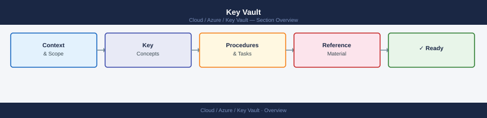

---
tags:
  - azure
---
# Key Vault


<div class="kb-summary">
Azure Key Vault CLI reference — manage vaults, secrets, keys, and certificates via az keyvault commands.

*Applies to: Azure*
</div>



> Part of the Azure CLI Reference.

---

```bash
# Vaults
az keyvault list --output table
az keyvault show --name <vault>

# Secrets
az keyvault secret list --vault-name <vault>
az keyvault secret show --vault-name <vault> --name <secret>
az keyvault secret set --vault-name <vault> --name <secret> --value <value>
az keyvault secret delete --vault-name <vault> --name <secret>

# Keys
az keyvault key list --vault-name <vault>
az keyvault key show --vault-name <vault> --name <key>

# Certificates
az keyvault certificate list --vault-name <vault>
az keyvault certificate show --vault-name <vault> --name <cert>
```

```d2
direction: right

center: "Azure" {shape: hexagon}
component_a: "Component A" {shape: rectangle}
component_b: "Component B" {shape: rectangle}
component_c: "Component C" {shape: rectangle}

center -> component_a
center -> component_b
center -> component_c
```

## See also

- [Azure CLI Reference](../index.md)
- [Azure Security](../../security/index.md)
