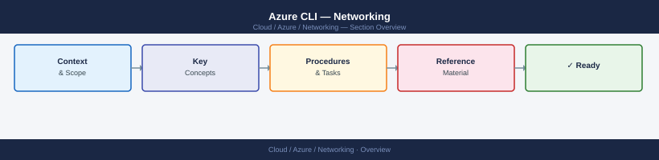

---
tags:
  - azure
  - networking
---
# Azure CLI — Networking


<div class="kb-summary">
Azure CLI commands for networking — VNet, subnets, NSGs, route tables, VNet peering, Private Endpoints, and DNS zones.

*Applies to: Azure*
</div>



> Part of the Azure CLI Reference.

---

```bash
# VNets
az network vnet list --output table
az network vnet show --resource-group <rg> --name <vnet>
az network vnet create --resource-group <rg> --name <vnet> --address-prefixes 10.0.0.0/16

# Subnets
az network vnet subnet list --resource-group <rg> --vnet-name <vnet> --output table
az network vnet subnet create --resource-group <rg> --vnet-name <vnet> --name <subnet> --address-prefixes 10.0.1.0/24

# NSGs
az network nsg list --resource-group <rg> --output table
az network nsg create --resource-group <rg> --name <nsg>
az network nsg rule create --resource-group <rg> --nsg-name <nsg> --name Allow-SSH \
  --priority 100 --protocol Tcp --destination-port-range 22 --access Allow

# Public IPs
az network public-ip list --output table
az network public-ip create --resource-group <rg> --name <pip> --allocation-method Static

# Load balancer
az network lb list --output table
```

```d2
direction: right

center: "Azure" {shape: hexagon}
component_a: "Component A" {shape: rectangle}
component_b: "Component B" {shape: rectangle}
component_c: "Component C" {shape: rectangle}

center -> component_a
center -> component_b
center -> component_c
```

## See also

- [Azure CLI Reference](../index.md)
- [Azure Networking](../../networking/index.md)
