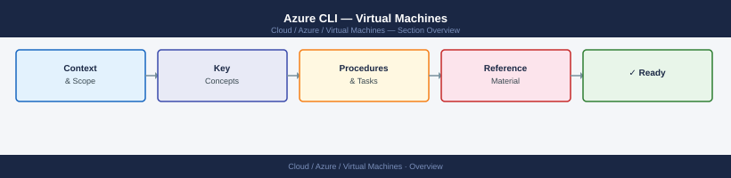

---
tags:
  - azure
---
# Azure CLI — Virtual Machines


<div class="kb-summary">
Azure CLI commands for VM management — create, resize, deallocate, managed disks, extensions, and snapshot operations.

*Applies to: Azure*
</div>



> Part of the Azure CLI Reference.

---

```bash
# List
az vm list --output table
az vm list --resource-group <rg> --output table
az vm list --resource-group <rg> --show-details --output table

# Start / stop / restart
az vm start --resource-group <rg> --name <vm>
az vm stop --resource-group <rg> --name <vm>
az vm deallocate --resource-group <rg> --name <vm>
az vm restart --resource-group <rg> --name <vm>

# Details
az vm show --resource-group <rg> --name <vm>
az vm get-instance-view --resource-group <rg> --name <vm>

# Create
az vm create --resource-group <rg> --name <vm> --image Ubuntu2204 --size Standard_D2s_v3 \
  --admin-username azureuser --ssh-key-values ~/.ssh/id_rsa.pub

# Resize
az vm resize --resource-group <rg> --name <vm> --size Standard_D4s_v3

# Run command
az vm run-command invoke --resource-group <rg> --name <vm> --command-id RunShellScript \
  --scripts "uptime"

# Open port
az vm open-port --resource-group <rg> --name <vm> --port 22
```

```d2
direction: right

center: "Azure" {shape: hexagon}
component_a: "Component A" {shape: rectangle}
component_b: "Component B" {shape: rectangle}
component_c: "Component C" {shape: rectangle}

center -> component_a
center -> component_b
center -> component_c
```

## See also

- [Azure CLI Reference](../index.md)
- [Azure Compute](../../compute/index.md)
- [Azure Operations](../../operations/index.md)
