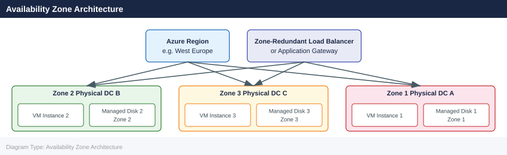

---
tags:
  - azure
description: "Availability Zones are physically separate datacenters within an Azure region, each with independent power, cooling, and networking. Deploying VMs across..."
---
# Availability Zones

<div class="kb-summary">
Availability Zones are physically separate datacenters within an Azure region, each with independent power, cooling, and networking. Deploying VMs across zones provides 99.99% SLA and protection against datacenter-level failures.

*Applies to: Azure*
</div>

---

## Availability Zone Architecture



## Core Concepts

| Concept | Description |
|---|---|
| Zone | A unique physical location within a region — typically 3 per region |
| Zone-Redundant | Resources spread across all 3 zones automatically |
| Zone-Pinned | Resource explicitly placed in a specific zone (1, 2, or 3) |
| Zonal VM | Single VM pinned to one zone — requires zone-aware load balancer for HA |

**SLA:** 99.99% for VMs spread across 2+ zones in the same region (requires zone-redundant or zonal deployment with load balancer).

---

## Checking Zone Support

```bash
# List regions that support Availability Zones
az account list-locations \
  --query "[?availabilityZoneMappings!=null].{Region:name, DisplayName:displayName}" \
  --output table

# Check which VM sizes support zones in a region
az vm list-skus \
  --location eastus \
  --resource-type virtualMachines \
  --query "[?locationInfo[0].zones!=null].{Size:name, Zones:locationInfo[0].zones}" \
  --output table
```


```text title="Expected output"
Region                DisplayName
--------------------  -------------------------
eastus                East US
eastus2               East US 2
westus2               West US 2
centralus             Central US
northeurope           North Europe
westeurope            West Europe
southeastasia         Southeast Asia
japaneast             Japan East
...

Size                          Zones
------------------------------  -----------
Standard_D2s_v3               [1, 2, 3]
Standard_D4s_v3               [1, 2, 3]
Standard_E2s_v3               [1, 2, 3]
Standard_B2s                  [1, 2, 3]
Standard_F2s_v2               [1, 2, 3]
Premium_LRS                   [1, 2, 3]
...
```

!!! warning "Common errors"
    **`ERROR: The following arguments are required: --location`** — Add `--location eastus` (or your target region) to the `az vm list-skus` command.
    **`No JSON object could be decoded`** — Ensure your Azure CLI is updated with `az upgrade` and you're authenticated with `az login`.
    **`The resource type 'virtualMachines' is invalid`** — Use lowercase `virtualmachines` or omit the `--resource-type` flag to query all resources in the location.
---

## Deploying Zone-Pinned VMs

```bash
# Deploy a VM in Zone 1
az vm create \
  --resource-group <rg> \
  --name <vm-name-z1> \
  --image Ubuntu2204 \
  --size Standard_D2s_v3 \
  --zone 1 \
  --admin-username azureuser \
  --generate-ssh-keys

# Deploy a VM in Zone 2
az vm create \
  --resource-group <rg> \
  --name <vm-name-z2> \
  --image Ubuntu2204 \
  --size Standard_D2s_v3 \
  --zone 2 \
  --admin-username azureuser \
  --generate-ssh-keys

# Deploy a VM in Zone 3
az vm create \
  --resource-group <rg> \
  --name <vm-name-z3> \
  --image Ubuntu2204 \
  --size Standard_D2s_v3 \
  --zone 3 \
  --admin-username azureuser \
  --generate-ssh-keys

# List VMs and their zones
az vm list \
  --resource-group <rg> \
  --query "[].{Name:name, Zone:zones[0], Size:hardwareProfile.vmSize}" \
  --output table
```


```text title="Expected output"
{
  "fqdns": "",
  "id": "/subscriptions/a1b2c3d4-e5f6-4a5b-8c9d-0e1f2a3b4c5d/resourceGroups/prod-rg/providers/Microsoft.Compute/virtualMachines/vm-z1",
  "location": "eastus",
  "macAddress": "00:0D:3A:2E:5F:7A",
  "powerState": "VM running",
  "privateIpAddress": "10.0.1.4",
  "publicIpAddress": "20.45.123.89",
  "resourceGroup": "prod-rg",
  "zones": [
    "1"
  ]
}
{
  "fqdns": "",
  "id": "/subscriptions/a1b2c3d4-e5f6-4a5b-8c9d-0e1f2a3b4c5d/resourceGroups/prod-rg/providers/Microsoft.Compute/virtualMachines/vm-z2",
  "location": "eastus",
  "macAddress": "00:0D:3A:2E:5F:7B",
  "powerState": "VM running",
  "privateIpAddress": "10.0.1.5",
  "publicIpAddress": "20.45.124.56",
  "resourceGroup": "prod-rg",
  "zones": [
    "2"
  ]
}
{
  "fqdns": "",
  "id": "/subscriptions/a1b2c3d4-e5f6-4a5b-8c9d-0e1f2a3b4c5d/resourceGroups/prod-rg/providers/Microsoft.Compute/virtualMachines/vm-z3",
  "location": "eastus",
  "macAddress": "00:0D:3A:2E:5F:7C",
  "powerState": "VM running",
  "privateIpAddress": "10.0.1.6",
  "publicIpAddress": "20.45.125.78",
  "resourceGroup": "prod-rg",
  "zones": [
    "3"
  ]
}
Name      Zone    Size
--------  ------  ----------------
vm-z1     1       Standard_D2s_v3
vm-z2     2       Standard_D2s_v3
vm-z3     3       Standard_D2s_v3
```

!!! warning "Common errors"
    **`ResourceGroupNotFound`** — Verify the resource group name is correct and exists in your subscription with `az group list`.
    **`InvalidImageName`** — Replace `Ubuntu2204` with a valid image URN like `UbuntuLTS` or `Canonical:0001-com-ubuntu-server-jammy:22_04-lts-gen2:latest`.
    **`ZoneNotAvailable`** — Confirm availability zones 1–3 are supported in your region with `az vm list-skus --location <region> --query "[?zones]" --output table`.
---

## Zone-Redundant Managed Disks

Managed disks support zone-redundant storage (ZRS), replicating data across all 3 zones.

```bash
# Create a ZRS managed disk
az disk create \
  --resource-group <rg> \
  --name <disk-name> \
  --size-gb 128 \
  --sku Premium_ZRS \
  --location eastus

# Attach a ZRS disk to a VM
az vm disk attach \
  --resource-group <rg> \
  --vm-name <vm-name> \
  --name <disk-name>
```


```text title="Expected output"
{
  "id": "/subscriptions/12a34b5c-d6ef-7890-g1h2-i3j4k5l6m7n8/resourceGroups/prod-rg/providers/Microsoft.Compute/disks/data-disk-01",
  "location": "eastus",
  "name": "data-disk-01",
  "sku": {
    "name": "Premium_ZRS",
    "tier": "Premium"
  },
  "zones": [
    "1",
    "2",
    "3"
  ],
  "diskSizeGb": 128,
  "provisioningState": "Succeeded",
  "timeCreated": "2024-01-15T10:42:33.456789+00:00"
}
Disk attached.
```

!!! warning "Common errors"
    **`ResourceNotFound : The Resource 'Microsoft.Compute/disks/<disk-name>' under resource group '<rg>' was not found.`** — Verify the disk name and resource group match exactly, and that the disk creation completed successfully before attempting attachment.
    **`InvalidParameter : The resource with id '/subscriptions/.../virtualMachines/<vm-name>' could not be found.`** — Confirm the VM name and resource group are correct, and that the VM exists in the same region and resource group as the disk.
    **`SkuNotAvailable : The requested sku 'Premium_ZRS' is not available in location 'eastus'.`** — Check Azure's current SKU availability for your region using `az vm list-skus --location eastus --query "[?name=='Premium_ZRS']"` and select an available location.
| Disk SKU | Zone-Redundant | Use Case |
|---|---|---|
| Premium_LRS | No | Single-zone premium performance |
| Premium_ZRS | Yes | Zone-redundant premium — production recommended |
| Standard_LRS | No | Dev/test |
| StandardSSD_ZRS | Yes | Zone-redundant balanced |

---

## Zone-Redundant Load Balancer

To distribute traffic across zonal VMs, use a Standard Load Balancer with zone-redundant frontend.

```bash
# Create a Standard public IP (zone-redundant)
az network public-ip create \
  --resource-group <rg> \
  --name <pip-name> \
  --sku Standard \
  --zone 1 2 3

# Create a Standard Load Balancer
az network lb create \
  --resource-group <rg> \
  --name <lb-name> \
  --sku Standard \
  --public-ip-address <pip-name> \
  --frontend-ip-name <frontend-name> \
  --backend-pool-name <backend-pool>

# Add zonal VMs to the backend pool
az network lb address-pool address add \
  --resource-group <rg> \
  --lb-name <lb-name> \
  --pool-name <backend-pool> \
  --name vm1-ip \
  --ip-address <vm1-private-ip> \
  --vnet <vnet-id>
```


```text title="Expected output"
{
  "publicIp": {
    "id": "/subscriptions/12a34b56-c789-0d12-e345-f67890ab1234/resourceGroups/prod-rg/providers/Microsoft.Network/publicIPAddresses/pip-zone-redundant",
    "name": "pip-zone-redundant",
    "resourceGroup": "prod-rg",
    "location": "eastus",
    "publicIpAddressVersion": "IPv4",
    "publicIpAllocationMethod": "Static",
    "sku": {
      "name": "Standard",
      "tier": "Regional"
    },
    "zones": [
      "1",
      "2",
      "3"
    ]
  }
}
{
  "loadBalancer": {
    "id": "/subscriptions/12a34b56-c789-0d12-e345-f67890ab1234/resourceGroups/prod-rg/providers/Microsoft.Network/loadBalancers/lb-standard",
    "name": "lb-standard",
    "location": "eastus",
    "sku": {
      "name": "Standard",
      "tier": "Regional"
    },
    "frontendIPConfigurations": [
      {
        "name": "frontend-ip",
        "publicIPAddress": {
          "id": "/subscriptions/12a34b56-c789-0d12-e345-f67890ab1234/resourceGroups/prod-rg/providers/Microsoft.Network/publicIPAddresses/pip-zone-redundant"
        }
      }
    ],
    "backendAddressPools": [
      {
        "name": "backend-pool",
        "backendIPConfigurations": []
      }
    ]
  }
}
{
  "address": {
    "name": "vm1-ip",
    "ipAddress": "10.0.1.15",
    "virtualNetwork": {
      "id": "/subscriptions/12a34b56-c789-0d12-e345-f67890ab1234/resourceGroups/prod-rg/providers/Microsoft.Network/virtualNetworks/prod-vnet"
    }
  }
}
```

!!! warning "Common errors"
    **`BadRequest: The resource with id ... does not exist.`** — Verify the resource group name, public IP name, and load balancer name exist before running the address pool command.
    **`InvalidResourceReference: The vnet parameter must be a full resource ID, not a name.`** — Use the full vnet resource ID format: `/subscriptions/<sub-id>/resourceGroups/<rg>/providers/Microsoft.Network/virtualNetworks/<vnet-name>`.
    **`ConflictingUserInput: Cannot use zones parameter with Basic SKU public IP.`** — Remove the `--zone` parameter or change the SKU to `Standard` for zone-redundancy support.
---

## Cross-Zone Latency Considerations

| Scenario | Typical Latency | Notes |
|---|---|---|
| Same zone | < 1 ms | Optimal for latency-sensitive workloads |
| Different zones, same region | 1–2 ms | Acceptable for most workloads |
| Different regions | 5–50+ ms | Use only for DR, not active/active |

```bash
# Run a latency test between zonal VMs using az vm run-command
az vm run-command invoke \
  --resource-group <rg> \
  --name <vm-name-z1> \
  --command-id RunShellScript \
  --scripts "ping -c 10 <vm-z2-private-ip>"
```


```text title="Expected output"
{
  "value": [
    {
      "code": "ProvisioningState/succeeded",
      "displayStatus": "Provision succeeded",
      "message": "Command execution finished",
      "output": [
        "PING 10.0.2.45 (10.0.2.45) 56(84) bytes of data.",
        "64 bytes from 10.0.2.45: icmp_seq=1 time=2.34 ms",
        "64 bytes from 10.0.2.45: icmp_seq=2 time=2.41 ms",
        "64 bytes from 10.0.2.45: icmp_seq=3 time=2.38 ms",
        "64 bytes from 10.0.2.45: icmp_seq=4 time=2.39 ms",
        "64 bytes from 10.0.2.45: icmp_seq=5 time=2.35 ms",
        "...",
        "10 packets transmitted, 10 received, 0% packet loss, time 9012ms",
        "rtt min/avg/max/stddev = 2.34/2.37/2.41/0.02 ms"
      ]
    }
  ]
}
```

!!! warning "Common errors"
    **`ResourceNotFound: The Resource 'Microsoft.Compute/virtualMachines/<vm-name-z1>' under resource group '<rg>' was not found.`** — Verify the VM name and resource group name are correct using `az vm list --resource-group <rg>`.
    **`The client '<principal-id>' does not have authorization to perform action 'Microsoft.Compute/virtualMachines/runCommands/action'`** — Assign the VM Contributor or higher role to your user/service principal using `az role assignment create`.
    **`Network connectivity failed: 100% packet loss`** — Ensure the target VM's private IP is correct, both VMs are in the same virtual network or peered networks, and NSG rules allow ICMP traffic between them.
---

## Availability Zones vs Availability Sets

| Dimension | Availability Zones | Availability Sets |
|---|---|---|
| Failure isolation | Datacenter-level | Rack-level |
| SLA (2+ VMs) | 99.99% | 99.95% |
| Managed disk alignment | Automatic | Requires aligned AS |
| Applicable regions | Zone-enabled only | All regions |
| Use with VMSS | Yes (zone-spanning) | Yes (single zone) |

---

## Listing Zone Information for Resources

```bash
# Show zone for a specific public IP
az network public-ip show \
  --resource-group <rg> \
  --name <pip-name> \
  --query "zones" --output tsv

# Show zone for a managed disk
az disk show \
  --resource-group <rg> \
  --name <disk-name> \
  --query "zones" --output tsv
```


```text title="Expected output"
["1"]
["2"]
```

!!! warning "Common errors"
    **`ResourceNotFound : The Resource 'Microsoft.Network/publicIPAddresses/<pip-name>' under resource group '<rg>' was not found.`** — Verify the public IP name and resource group name are correct with `az network public-ip list --resource-group <rg>`.
    **`ResourceNotFound : The Resource 'Microsoft.Compute/disks/<disk-name>' under resource group '<rg>' was not found.`** — Confirm the disk name exists in the resource group using `az disk list --resource-group <rg>`.