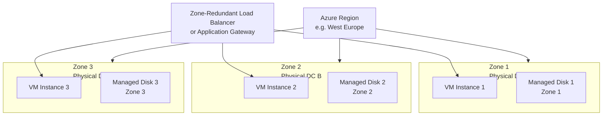

---
tags:
  - azure
---
# Availability Zones

<div class="kb-summary">
Availability Zones are physically separate datacenters within an Azure region, each with independent power, cooling, and networking. Deploying VMs across zones provides 99.99% SLA and protection against datacenter-level failures.

*Applies to: Azure*
</div>

---

## Availability Zone Architecture



## Core Concepts

| Concept | Description |
|---|---|
| Zone | A unique physical location within a region — typically 3 per region |
| Zone-Redundant | Resources spread across all 3 zones automatically |
| Zone-Pinned | Resource explicitly placed in a specific zone (1, 2, or 3) |
| Zonal VM | Single VM pinned to one zone — requires zone-aware load balancer for HA |

**SLA:** 99.99% for VMs spread across 2+ zones in the same region (requires zone-redundant or zonal deployment with load balancer).

---

## Checking Zone Support

```bash
# List regions that support Availability Zones
az account list-locations \
  --query "[?availabilityZoneMappings!=null].{Region:name, DisplayName:displayName}" \
  --output table

# Check which VM sizes support zones in a region
az vm list-skus \
  --location eastus \
  --resource-type virtualMachines \
  --query "[?locationInfo[0].zones!=null].{Size:name, Zones:locationInfo[0].zones}" \
  --output table
```

---

## Deploying Zone-Pinned VMs

```bash
# Deploy a VM in Zone 1
az vm create \
  --resource-group <rg> \
  --name <vm-name-z1> \
  --image Ubuntu2204 \
  --size Standard_D2s_v3 \
  --zone 1 \
  --admin-username azureuser \
  --generate-ssh-keys

# Deploy a VM in Zone 2
az vm create \
  --resource-group <rg> \
  --name <vm-name-z2> \
  --image Ubuntu2204 \
  --size Standard_D2s_v3 \
  --zone 2 \
  --admin-username azureuser \
  --generate-ssh-keys

# Deploy a VM in Zone 3
az vm create \
  --resource-group <rg> \
  --name <vm-name-z3> \
  --image Ubuntu2204 \
  --size Standard_D2s_v3 \
  --zone 3 \
  --admin-username azureuser \
  --generate-ssh-keys

# List VMs and their zones
az vm list \
  --resource-group <rg> \
  --query "[].{Name:name, Zone:zones[0], Size:hardwareProfile.vmSize}" \
  --output table
```

---

## Zone-Redundant Managed Disks

Managed disks support zone-redundant storage (ZRS), replicating data across all 3 zones.

```bash
# Create a ZRS managed disk
az disk create \
  --resource-group <rg> \
  --name <disk-name> \
  --size-gb 128 \
  --sku Premium_ZRS \
  --location eastus

# Attach a ZRS disk to a VM
az vm disk attach \
  --resource-group <rg> \
  --vm-name <vm-name> \
  --name <disk-name>
```

| Disk SKU | Zone-Redundant | Use Case |
|---|---|---|
| Premium_LRS | No | Single-zone premium performance |
| Premium_ZRS | Yes | Zone-redundant premium — production recommended |
| Standard_LRS | No | Dev/test |
| StandardSSD_ZRS | Yes | Zone-redundant balanced |

---

## Zone-Redundant Load Balancer

To distribute traffic across zonal VMs, use a Standard Load Balancer with zone-redundant frontend.

```bash
# Create a Standard public IP (zone-redundant)
az network public-ip create \
  --resource-group <rg> \
  --name <pip-name> \
  --sku Standard \
  --zone 1 2 3

# Create a Standard Load Balancer
az network lb create \
  --resource-group <rg> \
  --name <lb-name> \
  --sku Standard \
  --public-ip-address <pip-name> \
  --frontend-ip-name <frontend-name> \
  --backend-pool-name <backend-pool>

# Add zonal VMs to the backend pool
az network lb address-pool address add \
  --resource-group <rg> \
  --lb-name <lb-name> \
  --pool-name <backend-pool> \
  --name vm1-ip \
  --ip-address <vm1-private-ip> \
  --vnet <vnet-id>
```

---

## Cross-Zone Latency Considerations

| Scenario | Typical Latency | Notes |
|---|---|---|
| Same zone | < 1 ms | Optimal for latency-sensitive workloads |
| Different zones, same region | 1–2 ms | Acceptable for most workloads |
| Different regions | 5–50+ ms | Use only for DR, not active/active |

```bash
# Run a latency test between zonal VMs using az vm run-command
az vm run-command invoke \
  --resource-group <rg> \
  --name <vm-name-z1> \
  --command-id RunShellScript \
  --scripts "ping -c 10 <vm-z2-private-ip>"
```

---

## Availability Zones vs Availability Sets

| Dimension | Availability Zones | Availability Sets |
|---|---|---|
| Failure isolation | Datacenter-level | Rack-level |
| SLA (2+ VMs) | 99.99% | 99.95% |
| Managed disk alignment | Automatic | Requires aligned AS |
| Applicable regions | Zone-enabled only | All regions |
| Use with VMSS | Yes (zone-spanning) | Yes (single zone) |

---

## Listing Zone Information for Resources

```bash
# Show zone for a specific public IP
az network public-ip show \
  --resource-group <rg> \
  --name <pip-name> \
  --query "zones" --output tsv

# Show zone for a managed disk
az disk show \
  --resource-group <rg> \
  --name <disk-name> \
  --query "zones" --output tsv
```
