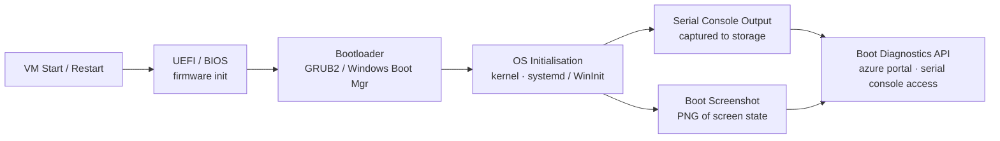

# Boot Diagnostics

Azure Boot Diagnostics captures the serial console output and a screenshot of the VM's screen at boot time. It is essential for diagnosing VMs that fail to start or are unreachable via SSH/RDP.

---

## Boot Diagnostics Flow



## Overview

| Feature | Description |
|---|---|
| Serial log | Text output from the OS boot process (kernel messages, systemd, etc.) |
| Boot screenshot | A PNG snapshot of what the monitor would show (OS login screen, panic, etc.) |
| Managed storage | Azure stores diagnostics data automatically — no storage account needed |
| Custom storage | You can specify your own storage account for compliance or retention reasons |

---

## Enabling Boot Diagnostics

```bash
# Enable boot diagnostics with managed storage (recommended)
az vm boot-diagnostics enable \
  --resource-group <rg> \
  --name <vm-name>

# Enable boot diagnostics with a custom storage account
az vm boot-diagnostics enable \
  --resource-group <rg> \
  --name <vm-name> \
  --storage <storage-account-uri>

# Verify boot diagnostics is enabled
az vm show \
  --resource-group <rg> \
  --name <vm-name> \
  --query "diagnosticsProfile.bootDiagnostics" \
  --output json
```

---

## Enabling at VM Creation

```bash
# Create VM with boot diagnostics enabled (managed storage)
az vm create \
  --resource-group <rg> \
  --name <vm-name> \
  --image Ubuntu2204 \
  --size Standard_D2s_v3 \
  --boot-diagnostics-storage "" \
  --admin-username azureuser \
  --generate-ssh-keys

# Create VM with boot diagnostics using a specific storage account
az vm create \
  --resource-group <rg> \
  --name <vm-name> \
  --image Ubuntu2204 \
  --size Standard_D2s_v3 \
  --boot-diagnostics-storage https://<storage-account>.blob.core.windows.net/ \
  --admin-username azureuser \
  --generate-ssh-keys
```

---

## Reading Boot Logs

```bash
# Get the serial console log (text output from OS boot)
az vm boot-diagnostics get-boot-log \
  --resource-group <rg> \
  --name <vm-name>

# Save the boot log to a file for analysis
az vm boot-diagnostics get-boot-log \
  --resource-group <rg> \
  --name <vm-name> > boot-log.txt

# Get a SAS URL to download the boot screenshot
az vm boot-diagnostics get-boot-log-uris \
  --resource-group <rg> \
  --name <vm-name> \
  --output json
```

---

## Serial Console Access

Azure Serial Console provides interactive access to the VM's serial port, even when the VM has no network connectivity. It requires boot diagnostics to be enabled.

```bash
# Serial Console is accessed via the Azure portal:
# Virtual Machines > <vm-name> > Help > Serial Console

# Confirm prerequisites are met
az vm show \
  --resource-group <rg> \
  --name <vm-name> \
  --query "{BootDiagnostics:diagnosticsProfile.bootDiagnostics.enabled, PowerState:powerState}" \
  --output json

# Ensure the VM agent is running (required for some serial console features)
az vm get-instance-view \
  --resource-group <rg> \
  --name <vm-name> \
  --query "instanceView.vmAgent.statuses[?code=='ProvisioningState/succeeded']" \
  --output table
```

| Serial Console Feature | Linux | Windows |
|---|---|---|
| GRUB menu access | Yes | N/A |
| Single-user / rescue mode | Yes | Via SAC |
| Special Admin Console (SAC) | N/A | Yes |
| CMD/PowerShell via SAC | N/A | Yes |
| Reset password via console | No (use `az vm user reset-ssh`) | Via SAC |

---

## Windows — Special Admin Console (SAC)

On Windows VMs, the Serial Console connects to the Special Administration Console.

```
# In SAC, type the following to open a command prompt channel:
cmd

# List active channels
ch -?

# Switch to cmd channel
ch -si <channel-number>
```

---

## Common Boot Issues and Diagnostics

| Symptom | What to Check | Resolution |
|---|---|---|
| VM stuck at "Waiting for FSCK" | Serial log for disk errors | Run `fsck` from rescue mode |
| Black screen / no login prompt | Boot screenshot shows blank | Check GPU driver or custom image issues |
| Kernel panic in serial log | Log shows `Kernel panic - not syncing` | Boot from recovery image, check disk |
| Windows BSOD (stop code) | Boot screenshot shows blue screen | Check stop code, review Windows Event Log |
| `fstab` error (Linux) | Log shows mount failure | Boot rescue mode, fix `/etc/fstab` |

```bash
# Disable boot diagnostics if no longer needed
az vm boot-diagnostics disable \
  --resource-group <rg> \
  --name <vm-name>
```
