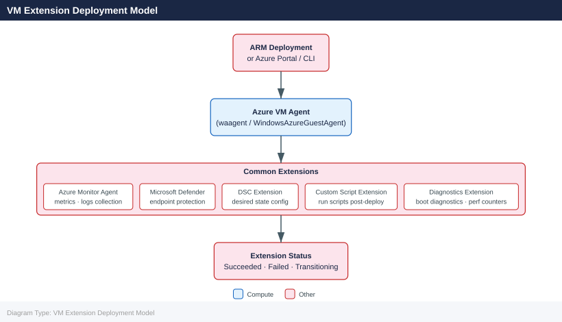

---
tags:
  - azure
description: "Azure VM Extensions are small applications that perform post-deployment configuration and automation tasks on Azure VMs. They are managed by the Azure VM..."
---
# VM Extensions

<div class="kb-summary">
Azure VM Extensions are small applications that perform post-deployment configuration and automation tasks on Azure VMs. They are managed by the Azure VM Agent and can be deployed at VM creation time or added afterward.

*Applies to: Azure*
</div>

---

## VM Extension Deployment Model



## Extension Architecture

| Component | Role |
|---|---|
| Azure VM Agent | Installed on every Azure VM; manages extension lifecycle |
| Extension Handler | Each extension has its own handler binary on the VM |
| Status File | Extensions report status back to the Azure fabric via JSON status files |
| Provisioning State | Succeeds / Failed / Transitioning |

```bash
# Check VM agent status and installed extensions
az vm show \
  --resource-group <rg> \
  --name <vm-name> \
  --query "{AgentStatus:instanceView.vmAgent.statuses[0].displayStatus, Extensions:instanceView.extensions[].{Name:name, Status:statuses[0].displayStatus}}" \
  --output json
```


```text title="Expected output"
{
  "AgentStatus": "Agent version 2.7.41964.1008 is running",
  "Extensions": [
    {
      "Name": "Microsoft.Compute.CustomScriptExtension",
      "Status": "Provisioning succeeded"
    },
    {
      "Name": "Microsoft.Azure.Security.Monitoring.AzureSecurityLinuxAgent",
      "Status": "Extension handler operation finished with status: success"
    },
    {
      "Name": "Microsoft.OSTCExtensions.LinuxDiagnostic",
      "Status": "Handler Status: success; Overall Provision Status: success"
    }
  ]
}
```

!!! warning "Common errors"
    | Error | Fix |
    |---|---|
    | `The resource 'Microsoft.Compute/virtualMachines/<vm-name>' under resource group '<rg>' was not found.` | Verify the resource group name and VM name are correct using `az vm list --resource-group <rg>`. |
    | `ERROR: The following arguments are required: --resource-group/-g, --name/-n` | Provide both `--resource-group` and `--name` parameters with actual values instead of placeholders. |
---

## Listing Extensions

```bash
# List all extensions installed on a VM
az vm extension list \
  --resource-group <rg> \
  --vm-name <vm-name> \
  --output table

# Show details of a specific extension
az vm extension show \
  --resource-group <rg> \
  --vm-name <vm-name> \
  --name <extension-name>

# List extensions available in Azure Marketplace for a given publisher
az vm extension image list \
  --publisher Microsoft.Azure.Diagnostics \
  --output table
```


```text title="Expected output"
Name                                Publisher                      Version  ProvisioningState
----------------------------------  ---------------------------  ---------  -------------------
CustomScriptExtension               Microsoft.Compute            1.10.12    Succeeded
DependencyAgentWindows              Microsoft.Azure.Monitoring   9.10.7     Succeeded
MicrosoftMonitoringAgent            Microsoft.EnterpriseCloud    1.0.11269  Succeeded

{
  "autoUpgradeMinorVersion": true,
  "forceUpdateTag": null,
  "id": "/subscriptions/a1b2c3d4-e5f6-7890-abcd-ef1234567890/resourceGroups/prod-rg/providers/Microsoft.Compute/virtualMachines/web-vm-01/extensions/CustomScriptExtension",
  "instanceView": {
    "name": "CustomScriptExtension",
    "statuses": [
      {
        "code": "ProvisioningState/succeeded",
        "displayStatus": "Provisioning succeeded",
        "level": "Info",
        "message": "Enable succeeded",
        "time": "2024-01-15T10:42:33.456789+00:00"
      }
    ],
    "substatuses": []
  },
  "name": "CustomScriptExtension",
  "protectedSettings": null,
  "publisher": "Microsoft.Compute",
  "resourceGroup": "prod-rg",
  "settings": {
    "commandToExecute": "powershell -ExecutionPolicy Unrestricted -File setup.ps1"
  },
  "type": "Microsoft.Compute/virtualMachines/extensions",
  "typeHandlerVersion": "1.10.12",
  "virtualMachineId": "/subscriptions/a1b2c3d4-e5f6-7890-abcd-ef1234567890/resourceGroups/prod-rg/providers/Microsoft.Compute/virtualMachines/web-vm-01"
}

Name                                 Version  OperatingSystem
-----------------------------------  -------  -----------------
MicrosoftMonitoringAgent             1.0.11   Windows
MicrosoftMonitoringAgent             1.0.10   Windows
DependencyAgentWindows               9.10.7   Windows
DependencyAgentWindows               9.10.6   Windows
...
```

!!! warning "Common errors"
    | Error | Fix |
    |---|---|
    | `The resource 'Microsoft.Compute/virtualMachines/<vm-name>/extensions/<extension-name>' under resource group '<rg>' was not found.` | Verify the extension name matches exactly using `az vm extension list` and check that the VM exists in the specified resource group. |
    | `ResourceGroupNotFound : Resource group '<rg>' could not be found.` | Confirm the resource group name is correct and exists in your subscription using `az group list`. |
    | `The client '<client-id>' with object id '<object-id>' does not have authorization to perform action 'Microsoft.Compute/virtualMachines/extensions/read' over scope '/subscriptions/<sub-id>/resourceGroups/<rg>/providers/Microsoft.Compute/virtualMachines/<vm-name>'.` | Ensure your Azure account has at least Reader role on the VM or resource group using `az role assignment list --scope /subscriptions/<sub- |
---

## Custom Script Extension

Runs arbitrary shell or PowerShell scripts on a VM after deployment. Useful for bootstrapping, configuration management, and one-time tasks.

```bash
# Run an inline script on a Linux VM
az vm extension set \
  --resource-group <rg> \
  --vm-name <vm-name> \
  --name CustomScript \
  --publisher Microsoft.Azure.Extensions \
  --version 2.1 \
  --settings '{"commandToExecute": "apt-get update && apt-get install -y nginx"}'

# Run a script from a storage blob on a Linux VM
az vm extension set \
  --resource-group <rg> \
  --vm-name <vm-name> \
  --name CustomScript \
  --publisher Microsoft.Azure.Extensions \
  --version 2.1 \
  --settings '{"fileUris": ["https://<storage>.blob.core.windows.net/scripts/setup.sh"]}' \
  --protected-settings '{"commandToExecute": "bash setup.sh"}'

# Run a PowerShell script on a Windows VM
az vm extension set \
  --resource-group <rg> \
  --vm-name <win-vm-name> \
  --name CustomScriptExtension \
  --publisher Microsoft.Compute \
  --settings '{"fileUris":["https://<storage>.blob.core.windows.net/scripts/setup.ps1"],"commandToExecute":"powershell.exe -ExecutionPolicy Unrestricted -File setup.ps1"}'
```


```text title="Expected output"
{
  "id": "/subscriptions/12a34b56-c789-0d12-e345-f67890123456/resourceGroups/prod-rg/providers/Microsoft.Compute/virtualMachines/web-vm-01/extensions/CustomScript",
  "name": "CustomScript",
  "provisioningState": "Succeeded",
  "publisher": "Microsoft.Azure.Extensions",
  "resourceGroup": "prod-rg",
  "typePropertiesType": "CustomScript",
  "typeHandlerVersion": "2.1",
  "virtualMachineExtensionType": "CustomScript"
}
{
  "id": "/subscriptions/12a34b56-c789-0d12-e345-f67890123456/resourceGroups/prod-rg/providers/Microsoft.Compute/virtualMachines/app-vm-02/extensions/CustomScript",
  "name": "CustomScript",
  "provisioningState": "Succeeded",
  "publisher": "Microsoft.Azure.Extensions",
  "resourceGroup": "prod-rg",
  "typePropertiesType": "CustomScript",
  "typeHandlerVersion": "2.1",
  "virtualMachineExtensionType": "CustomScript"
}
{
  "id": "/subscriptions/12a34b56-c789-0d12-e345-f67890123456/resourceGroups/prod-rg/providers/Microsoft.Compute/virtualMachines/win-vm-03/extensions/CustomScriptExtension",
  "name": "CustomScriptExtension",
  "provisioningState": "Succeeded",
  "publisher": "Microsoft.Compute",
  "resourceGroup": "prod-rg",
  "typePropertiesType": "CustomScriptExtension",
  "typeHandlerVersion": "2.0",
  "virtualMachineExtensionType": "CustomScriptExtension"
}
```

!!! warning "Common errors"
    | Error | Fix |
    |---|---|
    | `ResourceNotFound : The Resource 'Microsoft.Compute/virtualMachines/<vm-name>' under resource group '<rg>' was not found.` | Verify the VM name and resource group name are correct using `az vm list --resource-group <rg>`. |
    | `InvalidParameter : The value of parameter 'settings' is invalid.` | Ensure JSON in the `--settings` parameter is properly escaped and valid; test with `echo '{"commandToExecute": "..."}' | jq` before running. |
    | `AuthorizationFailed : The client '<user>' with object id '<id>' does not have authorization to perform action 'Microsoft.Compute/virtualMachines/extensions/write' over scope '<scope>'.` | Add the Contributor or Virtual Machine Contributor role to your Azure account for the target resource group. |
---

## Azure Monitor Agent (AMA) Extension

Replaces the legacy MMA/OMS agent for log and metric collection.

```bash
# Install Azure Monitor Agent on a Linux VM
az vm extension set \
  --resource-group <rg> \
  --vm-name <vm-name> \
  --name AzureMonitorLinuxAgent \
  --publisher Microsoft.Azure.Monitor \
  --version 1.28

# Install Azure Monitor Agent on a Windows VM
az vm extension set \
  --resource-group <rg> \
  --vm-name <win-vm-name> \
  --name AzureMonitorWindowsAgent \
  --publisher Microsoft.Azure.Monitor \
  --version 1.22
```


```text title="Expected output"
{
  "autoUpgradeMinorVersion": true,
  "enableAutomaticUpgrade": false,
  "forceUpdateTag": null,
  "id": "/subscriptions/a1b2c3d4-e5f6-4a7b-8c9d-0e1f2a3b4c5d/resourceGroups/prod-rg/providers/Microsoft.Compute/virtualMachines/linux-vm-01/extensions/AzureMonitorLinuxAgent",
  "instanceView": null,
  "name": "AzureMonitorLinuxAgent",
  "protectedSettings": null,
  "provisioningState": "Succeeded",
  "publisher": "Microsoft.Azure.Monitor",
  "resourceGroup": "prod-rg",
  "settings": null,
  "tags": null,
  "type": "Microsoft.Compute/virtualMachines/extensions",
  "typeHandlerVersion": "1.28",
  "virtualMachineExtensionType": "AzureMonitorLinuxAgent"
}
{
  "autoUpgradeMinorVersion": true,
  "enableAutomaticUpgrade": false,
  "forceUpdateTag": null,
  "id": "/subscriptions/a1b2c3d4-e5f6-4a7b-8c9d-0e1f2a3b4c5d/resourceGroups/prod-rg/providers/Microsoft.Compute/virtualMachines/win-vm-01/extensions/AzureMonitorWindowsAgent",
  "instanceView": null,
  "name": "AzureMonitorWindowsAgent",
  "protectedSettings": null,
  "provisioningState": "Succeeded",
  "publisher": "Microsoft.Azure.Monitor",
  "resourceGroup": "prod-rg",
  "settings": null,
  "tags": null,
  "type": "Microsoft.Compute/virtualMachines/extensions",
  "typeHandlerVersion": "1.22",
  "virtualMachineExtensionType": "AzureMonitorWindowsAgent"
}
```

!!! warning "Common errors"
    | Error | Fix |
    |---|---|
    | `ResourceNotFound : The Resource 'Microsoft.Compute/virtualMachines/<vm-name>' under resource group '<rg>' was not found.` | Verify the VM name and resource group name are correct and the VM exists in the specified subscription. |
    | `ExtensionAlreadyExists : Extension 'AzureMonitorLinuxAgent' already exists on virtual machine '<vm-name>'.` | Remove the existing extension with `az vm extension delete --resource-group <rg> --vm-name <vm-name> --name AzureMonitorLinuxAgent` before reinstalling. |
    | `InvalidApiVersionForOperation : The api-version '2021-03-01' does not support operations on 'Microsoft.Compute/virtualMachines/extensions'.` | Update the Azure CLI to the latest version with `az upgrade`. |
---

## Diagnostic Extension (LAD / WAD)

```bash
# Install Linux Diagnostic Extension (LAD 4.x)
az vm extension set \
  --resource-group <rg> \
  --vm-name <vm-name> \
  --name LinuxDiagnostic \
  --publisher Microsoft.Azure.Diagnostics \
  --version 4.0 \
  --settings @lad-settings.json \
  --protected-settings @lad-protected.json
```


```text title="Expected output"
{
  "id": "/subscriptions/12a34b56-c789-0d12-e345-f67890ab1234/resourceGroups/prod-rg/providers/Microsoft.Compute/virtualMachines/vm-prod-01/extensions/LinuxDiagnostic",
  "location": "eastus",
  "name": "LinuxDiagnostic",
  "properties": {
    "autoUpgradeMinorVersion": true,
    "provisioningState": "Succeeded",
    "publisher": "Microsoft.Azure.Diagnostics",
    "settings": {
      "StorageAccount": "diagstg12345",
      "ladCfg": {...}
    },
    "type": "LinuxDiagnostic",
    "typeHandlerVersion": "4.0",
    "protectedSettings": {
      "storageAccountName": "diagstg12345",
      "storageAccountSasToken": "sv=2021-06-08&ss=bfqt&srt=sco&sp=rwdlacupitfx&..."
    }
  },
  "type": "Microsoft.Compute/virtualMachines/extensions"
}
```

!!! warning "Common errors"
    | Error | Fix |
    |---|---|
    | `Error: The following arguments are required: --resource-group, --vm-name` | Ensure both `<rg>` and `<vm-name>` placeholders are replaced with actual resource group and VM names. |
    | `FileNotFoundError: [Errno 2] No such file or directory: 'lad-settings.json'` | Create the LAD configuration files in the current working directory or provide absolute paths (e.g., `@/path/to/lad-settings.json`). |
    | `BadRequest: The extension with publisher 'Microsoft.Azure.Diagnostics' and type 'LinuxDiagnostic' is not supported on this VM` | Verify the VM is running a supported Linux distribution (Ubuntu, CentOS, RHEL) and that the extension is available in your region. |
---

## Common Extension Reference

| Extension | Publisher | OS | Purpose |
|---|---|---|---|
| CustomScript | Microsoft.Azure.Extensions | Linux | Run scripts post-deploy |
| CustomScriptExtension | Microsoft.Compute | Windows | Run scripts post-deploy |
| AzureMonitorLinuxAgent | Microsoft.Azure.Monitor | Linux | Metrics and log collection |
| AzureMonitorWindowsAgent | Microsoft.Azure.Monitor | Windows | Metrics and log collection |
| AADSSHLoginForLinux | Microsoft.Azure.ActiveDirectory | Linux | SSH with Entra ID credentials |
| JsonADDomainExtension | Microsoft.Compute | Windows | Domain join |
| DependencyAgentLinux | Microsoft.Azure.Monitoring.DependencyAgent | Linux | VM Insights, service map |

---

## Removing an Extension

```bash
# Remove an extension from a VM
az vm extension delete \
  --resource-group <rg> \
  --vm-name <vm-name> \
  --name <extension-name>

# Force-delete a stuck extension
az vm extension delete \
  --resource-group <rg> \
  --vm-name <vm-name> \
  --name <extension-name> \
  --no-wait
```


```text title="Expected output"
(no output — command completes silently)
```

!!! warning "Common errors"
    | Error | Fix |
    |---|---|
    | `Extension '<extension-name>' was not found on virtual machine '<vm-name>'.` | Verify the extension name with `az vm extension list --resource-group <rg> --vm-name <vm-name>` and use the correct name from the output. |
    | `The client '<client-id>' with object id '<object-id>' does not have authorization to perform action 'Microsoft.Compute/virtualMachines/extensions/delete' over scope '/subscriptions/<sub-id>/resourceGroups/<rg>/providers/Microsoft.Compute/virtualMachines/<vm-name>/extensions/<extension-name>'.` | Ensure your Azure account has Contributor or Owner role on the resource group or VM. |
---

## Troubleshooting Extensions

```bash
# View extension provisioning state and status messages
az vm get-instance-view \
  --resource-group <rg> \
  --name <vm-name> \
  --query "instanceView.extensions[].{Name:name, State:statuses[0].displayStatus, Message:statuses[0].message}" \
  --output table

# Extension logs on Linux VM
# /var/log/azure/<ExtensionName>/<version>/extension.log

# Extension logs on Windows VM
# C:\WindowsAzure\Logs\Plugins\<ExtensionName>\<version>\
```


```text title="Expected output"
Name                                State                Message
----------------------------------  -------------------  ----------------------------------------
Microsoft.Compute/CustomScriptExtension  Provisioning succeeded  Enable extension succeeded
Microsoft.OSTCExtensions/OSPatchingExtension  Provisioning succeeded  Patching completed successfully
Microsoft.EnterpriseCloud.Monitoring/MicrosoftMonitoringAgent  Provisioning succeeded  Handler status: ready
Microsoft.Compute/VMAccessExtension  Provisioning succeeded  Enable extension succeeded
```

!!! warning "Common errors"
    | Error | Fix |
    |---|---|
    | `ERROR: (ResourceNotFound) The Resource 'Microsoft.Compute/virtualMachines/<vm-name>' under resource group '<rg>' was not found.` | Verify the resource group name and VM name are correct with `az vm list --resource-group <rg>`. |
    | `ERROR: The query resulted in no output. Verify the JMESPath query is valid.` | Check that the VM has extensions installed; if none exist, the query returns empty results—use `--query "instanceView.extensions"` without filtering to debug. |
    | `ERROR: (AuthorizationFailed) The client '<user>' with object id '<id>' does not have authorization to perform action 'Microsoft.Compute/virtualMachines/read' over scope '<scope>'.` | Ensure your Azure account has at least Reader role on the resource group with `az role assignment list --resource-group <rg>`. |