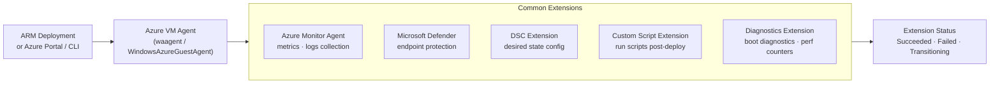

---
tags:
  - azure
---
# VM Extensions


<div class="kb-summary">
Azure VM Extensions are small applications that perform post-deployment configuration and automation tasks on Azure VMs. They are managed by the Azure VM Agent and can be deployed at VM creation time or added afterward.

*Applies to: Azure*
</div>
```text
┌───────────────────────────────────────── Cloud Azure Compute ─────────────────────────────────────────┐
│                                                                                                       │
│   ┌───────────────────────────────────────────────────────────────────────────────────────────────┐   │
│   │                              Azure: Cloud Azure Compute platform                              │   │
│   │                                  Protocols: Various protocols                                 │   │
│   │                       Management: Cloud Azure Compute management console                      │   │
│   │                Sections: Architecture · Operations · Security · Troubleshooting               │   │
│   └───────────────────────────────────────────────────────────────────────────────────────────────┘   │
│                                                                                                       │
│    Architecture → Operations → Security → Troubleshooting → Escalation                                │
│                                                                                                       │
│                  ▼                                ▼                                ▼                  │
│                                                                                                       │
│   ┌─────────────────────────────┐  ┌─────────────────────────────┐  ┌─────────────────────────────┐   │
│   │            Layer            │  │          Component          │  │            Notes            │   │
│   │             Core            │  │       Primary service       │  │        Main function        │   │
│   │          Management         │  │        Control plane        │  │         Admin access        │   │
│   │          Monitoring         │  │         Health/perf         │  │      Alerts/dashboards      │   │
│   │           Security          │  │         Auth/encrypt        │  │        Access control       │   │
│   │         Integration         │  │        APIs/plug-ins        │  │         Third-party         │   │
│   └─────────────────────────────┘  └─────────────────────────────┘  └─────────────────────────────┘   │
│                                                                                                       │
│                          ▼                                                 ▼                          │
│                                                                                                       │
│   ┌───────────────────────────────────────────────────────────────────────────────────────────────┐   │
│   │      Layer       │    Component     │      Function     │      Notes       │       Auth       │   │
│   │       Core       │ Primary service  │   Main function   │     See docs     │       RBAC       │   │
│   │    Management    │  Control plane   │    Admin access   │     See docs     │       RBAC       │   │
│   │    Monitoring    │   Health/perf    │  Alerts/dashboard │     See docs     │       RBAC       │   │
│   │     Security     │   Auth/encrypt   │   Access control  │     See docs     │       RBAC       │   │
│   └───────────────────────────────────────────────────────────────────────────────────────────────┘   │
│                                                                                                       │
│    Physical: Cloud Azure Compute infrastructure · management network · monitoring                     │
│                                                                                                       │
│    Key terms:                                                                                         │
│                                                                                                       │
│    Azure              = Cloud Azure Compute platform overview and core concepts                       │
│    Management         = management console and command-line interface for administration              │
│    Monitoring         = health and performance monitoring dashboards and alerting                     │
│    Automation         = REST API, scripting, and pipeline integration capabilities                    │
│    Security           = access control, authentication, and encryption configuration                  │
│    Backup             = backup and recovery procedures and schedule configuration                     │
│    Upgrade            = software version upgrades and firmware patching procedures                    │
│    Troubleshooting    = diagnostic procedures and common issue resolution steps                       │
│    Escalation         = vendor support escalation path and severity triage process                    │
│    Documentation      = vendor knowledge base and official product documentation                      │
│    Change management  = change ticket requirements for production modifications                       │
│    Audit log          = admin action logging for compliance and security review                       │
│                                                                                                       │
└───────────────────────────────────────────────────────────────────────────────────────────────────────┘
```


---

## VM Extension Deployment Model



## Extension Architecture

| Component | Role |
|---|---|
| Azure VM Agent | Installed on every Azure VM; manages extension lifecycle |
| Extension Handler | Each extension has its own handler binary on the VM |
| Status File | Extensions report status back to the Azure fabric via JSON status files |
| Provisioning State | Succeeds / Failed / Transitioning |

```bash
# Check VM agent status and installed extensions
az vm show \
  --resource-group <rg> \
  --name <vm-name> \
  --query "{AgentStatus:instanceView.vmAgent.statuses[0].displayStatus, Extensions:instanceView.extensions[].{Name:name, Status:statuses[0].displayStatus}}" \
  --output json
```

---

## Listing Extensions

```bash
# List all extensions installed on a VM
az vm extension list \
  --resource-group <rg> \
  --vm-name <vm-name> \
  --output table

# Show details of a specific extension
az vm extension show \
  --resource-group <rg> \
  --vm-name <vm-name> \
  --name <extension-name>

# List extensions available in Azure Marketplace for a given publisher
az vm extension image list \
  --publisher Microsoft.Azure.Diagnostics \
  --output table
```

---

## Custom Script Extension

Runs arbitrary shell or PowerShell scripts on a VM after deployment. Useful for bootstrapping, configuration management, and one-time tasks.

```bash
# Run an inline script on a Linux VM
az vm extension set \
  --resource-group <rg> \
  --vm-name <vm-name> \
  --name CustomScript \
  --publisher Microsoft.Azure.Extensions \
  --version 2.1 \
  --settings '{"commandToExecute": "apt-get update && apt-get install -y nginx"}'

# Run a script from a storage blob on a Linux VM
az vm extension set \
  --resource-group <rg> \
  --vm-name <vm-name> \
  --name CustomScript \
  --publisher Microsoft.Azure.Extensions \
  --version 2.1 \
  --settings '{"fileUris": ["https://<storage>.blob.core.windows.net/scripts/setup.sh"]}' \
  --protected-settings '{"commandToExecute": "bash setup.sh"}'

# Run a PowerShell script on a Windows VM
az vm extension set \
  --resource-group <rg> \
  --vm-name <win-vm-name> \
  --name CustomScriptExtension \
  --publisher Microsoft.Compute \
  --settings '{"fileUris":["https://<storage>.blob.core.windows.net/scripts/setup.ps1"],"commandToExecute":"powershell.exe -ExecutionPolicy Unrestricted -File setup.ps1"}'
```

---

## Azure Monitor Agent (AMA) Extension

Replaces the legacy MMA/OMS agent for log and metric collection.

```bash
# Install Azure Monitor Agent on a Linux VM
az vm extension set \
  --resource-group <rg> \
  --vm-name <vm-name> \
  --name AzureMonitorLinuxAgent \
  --publisher Microsoft.Azure.Monitor \
  --version 1.28

# Install Azure Monitor Agent on a Windows VM
az vm extension set \
  --resource-group <rg> \
  --vm-name <win-vm-name> \
  --name AzureMonitorWindowsAgent \
  --publisher Microsoft.Azure.Monitor \
  --version 1.22
```

---

## Diagnostic Extension (LAD / WAD)

```bash
# Install Linux Diagnostic Extension (LAD 4.x)
az vm extension set \
  --resource-group <rg> \
  --vm-name <vm-name> \
  --name LinuxDiagnostic \
  --publisher Microsoft.Azure.Diagnostics \
  --version 4.0 \
  --settings @lad-settings.json \
  --protected-settings @lad-protected.json
```

---

## Common Extension Reference

| Extension | Publisher | OS | Purpose |
|---|---|---|---|
| CustomScript | Microsoft.Azure.Extensions | Linux | Run scripts post-deploy |
| CustomScriptExtension | Microsoft.Compute | Windows | Run scripts post-deploy |
| AzureMonitorLinuxAgent | Microsoft.Azure.Monitor | Linux | Metrics and log collection |
| AzureMonitorWindowsAgent | Microsoft.Azure.Monitor | Windows | Metrics and log collection |
| AADSSHLoginForLinux | Microsoft.Azure.ActiveDirectory | Linux | SSH with Entra ID credentials |
| JsonADDomainExtension | Microsoft.Compute | Windows | Domain join |
| DependencyAgentLinux | Microsoft.Azure.Monitoring.DependencyAgent | Linux | VM Insights, service map |

---

## Removing an Extension

```bash
# Remove an extension from a VM
az vm extension delete \
  --resource-group <rg> \
  --vm-name <vm-name> \
  --name <extension-name>

# Force-delete a stuck extension
az vm extension delete \
  --resource-group <rg> \
  --vm-name <vm-name> \
  --name <extension-name> \
  --no-wait
```

---

## Troubleshooting Extensions

```bash
# View extension provisioning state and status messages
az vm get-instance-view \
  --resource-group <rg> \
  --name <vm-name> \
  --query "instanceView.extensions[].{Name:name, State:statuses[0].displayStatus, Message:statuses[0].message}" \
  --output table

# Extension logs on Linux VM
# /var/log/azure/<ExtensionName>/<version>/extension.log

# Extension logs on Windows VM
# C:\WindowsAzure\Logs\Plugins\<ExtensionName>\<version>\
```
