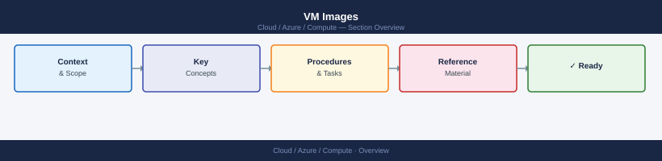
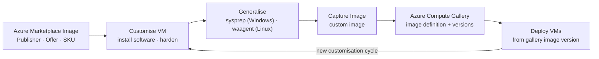

---
tags:
  - azure
---
# VM Images


<div class="kb-summary">
Azure VM images are the base OS configurations used to create virtual machines. This page covers Marketplace images, custom images, Azure Compute Gallery (ACG), and image versioning.

*Applies to: Azure*
</div>



---

## Azure Image Lifecycle



## Marketplace Images

```bash
# List all publishers in a region
az vm image list-publishers \
  --location eastus \
  --output table | head -30

# List offers from a specific publisher
az vm image list-offers \
  --location eastus \
  --publisher Canonical \
  --output table

# List SKUs for an offer
az vm image list-skus \
  --location eastus \
  --publisher Canonical \
  --offer 0001-com-ubuntu-server-jammy \
  --output table

# Get the latest version of a specific SKU
az vm image list \
  --location eastus \
  --publisher Canonical \
  --offer 0001-com-ubuntu-server-jammy \
  --sku 22_04-lts-gen2 \
  --all \
  --query "[-1]" \
  --output json

# Use a marketplace image URN to create a VM
az vm create \
  --resource-group <rg> \
  --name <vm-name> \
  --image Ubuntu2204 \
  --size Standard_D2s_v3 \
  --admin-username azureuser \
  --generate-ssh-keys
```

Common image aliases:

| Alias | Full URN |
|---|---|
| `Ubuntu2204` | Canonical:0001-com-ubuntu-server-jammy:22_04-lts-gen2:latest |
| `Ubuntu2404` | Canonical:ubuntu-24_04-lts:server:latest |
| `Win2022Datacenter` | MicrosoftWindowsServer:WindowsServer:2022-datacenter-g2:latest |
| `Win2019Datacenter` | MicrosoftWindowsServer:WindowsServer:2019-datacenter-gensecond:latest |
| `RHEL94` | RedHat:RHEL:9_4:latest |
| `Debian12` | Debian:debian-12:12:latest |

---

## Creating Custom Images

Before creating a custom image, the VM must be generalised (sysprep on Windows, waagent deprovision on Linux).

```bash
# Step 1: Generalise a Linux VM
az vm run-command invoke \
  --resource-group <rg> \
  --name <vm-name> \
  --command-id RunShellScript \
  --scripts "sudo waagent -deprovision+user -force"

# Step 2: Deallocate and generalise
az vm deallocate --resource-group <rg> --name <vm-name>
az vm generalize --resource-group <rg> --name <vm-name>

# Step 3: Create an image from the generalised VM
az image create \
  --resource-group <rg> \
  --name <image-name> \
  --source <vm-name> \
  --location eastus

# List custom images in a resource group
az image list --resource-group <rg> --output table

# Deploy a VM from a custom image
az vm create \
  --resource-group <rg> \
  --name <new-vm-name> \
  --image <image-resource-id> \
  --size Standard_D2s_v3 \
  --admin-username azureuser \
  --generate-ssh-keys
```

---

## Azure Compute Gallery (ACG)

ACG (formerly Shared Image Gallery) provides enterprise-grade image management with versioning, replication, and RBAC.

```bash
# Create an Azure Compute Gallery
az sig create \
  --resource-group <rg> \
  --gallery-name <gallery-name> \
  --location eastus

# Create an image definition in the gallery
az sig image-definition create \
  --resource-group <rg> \
  --gallery-name <gallery-name> \
  --gallery-image-definition <image-def-name> \
  --publisher MyOrg \
  --offer WebServer \
  --sku Ubuntu2204 \
  --os-type Linux \
  --os-state Generalized \
  --hyper-v-generation V2

# Create an image version from a managed image or VM
az sig image-version create \
  --resource-group <rg> \
  --gallery-name <gallery-name> \
  --gallery-image-definition <image-def-name> \
  --gallery-image-version 1.0.0 \
  --managed-image <image-resource-id> \
  --target-regions eastus=1 westeurope=1 \
  --replica-count 1
```

---

## Image Versioning and Replication

| Field | Description |
|---|---|
| Gallery Image Version | Semantic version, e.g. `1.0.0`, `2.1.3` |
| Target Regions | Regions where the version is replicated |
| Replica Count | Number of replicas per region (1–10) |
| End-of-Life Date | Date after which the version is hidden from `latest` |

```bash
# List all image versions for a definition
az sig image-version list \
  --resource-group <rg> \
  --gallery-name <gallery-name> \
  --gallery-image-definition <image-def-name> \
  --output table

# Deploy a VM from a gallery image version
az vm create \
  --resource-group <rg> \
  --name <vm-name> \
  --image "/subscriptions/<sub-id>/resourceGroups/<rg>/providers/Microsoft.Compute/galleries/<gallery>/images/<image-def>/versions/1.0.0" \
  --size Standard_D2s_v3 \
  --admin-username azureuser \
  --generate-ssh-keys

# Deprecate an old image version
az sig image-version update \
  --resource-group <rg> \
  --gallery-name <gallery-name> \
  --gallery-image-definition <image-def-name> \
  --gallery-image-version 1.0.0 \
  --end-of-life-date 2026-12-31
```

---

## Sharing Gallery Images

```bash
# Share the gallery with another subscription (RBAC)
az role assignment create \
  --assignee <principal-id> \
  --role "Reader" \
  --scope "/subscriptions/<sub-id>/resourceGroups/<rg>/providers/Microsoft.Compute/galleries/<gallery-name>"

# List all galleries accessible in the subscription
az sig list --output table
```
