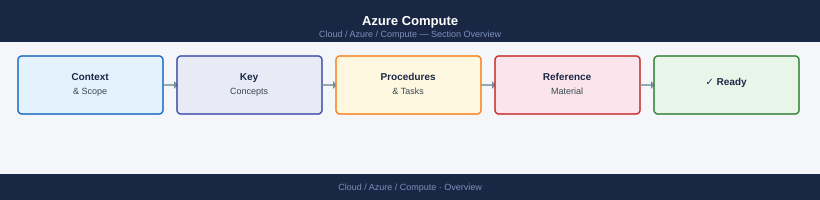

---
tags:
  - azure
---
# Azure Compute

Azure Compute articles, operational checks, troubleshooting notes, and references.

*Applies to: Azure*

## Articles

<a class="kb-card" href="availability-sets/">
  <strong>Availability Sets</strong>
  Fault domain and update domain grouping to protect VMs from planned and unplanned downtime.
</a>

<a class="kb-card" href="availability-zones/">
  <strong>Availability Zones</strong>
  Physically separate datacenter zones within an Azure region for high-availability deployments.
</a>

<a class="kb-card" href="boot-diagnostics/">
  <strong>Boot Diagnostics</strong>
  Screenshot and serial log capture for diagnosing VMs that won't boot or are unresponsive.
</a>

<a class="kb-card" href="extensions/">
  <strong>Extensions</strong>
  VM agent extensions for monitoring, antimalware, DSC, custom scripts, and diagnostics.
</a>

<a class="kb-card" href="images/">
  <strong>Images</strong>
  Custom and marketplace VM images, shared image gallery, and image lifecycle management.
</a>

<a class="kb-card" href="patching/">
  <strong>Patching</strong>
  Azure Update Manager and maintenance configurations for OS patch scheduling and compliance.
</a>

<a class="kb-card" href="serial-console/">
  <strong>Serial Console</strong>
  Out-of-band text console access to VMs and VMSS without needing network connectivity.
</a>

<a class="kb-card" href="virtual-machines/">
  <strong>Virtual Machines</strong>
  VM lifecycle management, sizing, availability, monitoring, and operational runbooks.
</a>

<a class="kb-card" href="vm-scale-sets/">
  <strong>VM Scale Sets</strong>
  Auto-scaling VM groups with uniform or flexible orchestration for stateless workloads.
</a>

