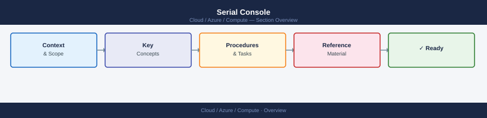

---
tags:
  - azure
---
# Serial Console


<div class="kb-summary">
Azure Serial Console provides out-of-band terminal access to a VM's serial port.

*Applies to: Azure*
</div>



---

```d2
direction: right

center: "Azure" {shape: hexagon}
accessing_the_serial_console: "Accessing the Serial Console" {shape: rectangle}
linux_serial_console: "Linux Serial Console" {shape: rectangle}
windows_serial_console_sac: "Windows Serial Console — SAC" {shape: rectangle}
enabling_sac_on_windows_if_not_preen: "Enabling SAC on Windows (if not pre-enabled)" {shape: rectangle}
troubleshooting_common_scenarios: "Troubleshooting Common Scenarios" {shape: rectangle}

center -> accessing_the_serial_console
center -> linux_serial_console
center -> windows_serial_console_sac
center -> enabling_sac_on_windows_if_not_preen
center -> troubleshooting_common_scenarios
```

## Accessing the Serial Console

Serial Console is accessed exclusively through the Azure portal:

1. Navigate to **Virtual Machines** > select VM > **Help** > **Serial console**
2. The portal connects to the VM's serial port and displays the current output buffer
3. Press **Enter** to send input if the prompt is idle

There is no `az` CLI command to directly open an interactive serial console session. However, you can verify readiness and collect the serial log programmatically.

```bash
# Get the serial log (non-interactive, last N KB of serial output)
az vm boot-diagnostics get-boot-log \
  --resource-group <rg> \
  --name <vm-name>

# Get URIs for both the log and screenshot
az vm boot-diagnostics get-boot-log-uris \
  --resource-group <rg> \
  --name <vm-name> \
  --output json
```

---

## Linux Serial Console

On Linux VMs, the serial console presents a login prompt on `ttyS0`. Common use cases:

```bash
# After logging in via the serial console (in-console commands):

# Check filesystem for errors (run from single-user mode)
fsck -y /dev/sda1

# Edit fstab if the VM won't boot due to bad mount entry
mount -o remount,rw /
vi /etc/fstab

# Unlock an SSH user (if locked out)
passwd azureuser

# Check network configuration
ip addr show
cat /etc/netplan/*.yaml

# Restart networking
systemctl restart systemd-networkd
```

To access GRUB on Linux via serial console, the VM must have `console=ttyS0` in its kernel command line. Most Azure marketplace images include this by default.

---

## Windows Serial Console — SAC

On Windows VMs, the Serial Console connects to the Special Administration Console (SAC). SAC requires EMS (Emergency Management Services) to be enabled.

```cmd
# From within SAC (entered after connecting via portal Serial Console):

# List running processes
cmd

# After 'cmd', switch to the command prompt channel
ch -si 1

# Inside the SAC cmd channel:

# Check disk
chkdsk C: /f

# View event logs
wevtutil qe System /c:20 /f:text

# Reset admin password
net user Administrator <NewPassword>

# Check network
ipconfig /all
netsh advfirewall show allprofiles
```

| SAC Command | Function |
|---|---|
| `cmd` | Open a new cmd.exe channel |
| `ch` | List active channels |
| `ch -si <n>` | Switch to channel n |
| `d` | Show system info |
| `i` | Show network config |
| `restart` | Reboot the machine |

---

## Enabling SAC on Windows (if not pre-enabled)

```bash
# Run via az vm run-command if the VM is still reachable via RDP/PowerShell
az vm run-command invoke \
  --resource-group <rg> \
  --name <win-vm-name> \
  --command-id RunPowerShellScript \
  --scripts "bcdedit /ems {current} on; bcdedit /emssettings EMSPORT:1 EMSBAUDRATE:115200; bcdedit /bootems {current} on"
```

---

## Troubleshooting Common Scenarios

| Scenario | Approach |
|---|---|
| VM stuck at GRUB (Linux) | Use serial console to select kernel or enter single-user mode |
| `fstab` error on boot (Linux) | Boot to emergency shell, fix `/etc/fstab`, remount, reboot |
| Windows BSOD loop | SAC cmd channel — run `chkdsk`, check MBR/BCD |
| Password locked (Linux) | Single-user mode, `passwd` command |
| SSH daemon not starting | Serial console, `systemctl status sshd`, check port/config |
| Network misconfiguration | Serial console, fix netplan/ifcfg, restart networking |

```bash
# After fixing the issue remotely, force VM restart
az vm restart \
  --resource-group <rg> \
  --name <vm-name>
```
