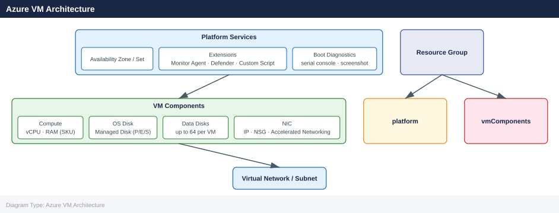
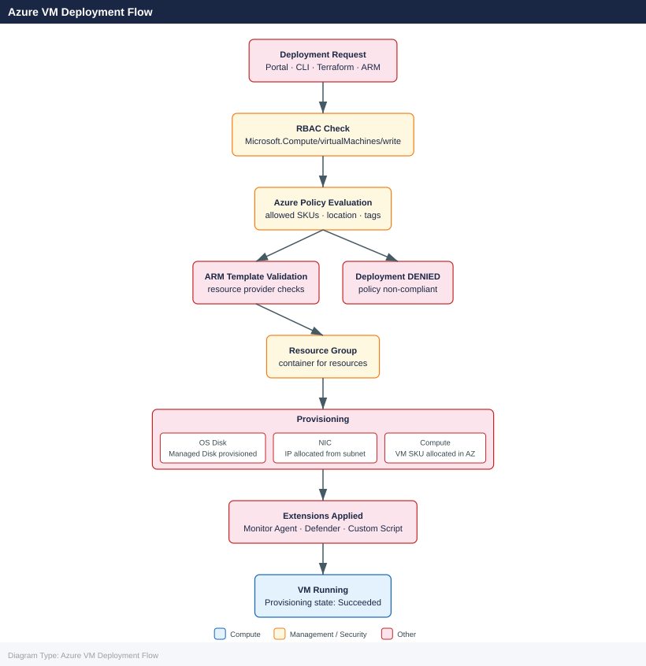

---
tags:
  - azure
---
# Virtual Machines

<div class="kb-summary">
Reference for creating, managing, sizing, and operating Azure Virtual Machines using the `az vm` CLI commands.

*Applies to: Azure*
</div>

---

## Azure VM Architecture



## Azure VM Deployment Flow



## Creating VMs

```bash
# Create a Linux VM with defaults
az vm create \
  --resource-group <rg> \
  --name <vm-name> \
  --image Ubuntu2204 \
  --size Standard_D2s_v3 \
  --admin-username azureuser \
  --generate-ssh-keys

# Create a Windows VM
az vm create \
  --resource-group <rg> \
  --name <win-vm-name> \
  --image Win2022Datacenter \
  --size Standard_D2s_v3 \
  --admin-username azureuser \
  --admin-password <password>

# Create a VM in a specific zone with a static private IP
az vm create \
  --resource-group <rg> \
  --name <vm-name> \
  --image Ubuntu2204 \
  --size Standard_D4s_v3 \
  --zone 1 \
  --vnet-name <vnet-name> \
  --subnet <subnet-name> \
  --private-ip-address 10.0.1.10 \
  --public-ip-sku Standard \
  --admin-username azureuser \
  --generate-ssh-keys \
  --tags env=prod role=webserver
```


```text title="Expected output"
{
  "fqdns": "vm-prod-01.eastus.cloudapp.azure.com",
  "id": "/subscriptions/12a34b5c-6789-0d1e-2f3g-4h5i6j7k8l9m/resourceGroups/prod-rg/providers/Microsoft.Compute/virtualMachines/vm-prod-01",
  "location": "eastus",
  "macAddress": "00:0D:3A:2F:5C:8E",
  "powerState": "VM running",
  "privateIpAddress": "10.0.1.4",
  "publicIpAddress": "20.45.123.67",
  "resourceGroup": "prod-rg",
  "zones": ""
}
{
  "fqdns": "win-vm-prod-01.eastus.cloudapp.azure.com",
  "id": "/subscriptions/12a34b5c-6789-0d1e-2f3g-4h5i6j7k8l9m/resourceGroups/prod-rg/providers/Microsoft.Compute/virtualMachines/win-vm-prod-01",
  "location": "eastus",
  "powerState": "VM running",
  "privateIpAddress": "10.0.1.5",
  "publicIpAddress": "20.45.124.89",
  "resourceGroup": "prod-rg"
}
{
  "fqdns": "vm-zoned-01.eastus.cloudapp.azure.com",
  "id": "/subscriptions/12a34b5c-6789-0d1e-2f3g-4h5i6j7k8l9m/resourceGroups/prod-rg/providers/Microsoft.Compute/virtualMachines/vm-zoned-01",
  "location": "eastus",
  "powerState": "VM running",
  "privateIpAddress": "10.0.1.10",
  "publicIpAddress": "20.45.125.42",
  "resourceGroup": "prod-rg",
  "zones": [
    "1"
  ]
}
```

!!! warning "Common errors"
    **`ResourceGroupNotFound`** — Verify the resource group exists in your subscription with `az group list` and use the correct `--resource-group` name.
    **`InvalidImageName`** — Use `az vm image list --output table` to find valid image names for your region, as image availability varies by location.
    **`PrivateIPAddressNotAvailable`** — Ensure the static IP address 10.0.1.10 is within the subnet range and not already assigned to another resource.
---

## VM Sizing

```bash
# List available VM sizes in a region
az vm list-sizes \
  --location eastus \
  --output table

# List sizes available for a VM (before resize)
az vm list-vm-resize-options \
  --resource-group <rg> \
  --name <vm-name> \
  --output table

# Resize an existing VM
az vm resize \
  --resource-group <rg> \
  --name <vm-name> \
  --size Standard_D4s_v3
```


```text title="Expected output"
Name                   NumberOfCores    MemoryInMB    ResourceDiskSizeInMB
---------------------  ---------------  -----------  ----------------------
Standard_B1s           1                 1024         4096
Standard_B2s           2                 4096         8192
Standard_D2s_v3        2                 8192         16384
Standard_D4s_v3        4                 16384        32768
Standard_D8s_v3        8                 32768        65536
...

Name                   NumberOfCores    MemoryInMB    ResourceDiskSizeInMB
---------------------  ---------------  -----------  ----------------------
Standard_D2s_v3        2                 8192         16384
Standard_D4s_v3        4                 16384        32768
Standard_D8s_v3        8                 32768        65536
Standard_E4s_v3        4                 32768        65536

(no output — command completes silently)
```

!!! warning "Common errors"
    **`The resource group '<rg>' could not be found.`** — Verify the resource group name with `az group list` and ensure you're using the correct subscription with `az account set --subscription <id>`.
    **`The virtual machine '<vm-name>' does not exist in the resource group '<rg>'.`** — Confirm the VM name with `az vm list --resource-group <rg>` and check that the VM is in the correct resource group.
    **`Operation failed with status: 'Conflict'. Details: The VM '<vm-name>' is currently in a running state. Please deallocate the VM before resizing.`** — Stop the VM first with `az vm deallocate --resource-group <rg> --name <vm-name>`, then retry the resize command.
Common VM size families:

| Family | Use Case | Example SKUs |
|---|---|---|
| Dsv5 / Dsv4 | General purpose (balanced) | Standard_D2s_v5, D4s_v5 |
| Esv5 / Esv4 | Memory-optimised | Standard_E4s_v5, E8s_v5 |
| Fsv2 | Compute-optimised | Standard_F4s_v2, F8s_v2 |
| Lsv3 | Storage-optimised (NVMe) | Standard_L8s_v3 |
| Msv3 | Large memory (SAP) | Standard_M8ms |
| NCasT4_v3 | GPU (inference) | Standard_NC4as_T4_v3 |

---

## Power State Operations

```bash
# Start a deallocated VM
az vm start --resource-group <rg> --name <vm-name>

# Stop (OS shutdown) — billing continues
az vm stop --resource-group <rg> --name <vm-name>

# Deallocate — stop billing for compute
az vm deallocate --resource-group <rg> --name <vm-name>

# Restart
az vm restart --resource-group <rg> --name <vm-name>

# Force delete (skip shutdown)
az vm delete --resource-group <rg> --name <vm-name> --force-deletion yes --yes

# Batch start all VMs in a resource group
az vm list --resource-group <rg> --query "[].name" --output tsv | \
  xargs -I {} az vm start --resource-group <rg> --name {}
```


```text title="Expected output"
{
  "id": "/subscriptions/12a34b56-c789-0d12-e345-f67890ab1cde/resourceGroups/prod-rg/providers/Microsoft.Compute/virtualMachines/web-vm-01",
  "name": "web-vm-01",
  "powerState": "VM running",
  "provisioningState": "Succeeded",
  "resourceGroup": "prod-rg"
}
{
  "id": "/subscriptions/12a34b56-c789-0d12-e345-f67890ab1cde/resourceGroups/prod-rg/providers/Microsoft.Compute/virtualMachines/web-vm-01",
  "name": "web-vm-01",
  "powerState": "VM stopped",
  "provisioningState": "Succeeded",
  "resourceGroup": "prod-rg"
}
{
  "id": "/subscriptions/12a34b56-c789-0d12-e345-f67890ab1cde/resourceGroups/prod-rg/providers/Microsoft.Compute/virtualMachines/web-vm-01",
  "name": "web-vm-01",
  "powerState": "VM deallocated",
  "provisioningState": "Succeeded",
  "resourceGroup": "prod-rg"
}
web-vm-01
web-vm-02
web-vm-03
{
  "powerState": "VM running",
  "provisioningState": "Succeeded"
}
{
  "powerState": "VM running",
  "provisioningState": "Succeeded"
}
```

!!! warning "Common errors"
    **`ResourceGroupNotFound : Resource group '<rg>' could not be found.`** — Verify the resource group name with `az group list` and use the correct spelling and subscription context.
    **`ResourceNotFound : The Resource 'Microsoft.Compute/virtualMachines/<vm-name>' under resource group '<rg>' was not found.`** — Confirm the VM name exists in the resource group using `az vm list --resource-group <rg>`.
    **`AuthorizationFailed : The client '<user-id>' with object id '<object-id>' does not have authorization to perform action 'Microsoft.Compute/virtualMachines/start/action' over scope '<resource-id>'.`** — Ensure your Azure account has Contributor or Virtual Machine Contributor role on the resource group.
---

## Disk Operations

```bash
# Add a new managed data disk to a running VM
az vm disk attach \
  --resource-group <rg> \
  --vm-name <vm-name> \
  --name <new-disk-name> \
  --new \
  --size-gb 256 \
  --sku Premium_LRS

# Attach an existing managed disk
az vm disk attach \
  --resource-group <rg> \
  --vm-name <vm-name> \
  --name <existing-disk-name>

# Detach a data disk
az vm disk detach \
  --resource-group <rg> \
  --vm-name <vm-name> \
  --name <disk-name>

# List disks attached to a VM
az vm show \
  --resource-group <rg> \
  --name <vm-name> \
  --query "storageProfile.dataDisks[].{Name:name, Lun:lun, SizeGB:diskSizeGb, Sku:managedDisk.storageAccountType}" \
  --output table
```


```text title="Expected output"
{
  "id": "/subscriptions/12a34b56-c789-0d12-e345-f67890ab1234/resourceGroups/prod-rg/providers/Microsoft.Compute/disks/datadisk-prod-256gb",
  "location": "eastus",
  "name": "datadisk-prod-256gb",
  "resourceGroup": "prod-rg",
  "sku": {
    "name": "Premium_LRS"
  },
  "timeCreated": "2024-01-15T10:23:45.123456+00:00"
}
(no output — command completes silently)
(no output — command completes silently)
Name                  Lun    SizeGB    Sku
--------------------  -----  --------  ---------------
datadisk-prod-256gb   0      256       Premium_LRS
datadisk-app-128gb    1      128       Standard_LRS
datadisk-backup-512   2      512       Premium_LRS
```

!!! warning "Common errors"
    **`ResourceNotFound: The Resource 'Microsoft.Compute/virtualMachines/<vm-name>' under resource group '<rg>' was not found.`** — Verify the resource group name and VM name are correct with `az vm list --resource-group <rg>`.
    **`The disk '<disk-name>' cannot be attached because it is already managed by another virtual machine.`** — Detach the disk from its current VM first using `az vm disk detach` before attaching it to a different VM.
---

## Networking

```bash
# List NICs attached to a VM
az vm show \
  --resource-group <rg> \
  --name <vm-name> \
  --query "networkProfile.networkInterfaces[].id" \
  --output tsv

# Add a public IP to an existing NIC
az network nic ip-config update \
  --resource-group <rg> \
  --nic-name <nic-name> \
  --name ipconfig1 \
  --public-ip-address <pip-name>

# Open a port in the NSG (quick rule for testing)
az vm open-port \
  --resource-group <rg> \
  --name <vm-name> \
  --port 443

# Get the public IP of a VM
az vm list-ip-addresses \
  --resource-group <rg> \
  --name <vm-name> \
  --output table
```


```text title="Expected output"
/subscriptions/12a4b5c6-d7e8-4f9a-b0c1-2d3e4f5a6b7c/resourceGroups/prod-rg/providers/Microsoft.Network/networkInterfaces/vm-prod-nic-01

(no output — command completes silently)

{
  "etag": "W/\"a1b2c3d4-e5f6-4a7b-8c9d-0e1f2a3b4c5d\"",
  "id": "/subscriptions/12a4b5c6-d7e8-4f9a-b0c1-2d3e4f5a6b7c/resourceGroups/prod-rg/providers/Microsoft.Network/networkSecurityGroups/vm-prod-nsg/securityRules/open-port-443-tcp",
  "name": "open-port-443-tcp",
  "priority": 100,
  "protocol": "Tcp",
  "sourcePortRange": "*",
  "destinationPortRange": "443"
}

VirtualMachine    PublicIPAddresses    PrivateIPAddresses
----------------  -------------------  --------------------
vm-prod-01        203.0.113.45         10.0.1.42
```

!!! warning "Common errors"
    **`The NIC 'nic-name' does not exist in the resource group 'rg'.`** — Verify the NIC name with `az network nic list --resource-group <rg>` and use the correct name.
    **`The public IP address 'pip-name' does not exist in the resource group 'rg'.`** — Create the public IP first with `az network public-ip create --resource-group <rg> --name <pip-name>` or use an existing one.
    **`(ResourceNotFound) No virtual machines found with name 'vm-name' in resource group 'rg'.`** — Confirm the VM name and resource group are correct using `az vm list --resource-group <rg>`.
---

## Running Commands on a VM

```bash
# Run a shell command on a Linux VM without SSH
az vm run-command invoke \
  --resource-group <rg> \
  --name <vm-name> \
  --command-id RunShellScript \
  --scripts "df -h && free -m && uptime"

# Run a PowerShell command on a Windows VM
az vm run-command invoke \
  --resource-group <rg> \
  --name <win-vm-name> \
  --command-id RunPowerShellScript \
  --scripts "Get-Process | Sort-Object CPU -Descending | Select-Object -First 10"
```


```text title="Expected output"
{
  "value": [
    {
      "code": "ProvisioningState/succeeded",
      "displayStatus": "Provision succeeded",
      "message": "Filesystem     Size  Used Avail Use% Mounted on\n/dev/sda1       30G  8.2G   21G  28% /\n/dev/sdb1      100G  45G   55G  45% /mnt/data\ntmpfs          3.9G     0  3.9G   0% /dev/shm\n\n              total        used        free      shared  buff/cache   available\nMem:           7872        2145        3421         156        2306        5234\nSwap:          2048         512        1536\n\n 10:34:22 up 45 days, 12:18,  2 users,  load average: 0.42, 0.38, 0.35"
    }
  ]
}
{
  "value": [
    {
      "code": "ProvisioningState/succeeded",
      "displayStatus": "Provision succeeded",
      "message": "Handles  NPM(K)    PM(K)      WS(K)     CPU(s)     Id  SI ProcessName\n-------  ------    -----      -----     ------     --  -- -----------\n    892      45    892156     1245632      156.2   4521   0 sqlservr\n    654      32    756234      987654       98.7   3892   0 w3wp\n    421      18    345678      456789       45.3   2156   0 svchost\n    389      22    234567      345678       32.1   1987   0 mssearch\n    267      15    123456      234567       18.9   1654   0 LogonUI\n    198      12     98765      156789       12.4   1423   0 csrss\n    145       8     67890      123456        8.7   1234   0 services\n    112       6     45678       98765        5.2   1045   0 lsass\n    89        4     34567       78901        3.1    892   0 svchost\n    67        3     23456       56789        1.8    654   0 conhost"
    }
  ]
}
```

!!! warning "Common errors"
    **`ResourceNotFound: The Resource 'Microsoft.Compute/virtualMachines/<vm-name>' under resource group '<rg>' was not found.`** — Verify the resource group name and VM name are correct using `az vm list --resource-group <rg>`.
    **`AuthorizationFailed: The client '<user-id>' with object id '<object-id>' does not have authorization to perform action 'Microsoft.Compute/virtualMachines/runCommands/action' over scope '<subscription-id>'.`** — Ensure your Azure account has the Virtual Machine Contributor role or higher on the target VM or resource group.
---

## Monitoring and Health

```bash
# Show VM power state and provisioning state
az vm show \
  --resource-group <rg> \
  --name <vm-name> \
  --show-details \
  --query "{PowerState:powerState, ProvisioningState:provisioningState}" \
  --output table

# Get instance view (agent status, extension status, disk statuses)
az vm get-instance-view \
  --resource-group <rg> \
  --name <vm-name> \
  --query "instanceView.{Agent:vmAgent.statuses[0].displayStatus, Disks:disks[].statuses[0].displayStatus}" \
  --output json

# List all VMs across all resource groups in a subscription
az vm list --show-details \
  --query "[].{Name:name, RG:resourceGroup, Size:hardwareProfile.vmSize, State:powerState, Location:location}" \
  --output table
```


```text title="Expected output"
PowerState    ProvisioningState
-----------   -----------------
VM running    Succeeded

{
  "Agent": "Guest Agent Status: Ready",
  "Disks": [
    "Disk is Healthy"
  ]
}

Name              RG                Size           State        Location
----------------  ----------------  -----------    -----------  ----------
prod-web-01       prod-rg            Standard_D2s   VM running   eastus
prod-web-02       prod-rg            Standard_D2s   VM running   eastus
prod-db-01        prod-rg            Standard_E4s   VM running   eastus
dev-test-vm       dev-rg             Standard_B2s   VM stopped   westus2
staging-app-01    staging-rg         Standard_D4s   VM running   centralus
...
```

!!! warning "Common errors"
    **`ResourceGroupNotFound`** — Verify the resource group name with `az group list` and ensure you have access to the subscription.
    **`ResourceNotFound`** — Confirm the VM name is correct and exists in the specified resource group using `az vm list --resource-group <rg>`.
    **`AuthorizationFailed`** — Ensure your Azure CLI session is authenticated with `az login` and has Reader or higher permissions on the target subscription.