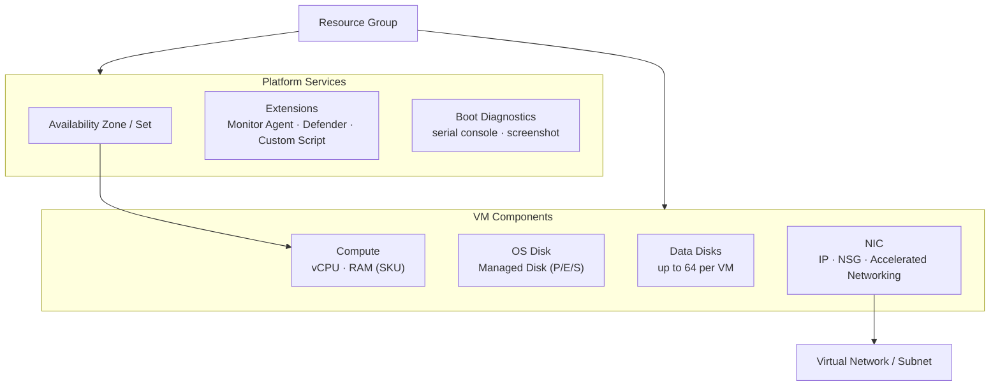
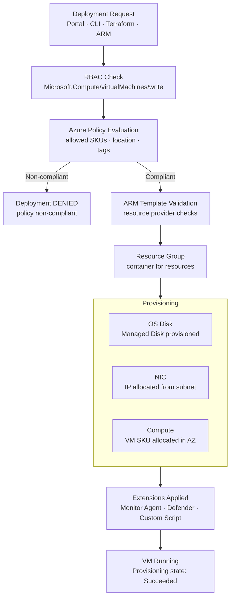

# Virtual Machines


<div class="kb-summary">
Reference for creating, managing, sizing, and operating Azure Virtual Machines using the `az vm` CLI commands.
</div>
```text
┌───────────────────────────────────────── Cloud Azure Compute ─────────────────────────────────────────┐
│                                                                                                       │
│   ┌───────────────────────────────────────────────────────────────────────────────────────────────┐   │
│   │                              Azure: Cloud Azure Compute platform                              │   │
│   │                                  Protocols: Various protocols                                 │   │
│   │                       Management: Cloud Azure Compute management console                      │   │
│   │                Sections: Architecture · Operations · Security · Troubleshooting               │   │
│   └───────────────────────────────────────────────────────────────────────────────────────────────┘   │
│                                                                                                       │
│    Architecture → Operations → Security → Troubleshooting → Escalation                                │
│                                                                                                       │
│                  ▼                                ▼                                ▼                  │
│                                                                                                       │
│   ┌─────────────────────────────┐  ┌─────────────────────────────┐  ┌─────────────────────────────┐   │
│   │            Layer            │  │          Component          │  │            Notes            │   │
│   │             Core            │  │       Primary service       │  │        Main function        │   │
│   │          Management         │  │        Control plane        │  │         Admin access        │   │
│   │          Monitoring         │  │         Health/perf         │  │      Alerts/dashboards      │   │
│   │           Security          │  │         Auth/encrypt        │  │        Access control       │   │
│   │         Integration         │  │        APIs/plug-ins        │  │         Third-party         │   │
│   └─────────────────────────────┘  └─────────────────────────────┘  └─────────────────────────────┘   │
│                                                                                                       │
│                          ▼                                                 ▼                          │
│                                                                                                       │
│   ┌───────────────────────────────────────────────────────────────────────────────────────────────┐   │
│   │      Layer       │    Component     │      Function     │      Notes       │       Auth       │   │
│   │       Core       │ Primary service  │   Main function   │     See docs     │       RBAC       │   │
│   │    Management    │  Control plane   │    Admin access   │     See docs     │       RBAC       │   │
│   │    Monitoring    │   Health/perf    │  Alerts/dashboard │     See docs     │       RBAC       │   │
│   │     Security     │   Auth/encrypt   │   Access control  │     See docs     │       RBAC       │   │
│   └───────────────────────────────────────────────────────────────────────────────────────────────┘   │
│                                                                                                       │
│    Physical: Cloud Azure Compute infrastructure · management network · monitoring                     │
│                                                                                                       │
│    Key terms:                                                                                         │
│                                                                                                       │
│    Azure              = Cloud Azure Compute platform overview and core concepts                       │
│    Management         = management console and command-line interface for administration              │
│    Monitoring         = health and performance monitoring dashboards and alerting                     │
│    Automation         = REST API, scripting, and pipeline integration capabilities                    │
│    Security           = access control, authentication, and encryption configuration                  │
│    Backup             = backup and recovery procedures and schedule configuration                     │
│    Upgrade            = software version upgrades and firmware patching procedures                    │
│    Troubleshooting    = diagnostic procedures and common issue resolution steps                       │
│    Escalation         = vendor support escalation path and severity triage process                    │
│    Documentation      = vendor knowledge base and official product documentation                      │
│    Change management  = change ticket requirements for production modifications                       │
│    Audit log          = admin action logging for compliance and security review                       │
│                                                                                                       │
└───────────────────────────────────────────────────────────────────────────────────────────────────────┘
```


---

## Azure VM Architecture



## Azure VM Deployment Flow



## Creating VMs

```bash
# Create a Linux VM with defaults
az vm create \
  --resource-group <rg> \
  --name <vm-name> \
  --image Ubuntu2204 \
  --size Standard_D2s_v3 \
  --admin-username azureuser \
  --generate-ssh-keys

# Create a Windows VM
az vm create \
  --resource-group <rg> \
  --name <win-vm-name> \
  --image Win2022Datacenter \
  --size Standard_D2s_v3 \
  --admin-username azureuser \
  --admin-password <password>

# Create a VM in a specific zone with a static private IP
az vm create \
  --resource-group <rg> \
  --name <vm-name> \
  --image Ubuntu2204 \
  --size Standard_D4s_v3 \
  --zone 1 \
  --vnet-name <vnet-name> \
  --subnet <subnet-name> \
  --private-ip-address 10.0.1.10 \
  --public-ip-sku Standard \
  --admin-username azureuser \
  --generate-ssh-keys \
  --tags env=prod role=webserver
```

---

## VM Sizing

```bash
# List available VM sizes in a region
az vm list-sizes \
  --location eastus \
  --output table

# List sizes available for a VM (before resize)
az vm list-vm-resize-options \
  --resource-group <rg> \
  --name <vm-name> \
  --output table

# Resize an existing VM
az vm resize \
  --resource-group <rg> \
  --name <vm-name> \
  --size Standard_D4s_v3
```

Common VM size families:

| Family | Use Case | Example SKUs |
|---|---|---|
| Dsv5 / Dsv4 | General purpose (balanced) | Standard_D2s_v5, D4s_v5 |
| Esv5 / Esv4 | Memory-optimised | Standard_E4s_v5, E8s_v5 |
| Fsv2 | Compute-optimised | Standard_F4s_v2, F8s_v2 |
| Lsv3 | Storage-optimised (NVMe) | Standard_L8s_v3 |
| Msv3 | Large memory (SAP) | Standard_M8ms |
| NCasT4_v3 | GPU (inference) | Standard_NC4as_T4_v3 |

---

## Power State Operations

```bash
# Start a deallocated VM
az vm start --resource-group <rg> --name <vm-name>

# Stop (OS shutdown) — billing continues
az vm stop --resource-group <rg> --name <vm-name>

# Deallocate — stop billing for compute
az vm deallocate --resource-group <rg> --name <vm-name>

# Restart
az vm restart --resource-group <rg> --name <vm-name>

# Force delete (skip shutdown)
az vm delete --resource-group <rg> --name <vm-name> --force-deletion yes --yes

# Batch start all VMs in a resource group
az vm list --resource-group <rg> --query "[].name" --output tsv | \
  xargs -I {} az vm start --resource-group <rg> --name {}
```

---

## Disk Operations

```bash
# Add a new managed data disk to a running VM
az vm disk attach \
  --resource-group <rg> \
  --vm-name <vm-name> \
  --name <new-disk-name> \
  --new \
  --size-gb 256 \
  --sku Premium_LRS

# Attach an existing managed disk
az vm disk attach \
  --resource-group <rg> \
  --vm-name <vm-name> \
  --name <existing-disk-name>

# Detach a data disk
az vm disk detach \
  --resource-group <rg> \
  --vm-name <vm-name> \
  --name <disk-name>

# List disks attached to a VM
az vm show \
  --resource-group <rg> \
  --name <vm-name> \
  --query "storageProfile.dataDisks[].{Name:name, Lun:lun, SizeGB:diskSizeGb, Sku:managedDisk.storageAccountType}" \
  --output table
```

---

## Networking

```bash
# List NICs attached to a VM
az vm show \
  --resource-group <rg> \
  --name <vm-name> \
  --query "networkProfile.networkInterfaces[].id" \
  --output tsv

# Add a public IP to an existing NIC
az network nic ip-config update \
  --resource-group <rg> \
  --nic-name <nic-name> \
  --name ipconfig1 \
  --public-ip-address <pip-name>

# Open a port in the NSG (quick rule for testing)
az vm open-port \
  --resource-group <rg> \
  --name <vm-name> \
  --port 443

# Get the public IP of a VM
az vm list-ip-addresses \
  --resource-group <rg> \
  --name <vm-name> \
  --output table
```

---

## Running Commands on a VM

```bash
# Run a shell command on a Linux VM without SSH
az vm run-command invoke \
  --resource-group <rg> \
  --name <vm-name> \
  --command-id RunShellScript \
  --scripts "df -h && free -m && uptime"

# Run a PowerShell command on a Windows VM
az vm run-command invoke \
  --resource-group <rg> \
  --name <win-vm-name> \
  --command-id RunPowerShellScript \
  --scripts "Get-Process | Sort-Object CPU -Descending | Select-Object -First 10"
```

---

## Monitoring and Health

```bash
# Show VM power state and provisioning state
az vm show \
  --resource-group <rg> \
  --name <vm-name> \
  --show-details \
  --query "{PowerState:powerState, ProvisioningState:provisioningState}" \
  --output table

# Get instance view (agent status, extension status, disk statuses)
az vm get-instance-view \
  --resource-group <rg> \
  --name <vm-name> \
  --query "instanceView.{Agent:vmAgent.statuses[0].displayStatus, Disks:disks[].statuses[0].displayStatus}" \
  --output json

# List all VMs across all resource groups in a subscription
az vm list --show-details \
  --query "[].{Name:name, RG:resourceGroup, Size:hardwareProfile.vmSize, State:powerState, Location:location}" \
  --output table
```
