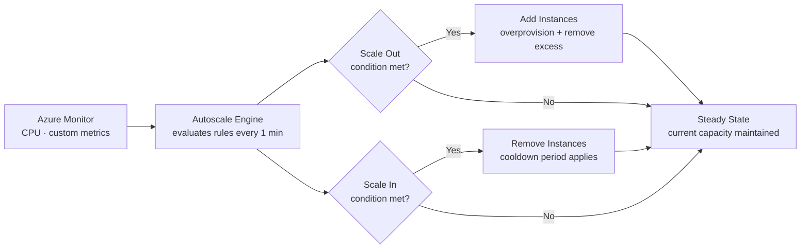

---
tags:
  - azure
---
# VM Scale Sets


<div class="kb-summary">
Azure Virtual Machine Scale Sets (VMSS) allow you to deploy and manage a group of identical, load-balanced VMs that can automatically scale in or out based on demand or a defined schedule.

*Applies to: Azure*
</div>
```text
┌───────────────────────────────────────── Cloud Azure Compute ─────────────────────────────────────────┐
│                                                                                                       │
│   ┌───────────────────────────────────────────────────────────────────────────────────────────────┐   │
│   │                              Azure: Cloud Azure Compute platform                              │   │
│   │                                  Protocols: Various protocols                                 │   │
│   │                       Management: Cloud Azure Compute management console                      │   │
│   │                Sections: Architecture · Operations · Security · Troubleshooting               │   │
│   └───────────────────────────────────────────────────────────────────────────────────────────────┘   │
│                                                                                                       │
│    Architecture → Operations → Security → Troubleshooting → Escalation                                │
│                                                                                                       │
│                  ▼                                ▼                                ▼                  │
│                                                                                                       │
│   ┌─────────────────────────────┐  ┌─────────────────────────────┐  ┌─────────────────────────────┐   │
│   │            Layer            │  │          Component          │  │            Notes            │   │
│   │             Core            │  │       Primary service       │  │        Main function        │   │
│   │          Management         │  │        Control plane        │  │         Admin access        │   │
│   │          Monitoring         │  │         Health/perf         │  │      Alerts/dashboards      │   │
│   │           Security          │  │         Auth/encrypt        │  │        Access control       │   │
│   │         Integration         │  │        APIs/plug-ins        │  │         Third-party         │   │
│   └─────────────────────────────┘  └─────────────────────────────┘  └─────────────────────────────┘   │
│                                                                                                       │
│                          ▼                                                 ▼                          │
│                                                                                                       │
│   ┌───────────────────────────────────────────────────────────────────────────────────────────────┐   │
│   │      Layer       │    Component     │      Function     │      Notes       │       Auth       │   │
│   │       Core       │ Primary service  │   Main function   │     See docs     │       RBAC       │   │
│   │    Management    │  Control plane   │    Admin access   │     See docs     │       RBAC       │   │
│   │    Monitoring    │   Health/perf    │  Alerts/dashboard │     See docs     │       RBAC       │   │
│   │     Security     │   Auth/encrypt   │   Access control  │     See docs     │       RBAC       │   │
│   └───────────────────────────────────────────────────────────────────────────────────────────────┘   │
│                                                                                                       │
│    Physical: Cloud Azure Compute infrastructure · management network · monitoring                     │
│                                                                                                       │
│    Key terms:                                                                                         │
│                                                                                                       │
│    Azure              = Cloud Azure Compute platform overview and core concepts                       │
│    Management         = management console and command-line interface for administration              │
│    Monitoring         = health and performance monitoring dashboards and alerting                     │
│    Automation         = REST API, scripting, and pipeline integration capabilities                    │
│    Security           = access control, authentication, and encryption configuration                  │
│    Backup             = backup and recovery procedures and schedule configuration                     │
│    Upgrade            = software version upgrades and firmware patching procedures                    │
│    Troubleshooting    = diagnostic procedures and common issue resolution steps                       │
│    Escalation         = vendor support escalation path and severity triage process                    │
│    Documentation      = vendor knowledge base and official product documentation                      │
│    Change management  = change ticket requirements for production modifications                       │
│    Audit log          = admin action logging for compliance and security review                       │
│                                                                                                       │
└───────────────────────────────────────────────────────────────────────────────────────────────────────┘
```


---

## VMSS Autoscale Flow



## Core Concepts

| Concept | Description |
|---|---|
| Orchestration Mode | Uniform (identical VMs) or Flexible (mix of VMs, recommended for new deployments) |
| Upgrade Policy | Automatic, Rolling, or Manual — controls how instance updates are applied |
| Overprovision | Azure creates extra VMs temporarily to speed up scale-out, then deletes excess |
| Capacity | Current number of running instances |
| Autoscale | Rules-based or scheduled scaling |

---

## Creating a Scale Set

```bash
# Create a basic Linux scale set (Flexible orchestration, zone-spanning)
az vmss create \
  --resource-group <rg> \
  --name <vmss-name> \
  --image Ubuntu2204 \
  --vm-sku Standard_D2s_v3 \
  --instance-count 2 \
  --admin-username azureuser \
  --generate-ssh-keys \
  --orchestration-mode Flexible \
  --zones 1 2 3

# Create a Windows scale set with a load balancer
az vmss create \
  --resource-group <rg> \
  --name <vmss-name> \
  --image Win2022Datacenter \
  --vm-sku Standard_D2s_v3 \
  --instance-count 2 \
  --admin-username azureuser \
  --admin-password <password> \
  --orchestration-mode Uniform \
  --load-balancer <lb-name> \
  --backend-pool-name <pool-name>

# List all scale sets in a resource group
az vmss list \
  --resource-group <rg> \
  --output table
```

---

## Scaling Operations

```bash
# Manually scale out to 5 instances
az vmss scale \
  --resource-group <rg> \
  --name <vmss-name> \
  --new-capacity 5

# Scale in to 2 instances
az vmss scale \
  --resource-group <rg> \
  --name <vmss-name> \
  --new-capacity 2

# Show current capacity
az vmss show \
  --resource-group <rg> \
  --name <vmss-name> \
  --query "sku.{Capacity:capacity, Name:name, Tier:tier}" \
  --output table

# List all instances in the scale set
az vmss list-instances \
  --resource-group <rg> \
  --name <vmss-name> \
  --output table
```

---

## Autoscale Rules

```bash
# Enable autoscale with min 2, max 10, default 2 instances
az monitor autoscale create \
  --resource-group <rg> \
  --resource <vmss-resource-id> \
  --resource-type Microsoft.Compute/virtualMachineScaleSets \
  --name <autoscale-name> \
  --min-count 2 \
  --max-count 10 \
  --count 2

# Add a scale-out rule (CPU > 70% for 5 minutes — add 2 instances)
az monitor autoscale rule create \
  --resource-group <rg> \
  --autoscale-name <autoscale-name> \
  --condition "Percentage CPU > 70 avg 5m" \
  --scale out 2

# Add a scale-in rule (CPU < 30% for 10 minutes — remove 1 instance)
az monitor autoscale rule create \
  --resource-group <rg> \
  --autoscale-name <autoscale-name> \
  --condition "Percentage CPU < 30 avg 10m" \
  --scale in 1

# List autoscale settings
az monitor autoscale list \
  --resource-group <rg> \
  --output table
```

---

## Upgrade Policies

| Policy | Behaviour |
|---|---|
| Automatic | Azure upgrades all instances immediately when the model changes |
| Rolling | Instances are updated in batches, maintains availability |
| Manual | Operator manually triggers upgrades per instance |

```bash
# Change upgrade policy to Rolling
az vmss update \
  --resource-group <rg> \
  --name <vmss-name> \
  --set upgradePolicy.mode=Rolling \
  --set upgradePolicy.rollingUpgradePolicy.maxBatchInstancePercent=20 \
  --set upgradePolicy.rollingUpgradePolicy.maxUnhealthyInstancePercent=20

# Manually upgrade specific instances
az vmss update-instances \
  --resource-group <rg> \
  --name <vmss-name> \
  --instance-ids 0 1 2
```

---

## Health Probes and Automatic Repairs

```bash
# Enable application health extension for automatic repair
az vmss extension set \
  --resource-group <rg> \
  --vmss-name <vmss-name> \
  --name ApplicationHealthLinux \
  --publisher Microsoft.ManagedServices \
  --version 1.0 \
  --settings '{"protocol": "http", "port": 80, "requestPath": "/health"}'

# Enable automatic repairs on the scale set
az vmss update \
  --resource-group <rg> \
  --name <vmss-name> \
  --enable-automatic-repairs true \
  --automatic-repairs-grace-period PT30M
```

---

## Instance Operations

```bash
# Restart a specific instance
az vmss restart \
  --resource-group <rg> \
  --name <vmss-name> \
  --instance-ids 0

# Deallocate a specific instance
az vmss deallocate \
  --resource-group <rg> \
  --name <vmss-name> \
  --instance-ids 1

# Delete a specific instance
az vmss delete-instances \
  --resource-group <rg> \
  --name <vmss-name> \
  --instance-ids 2

# Run a command on all instances in the set
az vmss run-command invoke \
  --resource-group <rg> \
  --name <vmss-name> \
  --command-id RunShellScript \
  --instance-id 0 \
  --scripts "systemctl status nginx"
```

---

## Scale Set Reference Table

| Setting | Uniform Mode | Flexible Mode |
|---|---|---|
| Identical VM config | Required | Optional |
| Max instances | 1000 (with placement groups) | 1000 |
| Mix VM sizes | No | Yes |
| Standalone VM support | No | Yes |
| Recommended for new workloads | No | Yes |
