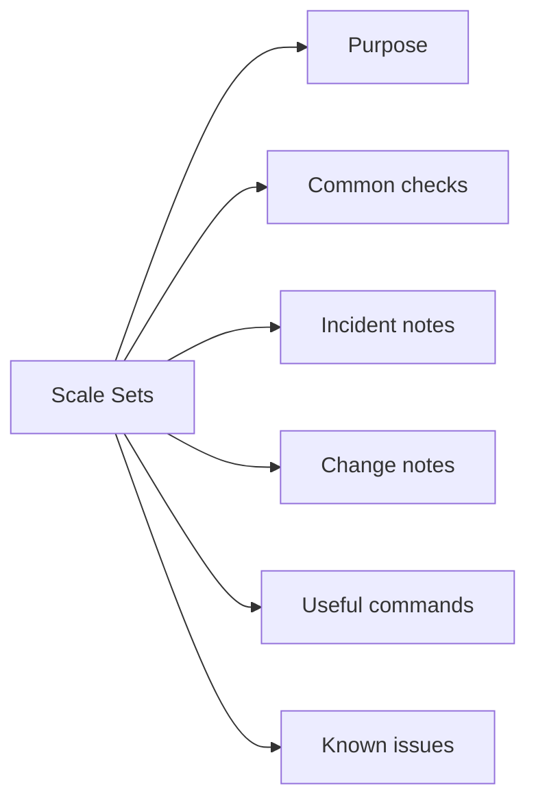

# Vm Scale Sets

## Purpose

Use this page for practical Azure Compute Vm Scale Sets notes, checks, troubleshooting, commands, change notes, and field references.

## Common checks

- Confirm subscription
- Confirm resource group
- Confirm region
- Review active alerts
- Review recent changes
- Check activity logs
- Check permissions
- Capture current state before changes

## Incident notes

Capture:

- Symptom
- Start time
- Impact
- Subscription
- Resource group
- Resource name
- Error message
- What changed
- What was checked
- Next action

## Change notes

- Confirm change approval
- Confirm maintenance window
- Confirm rollback plan
- Capture current state
- Make one change at a time
- Validate after the change

## Useful commands

Add tested Azure CLI or PowerShell commands here.

## Known issues

Add known issues here as they come up.
