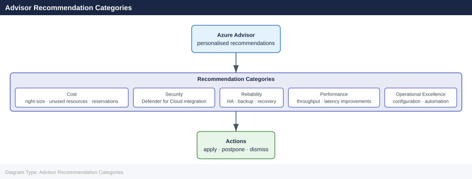

---
tags:
  - azure
---
# Advisor Recommendations

<div class="kb-summary">
Azure Advisor analyses your usage and configuration and surfaces personalised recommendations across cost, security, reliability, performance, and operational excellence. The cost category is the most actionable for day-to-day spend control.

*Applies to: Azure*
</div>

## Advisor Recommendation Categories



## Viewing Recommendations

Recommendations are available via the portal, CLI, and REST API. Use the CLI to script ingestion into reports or ticketing systems.

```bash
# List all Advisor recommendations for a subscription
az advisor recommendation list \
  --subscription <subscription-id> \
  --output table

# Filter to cost category only
az advisor recommendation list \
  --category Cost \
  --output table

# Show details of a specific recommendation
az advisor recommendation show \
  --ids /subscriptions/<sub-id>/providers/Microsoft.Advisor/recommendations/<rec-id>
```


```text title="Expected output"
Name                                    Category    Impact    Risk Level    Description
--------------------------------------  ----------  --------  -----------  -----------------------------------------------
reduce-vm-size-prod-eastus-01           Cost        High      Medium        Right-size underutilized Virtual Machines
delete-unattached-disks-rg-storage      Cost        Medium    Low           Remove unattached managed disks
optimize-sql-database-dtu-usage         Cost        High      Medium        Reduce Azure SQL Database DTU allocation
consolidate-storage-accounts            Cost        Medium    Low           Consolidate redundant storage accounts
enable-reserved-instances-compute       Cost        High      Medium        Purchase reserved instances for VMs
...

{
  "id": "/subscriptions/a1b2c3d4-e5f6-47a8-9b0c-1d2e3f4a5b6c/providers/Microsoft.Advisor/recommendations/reduce-vm-size-prod-eastus-01",
  "name": "reduce-vm-size-prod-eastus-01",
  "type": "Microsoft.Advisor/recommendations",
  "category": "Cost",
  "impact": "High",
  "riskLevel": "Medium",
  "description": "Virtual machine prod-eastus-01 is underutilized. Consider resizing to a smaller SKU.",
  "resourceMetadata": {
    "resourceId": "/subscriptions/a1b2c3d4-e5f6-47a8-9b0c-1d2e3f4a5b6c/resourceGroups/prod-rg/providers/Microsoft.Compute/virtualMachines/prod-eastus-01"
  },
  "shortDescription": {
    "problem": "Virtual machine is underutilized",
    "solution": "Resize to Standard_B2s"
  }
}
```

!!! warning "Common errors"
    **`The subscription '<subscription-id>' could not be found.`** — Replace `<subscription-id>` with a valid subscription ID from `az account list`.
    **`No recommendations found for the specified criteria.`** — Verify the subscription has completed the Advisor assessment (can take 24 hours) or check that the `--category` filter value matches available categories (Cost, Performance, Security, OperationalExcellence).
    **`Invalid resource ID format in --ids parameter.`** — Ensure the recommendation ID follows the full path format `/subscriptions/<sub-id>/providers/Microsoft.Advisor/recommendations/<rec-id>` with no extra spaces or characters.
### Recommendation Categories

| Category | Description | Typical Examples |
|---|---|---|
| Cost | Reduce or optimise spend | Shutdown idle VMs, buy RIs |
| Security | Close security gaps | Enable MFA, encrypt disks |
| Reliability | Improve uptime | Enable backups, zone redundancy |
| Performance | Increase responsiveness | Premium SSD, scale-out |
| Operational Excellence | Improve operations | Enable diagnostics, tag resources |

## Cost Savings Opportunities

Advisor calculates potential annual savings for each recommendation. Key cost recommendation types:

- **Unused VMs** — VMs with low CPU/network utilisation over 14 days
- **Unattached managed disks** — disks with no associated VM
- **Reserved Instance opportunities** — VMs running 24/7 that would save with 1- or 3-year RIs
- **Right-size App Service plans** — underutilised plan SKUs
- **Idle SQL databases** — databases with no connections over 14 days

```bash
# Get cost savings estimate across all recommendations
az advisor recommendation list \
  --category Cost \
  --query "[].{Name:shortDescription.solution, Savings:extendedProperties.annualSavingsAmount, Currency:extendedProperties.savingsCurrency}" \
  --output table
```


```text title="Expected output"
Name                                                    Savings      Currency
------------------------------------------------------  -----------  ----------
Delete unattached managed disks                         1250.00      USD
Reduce compute costs by resizing or shutting down...    8750.50      USD
Purchase reserved instances for predictable workloads   15320.25     USD
Eliminate unprovisioned ExpressRoute circuits           3100.00      USD
Right-size underutilized virtual machines               5680.75      USD
```

!!! warning "Common errors"
    **`ERROR: The following arguments are required: --subscription`** — Add `--subscription <subscription-id>` or set the default subscription with `az account set --subscription <id>`.
    **`ERROR: (AuthorizationFailed) The client '<object-id>' does not have authorization to perform action 'Microsoft.Advisor/recommendations/read' over scope '/subscriptions/<id>'`** — Ensure your Azure account has the Reader role or higher assigned on the subscription.
## Right-Sizing Recommendations

Advisor compares actual CPU, memory, and network metrics against the allocated SKU and recommends downsizing where appropriate.

```bash
# List VM right-size recommendations
az advisor recommendation list \
  --category Cost \
  --query "[?contains(shortDescription.solution, 'right-size') || contains(shortDescription.solution, 'Right-size')]" \
  --output table

# View extended properties for a recommendation (includes target SKU)
az advisor recommendation show \
  --ids <recommendation-resource-id> \
  --query "extendedProperties"
```


```text title="Expected output"
Name                                          Category    Impact    Risk Level    Short Description
────────────────────────────────────────────  ──────────  ────────  ────────────  ──────────────────────────────────────────
vm-prod-web-01-rightsize-rec-2024-01-15      Cost        High      Medium        Right-size underutilized VM Standard_D4s_v3
vm-staging-db-02-rightsize-rec-2024-01-14    Cost        Medium    Low           Right-size overprovisioned instance Standard_E8s_v4
vm-dev-app-03-rightsize-rec-2024-01-13       Cost        High      Medium        Right-size idle compute resource Standard_B2s
vm-prod-cache-04-rightsize-rec-2024-01-12    Cost        Medium    Low           Right-size underutilized VM Standard_D2s_v3

{
  "targetSku": "Standard_B4ms",
  "currentSku": "Standard_D4s_v3",
  "estimatedMonthlySavings": "$145.32",
  "utilizationPercentage": "18",
  "recommendationReason": "VM is running at 18% CPU and 22% memory utilization over the past 30 days"
}
```

!!! warning "Common errors"
    **`ERROR: The following arguments are required: --ids`** — Provide the full resource ID of the recommendation from the first command's output.
    **`ERROR: (ResourceNotFound) The resource 'Microsoft.Advisor/recommendations/<id>' does not exist.`** — Verify the recommendation ID is current and hasn't expired; re-run the list command to get active recommendation IDs.
### Right-Sizing Decision Criteria

| Signal | Threshold | Action |
|---|---|---|
| Avg CPU < 5 % over 14 days | Low utilisation | Downsize or deallocate |
| Max CPU < 20 % over 14 days | Headroom available | Consider one SKU smaller |
| Network < 10 Mbps consistently | Idle candidate | Review workload necessity |
| Memory headroom > 60 % | Oversized | Step down instance family |

## Dismissing Recommendations

Dismiss a recommendation when it does not apply (e.g., a VM must remain on for compliance). Dismissed recommendations are suppressed for 90 days by default.

```bash
# Dismiss a single recommendation
az advisor recommendation disable \
  --ids /subscriptions/<sub-id>/providers/Microsoft.Advisor/recommendations/<rec-id> \
  --days 90

# List suppressed (dismissed) recommendations
az advisor suppression list \
  --output table

# Delete a suppression to re-enable a recommendation
az advisor suppression delete \
  --ids <suppression-resource-id>
```


```text title="Expected output"
(no output — command completes silently)

Name                                          Type                                    ResourceGroup
────────────────────────────────────────────  ──────────────────────────────────────  ─────────────
high-availability-suppression-001             Microsoft.Advisor/suppressions          prod-rg
cost-optimization-vm-resize-suppression       Microsoft.Advisor/suppressions          prod-rg
security-nsg-rules-suppression-2024           Microsoft.Advisor/suppressions          dev-rg
unused-storage-account-suppression            Microsoft.Advisor/suppressions          staging-rg

(no output — command completes silently)
```

!!! warning "Common errors"
    **`The provided resource ID is invalid or does not exist.`** — Verify the recommendation ID format matches `/subscriptions/{subscriptionId}/providers/Microsoft.Advisor/recommendations/{recommendationId}` and the subscription is correct.
    **`The suppression resource was not found.`** — Confirm the suppression resource ID exists by running `az advisor suppression list` and copy the exact Name value from the output.
> **Note:** Dismissals should be documented. Add a comment in the ticket or tag the resource with a justification before dismissing.

## Automation and Reporting

```bash
# Export recommendations to JSON for reporting
az advisor recommendation list \
  --category Cost \
  --output json > advisor-cost-$(date +%Y%m%d).json

# Count open cost recommendations
az advisor recommendation list \
  --category Cost \
  --query "length(@)"
```


```text title="Expected output"
[
  {
    "id": "/subscriptions/a1b2c3d4-e5f6-4a5b-8c9d-0e1f2a3b4c5d/providers/Microsoft.Advisor/recommendations/cost-001",
    "name": "cost-001",
    "type": "Microsoft.Advisor/recommendations",
    "category": "Cost",
    "impact": "High",
    "impactedValue": "1250.50",
    "impactedValueUnit": "USD",
    "recommendation": "Delete unattached managed disks",
    "shortDescription": "Remove 3 unattached disks to save $1,250.50/month",
    "potentialBenefit": "1250.50 USD per month"
  },
  {
    "id": "/subscriptions/a1b2c3d4-e5f6-4a5b-8c9d-0e1f2a3b4c5d/providers/Microsoft.Advisor/recommendations/cost-002",
    "name": "cost-002",
    "type": "Microsoft.Advisor/recommendations",
    "category": "Cost",
    "impact": "Medium",
    "impactedValue": "425.75",
    "impactedValueUnit": "USD",
    "recommendation": "Resize underutilized virtual machines",
    "shortDescription": "Downsize 2 VMs to save $425.75/month",
    "potentialBenefit": "425.75 USD per month"
  }
]
12
```

!!! warning "Common errors"
    **`ERROR: The subscription of type 'Microsoft.Subscription/subscriptions' could not be found.`** — Ensure you are logged in with `az login` and the correct subscription is set via `az account set --subscription <subscription-id>`.
    **`ERROR: This operation requires the 'Microsoft.Advisor/register/action' permission.`** — Register the Advisor resource provider with `az provider register --namespace Microsoft.Advisor`.
### Recommendation Score

Advisor calculates an overall Advisor Score (0–100) per category. Track score improvements as a KPI.

```bash
# Get Advisor score per category
az advisor score show \
  --output table
```


```text title="Expected output"
Category                 Percentage    ImpactedResourceCount
-----------------------  -----------  ----------------------
Cost                     87            12
Reliability              92            3
Security                 78            8
Operational Excellence   85            5
Performance Efficiency   81            6
```

!!! warning "Common errors"
    **`ERROR: The following arguments are required: --subscription`** — Add `--subscription <subscription-id>` or set the default subscription with `az account set --subscription <id>`.
    **`ERROR: This operation is not supported by your current Azure CLI version.`** — Upgrade Azure CLI with `az upgrade` to ensure Advisor commands are available.