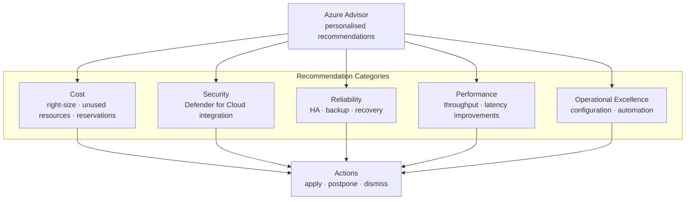

# Advisor Recommendations


<div class="kb-summary">
Azure Advisor analyses your usage and configuration and surfaces personalised recommendations across cost, security, reliability, performance, and operational excellence. The cost category is the most actionable for day-to-day spend control.
</div>
```
┌────────────────────────────────────────── Cloud Azure Cost ───────────────────────────────────────────┐
│                                                                                                       │
│   ┌───────────────────────────────────────────────────────────────────────────────────────────────┐   │
│   │                                Azure: Cloud Azure Cost platform                               │   │
│   │                                  Protocols: Various protocols                                 │   │
│   │                        Management: Cloud Azure Cost management console                        │   │
│   │                Sections: Architecture · Operations · Security · Troubleshooting               │   │
│   └───────────────────────────────────────────────────────────────────────────────────────────────┘   │
│                                                                                                       │
│    Architecture → Operations → Security → Troubleshooting → Escalation                                │
│                                                                                                       │
│                  ▼                                ▼                                ▼                  │
│                                                                                                       │
│   ┌─────────────────────────────┐  ┌─────────────────────────────┐  ┌─────────────────────────────┐   │
│   │            Layer            │  │          Component          │  │            Notes            │   │
│   │             Core            │  │       Primary service       │  │        Main function        │   │
│   │          Management         │  │        Control plane        │  │         Admin access        │   │
│   │          Monitoring         │  │         Health/perf         │  │      Alerts/dashboards      │   │
│   │           Security          │  │         Auth/encrypt        │  │        Access control       │   │
│   │         Integration         │  │        APIs/plug-ins        │  │         Third-party         │   │
│   └─────────────────────────────┘  └─────────────────────────────┘  └─────────────────────────────┘   │
│                                                                                                       │
│                          ▼                                                 ▼                          │
│                                                                                                       │
│   ┌───────────────────────────────────────────────────────────────────────────────────────────────┐   │
│   │      Layer       │    Component     │      Function     │      Notes       │       Auth       │   │
│   │       Core       │ Primary service  │   Main function   │     See docs     │       RBAC       │   │
│   │    Management    │  Control plane   │    Admin access   │     See docs     │       RBAC       │   │
│   │    Monitoring    │   Health/perf    │  Alerts/dashboard │     See docs     │       RBAC       │   │
│   │     Security     │   Auth/encrypt   │   Access control  │     See docs     │       RBAC       │   │
│   └───────────────────────────────────────────────────────────────────────────────────────────────┘   │
│                                                                                                       │
│    Physical: Cloud Azure Cost infrastructure · management network · monitoring                        │
│                                                                                                       │
│    Key terms:                                                                                         │
│                                                                                                       │
│    Azure              = Cloud Azure Cost platform overview and core concepts                          │
│    Management         = management console and command-line interface for administration              │
│    Monitoring         = health and performance monitoring dashboards and alerting                     │
│    Automation         = REST API, scripting, and pipeline integration capabilities                    │
│    Security           = access control, authentication, and encryption configuration                  │
│    Backup             = backup and recovery procedures and schedule configuration                     │
│    Upgrade            = software version upgrades and firmware patching procedures                    │
│    Troubleshooting    = diagnostic procedures and common issue resolution steps                       │
│    Escalation         = vendor support escalation path and severity triage process                    │
│    Documentation      = vendor knowledge base and official product documentation                      │
│    Change management  = change ticket requirements for production modifications                       │
│    Audit log          = admin action logging for compliance and security review                       │
│                                                                                                       │
└───────────────────────────────────────────────────────────────────────────────────────────────────────┘
```


## Advisor Recommendation Categories



## Viewing Recommendations

Recommendations are available via the portal, CLI, and REST API. Use the CLI to script ingestion into reports or ticketing systems.

```bash
# List all Advisor recommendations for a subscription
az advisor recommendation list \
  --subscription <subscription-id> \
  --output table

# Filter to cost category only
az advisor recommendation list \
  --category Cost \
  --output table

# Show details of a specific recommendation
az advisor recommendation show \
  --ids /subscriptions/<sub-id>/providers/Microsoft.Advisor/recommendations/<rec-id>
```

### Recommendation Categories

| Category | Description | Typical Examples |
|---|---|---|
| Cost | Reduce or optimise spend | Shutdown idle VMs, buy RIs |
| Security | Close security gaps | Enable MFA, encrypt disks |
| Reliability | Improve uptime | Enable backups, zone redundancy |
| Performance | Increase responsiveness | Premium SSD, scale-out |
| Operational Excellence | Improve operations | Enable diagnostics, tag resources |

## Cost Savings Opportunities

Advisor calculates potential annual savings for each recommendation. Key cost recommendation types:

- **Unused VMs** — VMs with low CPU/network utilisation over 14 days
- **Unattached managed disks** — disks with no associated VM
- **Reserved Instance opportunities** — VMs running 24/7 that would save with 1- or 3-year RIs
- **Right-size App Service plans** — underutilised plan SKUs
- **Idle SQL databases** — databases with no connections over 14 days

```bash
# Get cost savings estimate across all recommendations
az advisor recommendation list \
  --category Cost \
  --query "[].{Name:shortDescription.solution, Savings:extendedProperties.annualSavingsAmount, Currency:extendedProperties.savingsCurrency}" \
  --output table
```

## Right-Sizing Recommendations

Advisor compares actual CPU, memory, and network metrics against the allocated SKU and recommends downsizing where appropriate.

```bash
# List VM right-size recommendations
az advisor recommendation list \
  --category Cost \
  --query "[?contains(shortDescription.solution, 'right-size') || contains(shortDescription.solution, 'Right-size')]" \
  --output table

# View extended properties for a recommendation (includes target SKU)
az advisor recommendation show \
  --ids <recommendation-resource-id> \
  --query "extendedProperties"
```

### Right-Sizing Decision Criteria

| Signal | Threshold | Action |
|---|---|---|
| Avg CPU < 5 % over 14 days | Low utilisation | Downsize or deallocate |
| Max CPU < 20 % over 14 days | Headroom available | Consider one SKU smaller |
| Network < 10 Mbps consistently | Idle candidate | Review workload necessity |
| Memory headroom > 60 % | Oversized | Step down instance family |

## Dismissing Recommendations

Dismiss a recommendation when it does not apply (e.g., a VM must remain on for compliance). Dismissed recommendations are suppressed for 90 days by default.

```bash
# Dismiss a single recommendation
az advisor recommendation disable \
  --ids /subscriptions/<sub-id>/providers/Microsoft.Advisor/recommendations/<rec-id> \
  --days 90

# List suppressed (dismissed) recommendations
az advisor suppression list \
  --output table

# Delete a suppression to re-enable a recommendation
az advisor suppression delete \
  --ids <suppression-resource-id>
```

> **Note:** Dismissals should be documented. Add a comment in the ticket or tag the resource with a justification before dismissing.

## Automation and Reporting

```bash
# Export recommendations to JSON for reporting
az advisor recommendation list \
  --category Cost \
  --output json > advisor-cost-$(date +%Y%m%d).json

# Count open cost recommendations
az advisor recommendation list \
  --category Cost \
  --query "length(@)"
```

### Recommendation Score

Advisor calculates an overall Advisor Score (0–100) per category. Track score improvements as a KPI.

```bash
# Get Advisor score per category
az advisor score show \
  --output table
```
