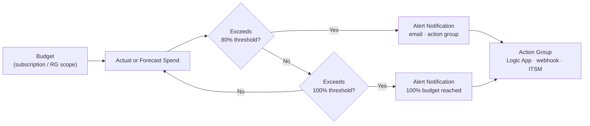

# Budgets


<div class="kb-summary">
Azure Cost Management budgets let you set spending thresholds and trigger alerts or automated actions when spending approaches or exceeds those thresholds. Budgets are scoped to a management group, subscription, or resource group.
</div>
```text
┌────────────────────────────────────────── Cloud Azure Cost ───────────────────────────────────────────┐
│                                                                                                       │
│   ┌───────────────────────────────────────────────────────────────────────────────────────────────┐   │
│   │                                Azure: Cloud Azure Cost platform                               │   │
│   │                                  Protocols: Various protocols                                 │   │
│   │                        Management: Cloud Azure Cost management console                        │   │
│   │                Sections: Architecture · Operations · Security · Troubleshooting               │   │
│   └───────────────────────────────────────────────────────────────────────────────────────────────┘   │
│                                                                                                       │
│    Architecture → Operations → Security → Troubleshooting → Escalation                                │
│                                                                                                       │
│                  ▼                                ▼                                ▼                  │
│                                                                                                       │
│   ┌─────────────────────────────┐  ┌─────────────────────────────┐  ┌─────────────────────────────┐   │
│   │            Layer            │  │          Component          │  │            Notes            │   │
│   │             Core            │  │       Primary service       │  │        Main function        │   │
│   │          Management         │  │        Control plane        │  │         Admin access        │   │
│   │          Monitoring         │  │         Health/perf         │  │      Alerts/dashboards      │   │
│   │           Security          │  │         Auth/encrypt        │  │        Access control       │   │
│   │         Integration         │  │        APIs/plug-ins        │  │         Third-party         │   │
│   └─────────────────────────────┘  └─────────────────────────────┘  └─────────────────────────────┘   │
│                                                                                                       │
│                          ▼                                                 ▼                          │
│                                                                                                       │
│   ┌───────────────────────────────────────────────────────────────────────────────────────────────┐   │
│   │      Layer       │    Component     │      Function     │      Notes       │       Auth       │   │
│   │       Core       │ Primary service  │   Main function   │     See docs     │       RBAC       │   │
│   │    Management    │  Control plane   │    Admin access   │     See docs     │       RBAC       │   │
│   │    Monitoring    │   Health/perf    │  Alerts/dashboard │     See docs     │       RBAC       │   │
│   │     Security     │   Auth/encrypt   │   Access control  │     See docs     │       RBAC       │   │
│   └───────────────────────────────────────────────────────────────────────────────────────────────┘   │
│                                                                                                       │
│    Physical: Cloud Azure Cost infrastructure · management network · monitoring                        │
│                                                                                                       │
│    Key terms:                                                                                         │
│                                                                                                       │
│    Azure              = Cloud Azure Cost platform overview and core concepts                          │
│    Management         = management console and command-line interface for administration              │
│    Monitoring         = health and performance monitoring dashboards and alerting                     │
│    Automation         = REST API, scripting, and pipeline integration capabilities                    │
│    Security           = access control, authentication, and encryption configuration                  │
│    Backup             = backup and recovery procedures and schedule configuration                     │
│    Upgrade            = software version upgrades and firmware patching procedures                    │
│    Troubleshooting    = diagnostic procedures and common issue resolution steps                       │
│    Escalation         = vendor support escalation path and severity triage process                    │
│    Documentation      = vendor knowledge base and official product documentation                      │
│    Change management  = change ticket requirements for production modifications                       │
│    Audit log          = admin action logging for compliance and security review                       │
│                                                                                                       │
└───────────────────────────────────────────────────────────────────────────────────────────────────────┘
```


## Budget Alert Flow



## Creating a Budget

Budgets are created with the `az costmanagement budget create` command. You define the amount, time grain, start/end dates, and notification rules in one call.

```bash
# Create a monthly subscription-level budget with email alert at 80% and 100%
az costmanagement budget create \
  --budget-name "monthly-sub-budget" \
  --scope "/subscriptions/<subscription-id>" \
  --amount 5000 \
  --time-grain Monthly \
  --start-date 2026-05-01 \
  --end-date 2027-05-01 \
  --notifications '[
    {
      "enabled": true,
      "operator": "GreaterThan",
      "threshold": 80,
      "contactEmails": ["finops@example.com"],
      "thresholdType": "Actual"
    },
    {
      "enabled": true,
      "operator": "GreaterThan",
      "threshold": 100,
      "contactEmails": ["finops@example.com", "eng-leads@example.com"],
      "thresholdType": "Actual"
    }
  ]'

# List budgets on a subscription
az costmanagement budget list \
  --scope "/subscriptions/<subscription-id>" \
  --output table

# Show a specific budget
az costmanagement budget show \
  --budget-name "monthly-sub-budget" \
  --scope "/subscriptions/<subscription-id>"

# Delete a budget
az costmanagement budget delete \
  --budget-name "monthly-sub-budget" \
  --scope "/subscriptions/<subscription-id>"
```

## Scope Options

Budgets can target different scopes. Use the narrowest scope that makes sense for the use case.

| Scope | Resource ID Pattern | Use Case |
|---|---|---|
| Management Group | `/providers/Microsoft.Management/managementGroups/<mg-id>` | Organisation-wide cap |
| Subscription | `/subscriptions/<sub-id>` | Per-environment budget |
| Resource Group | `/subscriptions/<sub-id>/resourceGroups/<rg>` | Per-team or per-project |
| Billing Account | `/providers/Microsoft.Billing/billingAccounts/<id>` | EA/MCA billing control |
| Invoice Section | `/providers/Microsoft.Billing/billingAccounts/<id>/invoiceSections/<id>` | Department-level |

```bash
# Create a resource-group-scoped budget
az costmanagement budget create \
  --budget-name "team-alpha-monthly" \
  --scope "/subscriptions/<sub-id>/resourceGroups/rg-team-alpha" \
  --amount 1000 \
  --time-grain Monthly \
  --start-date 2026-05-01 \
  --end-date 2027-05-01
```

## Alert Thresholds

Each budget supports up to five notification rules. Notifications fire when actual or forecasted spend crosses a percentage of the budget amount.

### Threshold Types

| Type | Description |
|---|---|
| Actual | Fires when cumulative spend in the period exceeds the threshold |
| Forecasted | Fires when projected end-of-period spend exceeds the threshold |

Recommended tier structure:

| Threshold % | Threshold Type | Purpose |
|---|---|---|
| 70 % | Forecasted | Early awareness |
| 90 % | Forecasted | Time to investigate |
| 80 % | Actual | Confirmed trending high |
| 100 % | Actual | Budget breached |

## Action Groups

In addition to email notifications, budgets can trigger an Azure Action Group to run Logic Apps, webhooks, or Function Apps.

```bash
# Create an Action Group for budget alerts
az monitor action-group create \
  --resource-group rg-finops \
  --name ag-budget-alerts \
  --short-name budg-alert \
  --action email finops-team finops@example.com

# Get the Action Group resource ID
az monitor action-group show \
  --resource-group rg-finops \
  --name ag-budget-alerts \
  --query id \
  --output tsv
```

## Budget Best Practices

| Practice | Rationale |
|---|---|
| Set budgets at subscription and RG level | Dual coverage — broad and granular |
| Use forecasted thresholds at 90% | Early warning before actual breach |
| Attach Action Group for auto-remediation | Enables automated shutdown of non-prod VMs |
| Review and update amounts quarterly | Aligns budgets with approved spend plans |
| Tag budgets with owner metadata | Accountability for overspend |
