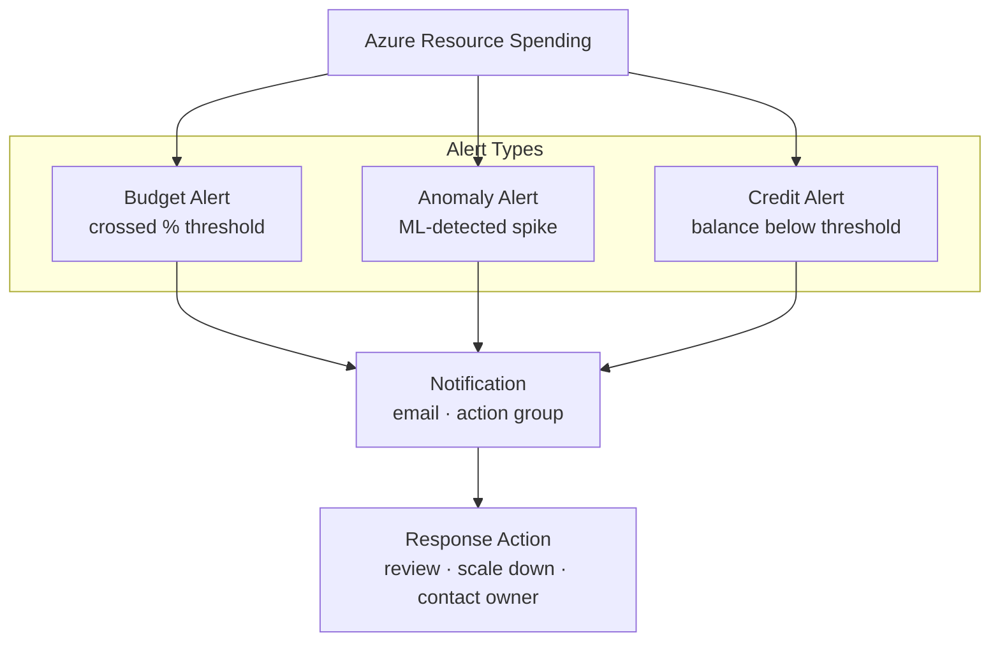

# Cost Alerts


<div class="kb-summary">
Azure Cost Management supports multiple alert types to notify teams of unexpected or excessive spending. Alerts complement budgets and provide finer-grained visibility into spend anomalies.
</div>
```
┌────────────────────────────────────────── Cloud Azure Cost ───────────────────────────────────────────┐
│                                                                                                       │
│   ┌───────────────────────────────────────────────────────────────────────────────────────────────┐   │
│   │                                Azure: Cloud Azure Cost platform                               │   │
│   │                                  Protocols: Various protocols                                 │   │
│   │                        Management: Cloud Azure Cost management console                        │   │
│   │                Sections: Architecture · Operations · Security · Troubleshooting               │   │
│   └───────────────────────────────────────────────────────────────────────────────────────────────┘   │
│                                                                                                       │
│    Architecture → Operations → Security → Troubleshooting → Escalation                                │
│                                                                                                       │
│                  ▼                                ▼                                ▼                  │
│                                                                                                       │
│   ┌─────────────────────────────┐  ┌─────────────────────────────┐  ┌─────────────────────────────┐   │
│   │            Layer            │  │          Component          │  │            Notes            │   │
│   │             Core            │  │       Primary service       │  │        Main function        │   │
│   │          Management         │  │        Control plane        │  │         Admin access        │   │
│   │          Monitoring         │  │         Health/perf         │  │      Alerts/dashboards      │   │
│   │           Security          │  │         Auth/encrypt        │  │        Access control       │   │
│   │         Integration         │  │        APIs/plug-ins        │  │         Third-party         │   │
│   └─────────────────────────────┘  └─────────────────────────────┘  └─────────────────────────────┘   │
│                                                                                                       │
│                          ▼                                                 ▼                          │
│                                                                                                       │
│   ┌───────────────────────────────────────────────────────────────────────────────────────────────┐   │
│   │      Layer       │    Component     │      Function     │      Notes       │       Auth       │   │
│   │       Core       │ Primary service  │   Main function   │     See docs     │       RBAC       │   │
│   │    Management    │  Control plane   │    Admin access   │     See docs     │       RBAC       │   │
│   │    Monitoring    │   Health/perf    │  Alerts/dashboard │     See docs     │       RBAC       │   │
│   │     Security     │   Auth/encrypt   │   Access control  │     See docs     │       RBAC       │   │
│   └───────────────────────────────────────────────────────────────────────────────────────────────┘   │
│                                                                                                       │
│    Physical: Cloud Azure Cost infrastructure · management network · monitoring                        │
│                                                                                                       │
│    Key terms:                                                                                         │
│                                                                                                       │
│    Azure              = Cloud Azure Cost platform overview and core concepts                          │
│    Management         = management console and command-line interface for administration              │
│    Monitoring         = health and performance monitoring dashboards and alerting                     │
│    Automation         = REST API, scripting, and pipeline integration capabilities                    │
│    Security           = access control, authentication, and encryption configuration                  │
│    Backup             = backup and recovery procedures and schedule configuration                     │
│    Upgrade            = software version upgrades and firmware patching procedures                    │
│    Troubleshooting    = diagnostic procedures and common issue resolution steps                       │
│    Escalation         = vendor support escalation path and severity triage process                    │
│    Documentation      = vendor knowledge base and official product documentation                      │
│    Change management  = change ticket requirements for production modifications                       │
│    Audit log          = admin action logging for compliance and security review                       │
│                                                                                                       │
└───────────────────────────────────────────────────────────────────────────────────────────────────────┘
```


## Cost Alert Types Overview



## Alert Types

| Alert Type | Trigger | Configuration |
|---|---|---|
| Budget alerts | Spend crosses a budget threshold | Defined on the budget object |
| Anomaly alerts | ML-detected unusual spend pattern | Enabled per subscription in Cost Management |
| Credit alerts | Azure credit balance falls below threshold | EA/MCA accounts only |
| Department quota alerts | Department quota approaching | EA accounts only |

## Anomaly Alerts

Anomaly detection uses machine learning to identify spend spikes that deviate from historical patterns. No manual threshold is required — Azure learns the baseline automatically.

```bash
# List existing cost alerts on a scope
az costmanagement alert list \
  --scope "/subscriptions/<subscription-id>" \
  --output table

# Show a specific alert
az costmanagement alert show \
  --alert-id <alert-id> \
  --scope "/subscriptions/<subscription-id>"

# Dismiss an anomaly alert
az costmanagement alert dismiss \
  --alert-id <alert-id> \
  --scope "/subscriptions/<subscription-id>"
```

### Anomaly Alert Properties

| Property | Description |
|---|---|
| Detection confidence | Low / Medium / High |
| Affected service | Azure service with the spike |
| Spike amount | Estimated overspend vs baseline |
| Detection date | When the anomaly was identified |
| Affected period | Start and end of the anomalous window |

## Budget Alerts

Budget alerts are the most commonly used cost alert type. They fire based on percentage thresholds against a named budget.

```bash
# List all budget-linked alerts on a subscription
az costmanagement alert list \
  --scope "/subscriptions/<subscription-id>" \
  --query "[?properties.definition.type=='Budget']" \
  --output table

# View notification config on a budget
az costmanagement budget show \
  --budget-name "monthly-sub-budget" \
  --scope "/subscriptions/<subscription-id>" \
  --query "properties.notifications"
```

## Alert Channels

Alerts are delivered through one or more of the following channels:

| Channel | Configuration |
|---|---|
| Email (direct) | List of email addresses on the budget notification |
| Action Group | Azure Monitor Action Group (email, SMS, webhook, Logic App) |
| Azure Monitor alerts | Via diagnostic settings and metric alert rules |

```bash
# Create an Action Group with email and webhook receivers
az monitor action-group create \
  --resource-group rg-finops \
  --name ag-cost-critical \
  --short-name cost-crit \
  --action email finops-lead finops@example.com \
  --action webhook cost-webhook https://hooks.example.com/cost-alert

# List Action Groups in the finops resource group
az monitor action-group list \
  --resource-group rg-finops \
  --output table
```

## Threshold Configuration

For budget-based alerts the threshold is a percentage of the budget amount. Thresholds should be set in tiers to give progressive warning.

| Threshold % | Threshold Type | Recipient | Purpose |
|---|---|---|---|
| 70 % | Forecasted | Team lead | Early awareness |
| 90 % | Forecasted | Team lead + FinOps | Time to investigate |
| 80 % | Actual | Team lead | Confirmed trending high |
| 100 % | Actual | Team lead + FinOps + Management | Budget breached |

## Alert State Management

Alerts have a state of `Active`, `Overridden`, `Resolved`, or `Dismissed`. Dismissed alerts are suppressed until the next billing period resets.

```bash
# List active alerts only
az costmanagement alert list \
  --scope "/subscriptions/<subscription-id>" \
  --query "[?properties.status=='Active']" \
  --output table
```

## Alert Best Practices

- Always pair anomaly detection with a budget alert — anomaly detection catches unexpected spikes; budgets catch slow overruns.
- Route alerts to a shared team mailbox and an Action Group webhook so alerts are never missed during holidays.
- Review dismissed alerts monthly — a pattern of dismissals may indicate a budget that needs updating.
- Test alert delivery by temporarily lowering the budget threshold to a value already exceeded, then restore after confirming receipt.
