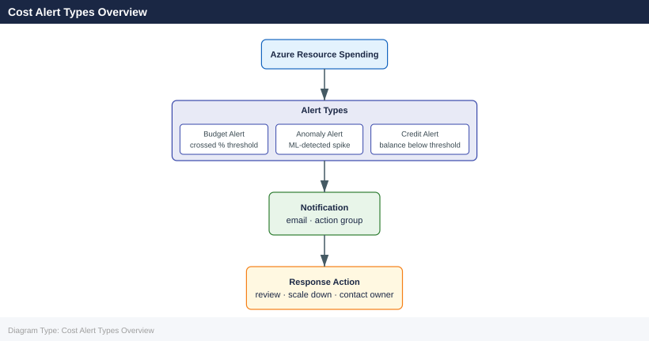

---
tags:
  - azure
description: "Azure Cost Management supports multiple alert types to notify teams of unexpected or excessive spending. Alerts complement budgets and provide..."
---
# Cost Alerts

<div class="kb-summary">
Azure Cost Management supports multiple alert types to notify teams of unexpected or excessive spending. Alerts complement budgets and provide finer-grained visibility into spend anomalies.

*Applies to: Azure*
</div>

## Cost Alert Types Overview



## Alert Types

| Alert Type | Trigger | Configuration |
|---|---|---|
| Budget alerts | Spend crosses a budget threshold | Defined on the budget object |
| Anomaly alerts | ML-detected unusual spend pattern | Enabled per subscription in Cost Management |
| Credit alerts | Azure credit balance falls below threshold | EA/MCA accounts only |
| Department quota alerts | Department quota approaching | EA accounts only |

## Anomaly Alerts

Anomaly detection uses machine learning to identify spend spikes that deviate from historical patterns. No manual threshold is required — Azure learns the baseline automatically.

```bash
# List existing cost alerts on a scope
az costmanagement alert list \
  --scope "/subscriptions/<subscription-id>" \
  --output table

# Show a specific alert
az costmanagement alert show \
  --alert-id <alert-id> \
  --scope "/subscriptions/<subscription-id>"

# Dismiss an anomaly alert
az costmanagement alert dismiss \
  --alert-id <alert-id> \
  --scope "/subscriptions/<subscription-id>"
```


```text title="Expected output"
AlertId                              AlertType    Status      CreationTime         CloseTime
------------------------------------  -----------  ----------  -------------------  -------------------
alert-001-anomaly-2024               Anomaly      Active      2024-01-15T09:32:00Z
alert-002-budget-threshold           BudgetAlert  Dismissed   2024-01-10T14:22:00Z  2024-01-12T11:05:00Z
alert-003-anomaly-2024               Anomaly      Active      2024-01-18T16:45:00Z

{
  "id": "/subscriptions/a1b2c3d4-e5f6-4a7b-8c9d-0e1f2a3b4c5d/providers/Microsoft.CostManagement/alerts/alert-001-anomaly-2024",
  "name": "alert-001-anomaly-2024",
  "type": "Microsoft.CostManagement/alerts",
  "properties": {
    "alertType": "Anomaly",
    "status": "Active",
    "creationTime": "2024-01-15T09:32:00Z",
    "closeTime": null,
    "modificationTime": "2024-01-15T09:32:00Z",
    "statusModificationTime": "2024-01-15T09:32:00Z",
    "description": "Anomalous spending detected"
  }
}

(no output — command completes silently)
```

!!! warning "Common errors"
    | Error | Fix |
    |---|---|
    | `ResourceNotFound: The resource 'alert-id' does not exist` | Verify the alert ID is correct by running `az costmanagement alert list` and copy the exact AlertId value. |
    | `AuthorizationFailed: The client 'user@example.com' with object id 'xxxx' does not have authorization to perform action 'Microsoft.CostManagement/alerts/read'` | Ensure your user account has the Cost Management Reader or Owner role assigned on the subscription scope. |
### Anomaly Alert Properties

| Property | Description |
|---|---|
| Detection confidence | Low / Medium / High |
| Affected service | Azure service with the spike |
| Spike amount | Estimated overspend vs baseline |
| Detection date | When the anomaly was identified |
| Affected period | Start and end of the anomalous window |

## Budget Alerts

Budget alerts are the most commonly used cost alert type. They fire based on percentage thresholds against a named budget.

```bash
# List all budget-linked alerts on a subscription
az costmanagement alert list \
  --scope "/subscriptions/<subscription-id>" \
  --query "[?properties.definition.type=='Budget']" \
  --output table

# View notification config on a budget
az costmanagement budget show \
  --budget-name "monthly-sub-budget" \
  --scope "/subscriptions/<subscription-id>" \
  --query "properties.notifications"
```


```text title="Expected output"
Name                          Type      Status    CreationTime              CloseTime
────────────────────────────  ────────  ────────  ────────────────────────  ────────────────────────
monthly-sub-budget-alert-80   Budget    Active    2024-01-15T09:32:14Z
quarterly-spend-threshold     Budget    Active    2024-01-10T14:22:05Z
dev-env-overspend-warning     Budget    Resolved  2023-12-28T16:45:33Z      2024-01-12T08:19:22Z
prod-cost-limit-alert         Budget    Active    2024-01-18T11:08:47Z

{
  "exceededNotification": {
    "enabled": true,
    "operator": "GreaterThan",
    "threshold": 100,
    "thresholdType": "Forecasted",
    "contactEmails": [
      "ops-team@contoso.com",
      "finance@contoso.com"
    ],
    "contactRoles": [
      "Owner",
      "Contributor"
    ],
    "contactGroups": [
      "/subscriptions/12345678-1234-1234-1234-123456789012/resourceGroups/alerts-rg/providers/microsoft.insights/actionGroups/cost-alerts-ag"
    ]
  },
  "forecastExceededNotification": {
    "enabled": true,
    "operator": "GreaterThan",
    "threshold": 80,
    "thresholdType": "Forecasted"
  }
}
```

!!! warning "Common errors"
    | Error | Fix |
    |---|---|
    | `ERROR: (ResourceNotFound) The resource 'subscriptions/<subscription-id>/providers/microsoft.costmanagement/budgets/monthly-sub-budget' could not be found.` | Verify the budget name and subscription ID are correct using `az costmanagement budget list --scope "/subscriptions/<subscription-id>"`. |
    | `ERROR: The following arguments are required: --scope` | Ensure the `--scope` parameter is provided with a valid subscription path like `/subscriptions/12345678-1234-1234-1234-123456789012`. |
## Alert Channels

Alerts are delivered through one or more of the following channels:

| Channel | Configuration |
|---|---|
| Email (direct) | List of email addresses on the budget notification |
| Action Group | Azure Monitor Action Group (email, SMS, webhook, Logic App) |
| Azure Monitor alerts | Via diagnostic settings and metric alert rules |

```bash
# Create an Action Group with email and webhook receivers
az monitor action-group create \
  --resource-group rg-finops \
  --name ag-cost-critical \
  --short-name cost-crit \
  --action email finops-lead finops@example.com \
  --action webhook cost-webhook https://hooks.example.com/cost-alert

# List Action Groups in the finops resource group
az monitor action-group list \
  --resource-group rg-finops \
  --output table
```


```text title="Expected output"
{
  "id": "/subscriptions/a1b2c3d4-e5f6-4g7h-8i9j-0k1l2m3n4o5p/resourceGroups/rg-finops/providers/microsoft.insights/actionGroups/ag-cost-critical",
  "location": "global",
  "name": "ag-cost-critical",
  "resourceGroup": "rg-finops",
  "shortName": "cost-crit",
  "tags": {}
}

Name              ResourceGroup    ShortName   Location
-----------------  ---------------  ----------  ----------
ag-cost-critical   rg-finops        cost-crit   global
ag-pagerduty       rg-finops        pd-alert    global
ag-slack-notify    rg-finops        slack-ntf   global
```

!!! warning "Common errors"
    | Error | Fix |
    |---|---|
    | `ResourceGroupNotFound` | Verify the resource group name with `az group list` and ensure you have access to the subscription. |
    | `InvalidEmailAddress` | Ensure the email address is properly formatted and use quotes around the email parameter if it contains special characters. |
    | `WebhookUrlInvalid` | Confirm the webhook URL is accessible and returns a 200 status code by testing with `curl -X POST https://hooks.example.com/cost-alert`. |
## Threshold Configuration

For budget-based alerts the threshold is a percentage of the budget amount. Thresholds should be set in tiers to give progressive warning.

| Threshold % | Threshold Type | Recipient | Purpose |
|---|---|---|---|
| 70 % | Forecasted | Team lead | Early awareness |
| 90 % | Forecasted | Team lead + FinOps | Time to investigate |
| 80 % | Actual | Team lead | Confirmed trending high |
| 100 % | Actual | Team lead + FinOps + Management | Budget breached |

## Alert State Management

Alerts have a state of `Active`, `Overridden`, `Resolved`, or `Dismissed`. Dismissed alerts are suppressed until the next billing period resets.

```bash
# List active alerts only
az costmanagement alert list \
  --scope "/subscriptions/<subscription-id>" \
  --query "[?properties.status=='Active']" \
  --output table
```


```text title="Expected output"
Name                                    Type                  Status    CreationTime
--------------------------------------  --------------------  --------  --------------------------
alert-cpu-overspend-prod                BudgetThresholdAlert  Active    2024-01-15T09:23:45Z
alert-storage-anomaly-dev               AnomalyAlert          Active    2024-01-14T14:12:30Z
alert-forecast-exceed-q1                ForecastAlert         Active    2024-01-10T11:05:18Z
alert-spending-trend-warning            TrendAlert            Active    2024-01-12T16:47:22Z
```

!!! warning "Common errors"
    | Error | Fix |
    |---|---|
    | `The subscription '<subscription-id>' could not be found.` | Replace `<subscription-id>` with your actual subscription ID from `az account show --query id -o tsv`. |
    | `No registered resource provider found for location 'microsoft.costmanagement'.` | Register the Cost Management provider with `az provider register --namespace Microsoft.CostManagement`. |
    | `Authorization failed: The client does not have permission to perform action 'microsoft.costmanagement/alerts/read'.` | Ensure your Azure account has the Cost Management Reader role assigned at the subscription scope. |
## Alert Best Practices

- Always pair anomaly detection with a budget alert — anomaly detection catches unexpected spikes; budgets catch slow overruns.
- Route alerts to a shared team mailbox and an Action Group webhook so alerts are never missed during holidays.
- Review dismissed alerts monthly — a pattern of dismissals may indicate a budget that needs updating.
- Test alert delivery by temporarily lowering the budget threshold to a value already exceeded, then restore after confirming receipt.
