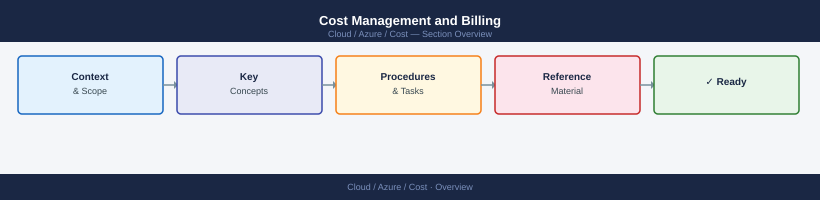
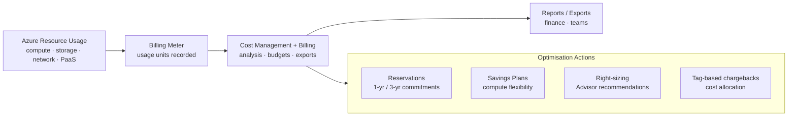

---
tags:
  - azure
---
# Cost Management and Billing


<div class="kb-summary">
Azure Cost Management + Billing is the central hub for understanding, analysing, and optimising Azure spend. It covers cost analysis, invoices, billing exports, and the Cost Management REST API.

*Applies to: Azure*
</div>



## Cost Management Flow



## Cost Analysis Views

The cost analysis blade provides interactive spend breakdowns. Use the CLI to pull the same data programmatically.

```bash
# Query cost for the current month by service name (subscription scope)
az costmanagement query \
  --scope "/subscriptions/<subscription-id>" \
  --type Usage \
  --timeframe MonthToDate \
  --dataset-granularity Daily \
  --dataset-aggregation '{"totalCost":{"name":"Cost","function":"Sum"}}' \
  --dataset-grouping '[{"type":"Dimension","name":"ServiceName"}]'

# Query cost grouped by resource group for a custom date range
az costmanagement query \
  --scope "/subscriptions/<subscription-id>" \
  --type Usage \
  --timeframe Custom \
  --time-period-from 2026-04-01 \
  --time-period-to 2026-04-30 \
  --dataset-aggregation '{"totalCost":{"name":"Cost","function":"Sum"}}' \
  --dataset-grouping '[{"type":"Dimension","name":"ResourceGroupName"}]'
```

### Common Cost Dimensions

| Dimension | Description |
|---|---|
| `ServiceName` | Azure service (Compute, Storage, Networking) |
| `ResourceGroupName` | Resource group |
| `ResourceLocation` | Azure region |
| `MeterCategory` | Billing meter category |
| `TagValue` | Value of a specific tag (combine with TagKey filter) |
| `SubscriptionName` | Subscription (useful at MG scope) |

## Invoice Sections

Invoice sections (MCA) or departments (EA) allow cost to be split within a billing account. Each invoice section gets its own cost centre view.

```bash
# List billing accounts
az billing account list \
  --output table

# List invoice sections for a billing account
az billing invoice-section list \
  --billing-account-name <billing-account-id> \
  --billing-profile-name <billing-profile-id> \
  --output table

# Show details of an invoice section
az billing invoice-section show \
  --billing-account-name <billing-account-id> \
  --billing-profile-name <billing-profile-id> \
  --invoice-section-name <invoice-section-id>
```

## Billing Exports

Scheduled exports push daily or monthly cost data to an Azure Storage account in CSV format. This feeds downstream BI tools, cost dashboards, and data lakes.

```bash
# Create a daily export of actual costs for a subscription
az costmanagement export create \
  --name "daily-actual-export" \
  --scope "/subscriptions/<subscription-id>" \
  --type ActualCost \
  --dataset-granularity Daily \
  --recurrence Daily \
  --recurrence-period from="2026-05-01T00:00:00Z" to="2027-05-01T00:00:00Z" \
  --storage-container "cost-exports" \
  --storage-account-id "/subscriptions/<sub-id>/resourceGroups/rg-finops/providers/Microsoft.Storage/storageAccounts/safinops01" \
  --storage-directory "azure/subscriptions/<sub-id>"

# List exports on a scope
az costmanagement export list \
  --scope "/subscriptions/<subscription-id>" \
  --output table

# Trigger an export run on demand
az costmanagement export run \
  --name "daily-actual-export" \
  --scope "/subscriptions/<subscription-id>"

# Delete an export
az costmanagement export delete \
  --name "daily-actual-export" \
  --scope "/subscriptions/<subscription-id>"
```

### Export Types

| Export Type | Description |
|---|---|
| `ActualCost` | Invoice-basis costs including reservations as one-time charges |
| `AmortizedCost` | Amortises RI and savings plan costs daily across the term |
| `Usage` | Raw usage data without cost (useful for capacity planning) |

## Cost Management API

The Cost Management REST API supports queries not yet available in the CLI.

```bash
# Use az rest to call the Cost Management query API directly
az rest \
  --method POST \
  --url "https://management.azure.com/subscriptions/<sub-id>/providers/Microsoft.CostManagement/query?api-version=2023-11-01" \
  --body '{
    "type": "Usage",
    "timeframe": "MonthToDate",
    "dataset": {
      "granularity": "Daily",
      "aggregation": {
        "totalCost": {"name": "Cost", "function": "Sum"}
      },
      "grouping": [{"type": "Dimension", "name": "ServiceName"}]
    }
  }'
```

## Key Metrics to Track

| Metric | Description | Review Cadence |
|---|---|---|
| Month-to-date spend | Running total vs budget | Daily |
| Forecasted month-end | Projected final spend | Weekly |
| Untagged resource spend | Cost without attribution | Weekly |
| Top 5 services by cost | Largest spend drivers | Monthly |
| Reservation utilisation | % of RI hours consumed | Monthly |
