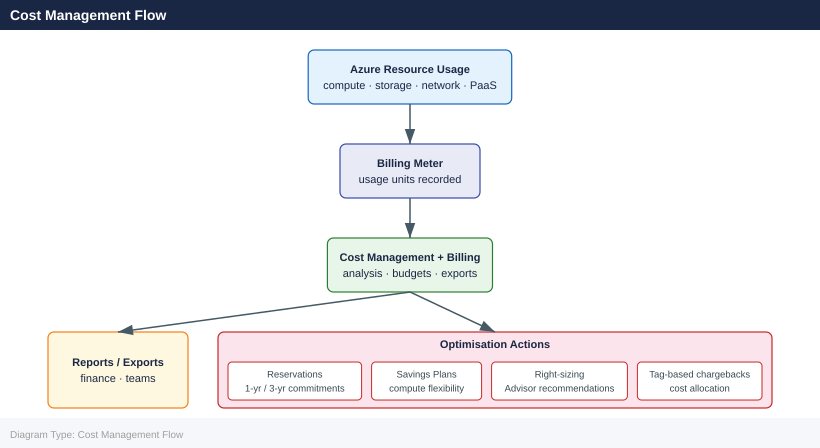

---
tags:
  - azure
---
# Cost Management and Billing

<div class="kb-summary">
Azure Cost Management + Billing is the central hub for understanding, analysing, and optimising Azure spend. It covers cost analysis, invoices, billing exports, and the Cost Management REST API.

*Applies to: Azure*
</div>

## Cost Management Flow



## Cost Analysis Views

The cost analysis blade provides interactive spend breakdowns. Use the CLI to pull the same data programmatically.

```bash
# Query cost for the current month by service name (subscription scope)
az costmanagement query \
  --scope "/subscriptions/<subscription-id>" \
  --type Usage \
  --timeframe MonthToDate \
  --dataset-granularity Daily \
  --dataset-aggregation '{"totalCost":{"name":"Cost","function":"Sum"}}' \
  --dataset-grouping '[{"type":"Dimension","name":"ServiceName"}]'

# Query cost grouped by resource group for a custom date range
az costmanagement query \
  --scope "/subscriptions/<subscription-id>" \
  --type Usage \
  --timeframe Custom \
  --time-period-from 2026-04-01 \
  --time-period-to 2026-04-30 \
  --dataset-aggregation '{"totalCost":{"name":"Cost","function":"Sum"}}' \
  --dataset-grouping '[{"type":"Dimension","name":"ResourceGroupName"}]'
```


```text title="Expected output"
{
  "properties": {
    "nextLink": null,
    "rows": [
      [
        "Virtual Machines",
        "2026-04-15",
        1247.89
      ],
      [
        "Storage",
        "2026-04-15",
        342.56
      ],
      [
        "SQL Database",
        "2026-04-15",
        189.23
      ],
      [
        "App Service",
        "2026-04-15",
        67.45
      ]
    ],
    "columns": [
      {
        "name": "ServiceName",
        "type": "Dimension"
      },
      {
        "name": "UsageDate",
        "type": "Dimension"
      },
      {
        "name": "Cost",
        "type": "Measure"
      }
    ]
  }
}
{
  "properties": {
    "nextLink": null,
    "rows": [
      [
        "prod-rg-eastus",
        1523.67
      ],
      [
        "dev-rg-westus",
        456.89
      ],
      [
        "staging-rg-centralus",
        234.12
      ],
      [
        "legacy-rg-northeurope",
        89.34
      ]
    ],
    "columns": [
      {
        "name": "ResourceGroupName",
        "type": "Dimension"
      },
      {
        "name": "Cost",
        "type": "Measure"
      }
    ]
  }
}
```

!!! warning "Common errors"
    **`The provided scope '/subscriptions/<subscription-id>' is invalid.`** — Replace `<subscription-id>` with your actual subscription ID from `az account show --query id -o tsv`.
    **`Invalid value for '--time-period-from': '2026-04-01' (type: CLIError)`** — Use ISO 8601 format `YYYY-MM-DDT00:00:00Z` or ensure the date is not in the future relative to your billing period.
    **`The dataset aggregation or grouping is malformed.`** — Validate JSON syntax in the aggregation and grouping parameters; use single quotes around the entire JSON string and escape inner quotes properly.
### Common Cost Dimensions

| Dimension | Description |
|---|---|
| `ServiceName` | Azure service (Compute, Storage, Networking) |
| `ResourceGroupName` | Resource group |
| `ResourceLocation` | Azure region |
| `MeterCategory` | Billing meter category |
| `TagValue` | Value of a specific tag (combine with TagKey filter) |
| `SubscriptionName` | Subscription (useful at MG scope) |

## Invoice Sections

Invoice sections (MCA) or departments (EA) allow cost to be split within a billing account. Each invoice section gets its own cost centre view.

```bash
# List billing accounts
az billing account list \
  --output table

# List invoice sections for a billing account
az billing invoice-section list \
  --billing-account-name <billing-account-id> \
  --billing-profile-name <billing-profile-id> \
  --output table

# Show details of an invoice section
az billing invoice-section show \
  --billing-account-name <billing-account-id> \
  --billing-profile-name <billing-profile-id> \
  --invoice-section-name <invoice-section-id>
```


```text title="Expected output"
Name                                 DisplayName              Properties
-----------------------------------  -----------------------  -----------------------------------------------
00000000-0000-0000-0000-000000000000  Contoso Billing Account  {"agreementType": "MicrosoftCustomerAgreement"}
11111111-1111-1111-1111-111111111111  Fabrikam Operations      {"agreementType": "EnterpriseAgreement"}

InvoiceSectionName    DisplayName           Status
--------------------  ---------------------  --------
INV-PROD-001          Production Services   Active
INV-PROD-002          Development Services  Active
INV-STAGING-001       Staging Environment   Active

{
  "id": "/providers/Microsoft.Billing/billingAccounts/00000000-0000-0000-0000-000000000000/billingProfiles/bp-prod-001/invoiceSections/INV-PROD-001",
  "name": "INV-PROD-001",
  "displayName": "Production Services",
  "status": "Active",
  "properties": {
    "displayName": "Production Services",
    "status": "Active"
  }
}
```

!!! warning "Common errors"
    **`The billing account '<billing-account-id>' does not exist or you do not have access to it.`** — Verify the billing account ID with `az billing account list` and ensure your account has the required Billing Reader role.
    **`The specified billing profile '<billing-profile-id>' was not found.`** — Confirm the billing profile ID exists under the specified billing account using `az billing profile list --billing-account-name <billing-account-id>`.
    **`Authorization failed: User does not have permission to perform action 'Microsoft.Billing/billingAccounts/read'.`** — Request Billing Reader or higher role assignment from your Azure subscription administrator.
## Billing Exports

Scheduled exports push daily or monthly cost data to an Azure Storage account in CSV format. This feeds downstream BI tools, cost dashboards, and data lakes.

```bash
# Create a daily export of actual costs for a subscription
az costmanagement export create \
  --name "daily-actual-export" \
  --scope "/subscriptions/<subscription-id>" \
  --type ActualCost \
  --dataset-granularity Daily \
  --recurrence Daily \
  --recurrence-period from="2026-05-01T00:00:00Z" to="2027-05-01T00:00:00Z" \
  --storage-container "cost-exports" \
  --storage-account-id "/subscriptions/<sub-id>/resourceGroups/rg-finops/providers/Microsoft.Storage/storageAccounts/safinops01" \
  --storage-directory "azure/subscriptions/<sub-id>"

# List exports on a scope
az costmanagement export list \
  --scope "/subscriptions/<subscription-id>" \
  --output table

# Trigger an export run on demand
az costmanagement export run \
  --name "daily-actual-export" \
  --scope "/subscriptions/<subscription-id>"

# Delete an export
az costmanagement export delete \
  --name "daily-actual-export" \
  --scope "/subscriptions/<subscription-id>"
```


```text title="Expected output"
{
  "id": "/subscriptions/12345678-1234-1234-1234-123456789012/providers/Microsoft.CostManagement/exports/daily-actual-export",
  "name": "daily-actual-export",
  "type": "Microsoft.CostManagement/exports",
  "properties": {
    "definition": {
      "type": "ActualCost",
      "timeframe": "Custom",
      "timePeriod": {
        "from": "2026-05-01T00:00:00Z",
        "to": "2027-05-01T00:00:00Z"
      },
      "dataset": {
        "granularity": "Daily",
        "aggregationTimePeriod": "Daily"
      }
    },
    "deliveryInfo": {
      "destination": {
        "resourceId": "/subscriptions/12345678-1234-1234-1234-123456789012/resourceGroups/rg-finops/providers/Microsoft.Storage/storageAccounts/safinops01",
        "container": "cost-exports",
        "rootFolderPath": "azure/subscriptions/12345678-1234-1234-1234-123456789012"
      }
    },
    "schedule": {
      "status": "Active",
      "recurrence": "Daily",
      "recurrencePeriod": {
        "from": "2026-05-01T00:00:00Z",
        "to": "2027-05-01T00:00:00Z"
      }
    }
  }
}

Name                    Type                              Scope
----------------------  --------------------------------  -----------------------------------------------
daily-actual-export     Microsoft.CostManagement/exports  /subscriptions/12345678-1234-1234-1234-123456789012
weekly-budget-export    Microsoft.CostManagement/exports  /subscriptions/12345678-1234-1234-1234-123456789012

{
  "id": "/subscriptions/12345678-1234-1234-1234-123456789012/providers/Microsoft.CostManagement/exports/daily-actual-export/run/20260501T000000Z",
  "name": "20260501T000000Z",
  "type": "Microsoft.CostManagement/exports/run",
  "properties": {
    "executionType": "OnDemand",
    "status": "Completed",
    "submittedTime": "2026-05-01T14:32:15.123Z",
    "processingEndTime": "2026-05-01T14:35:42.456Z"
  }
}
```

!!! warning "Common errors"
    **`InvalidResourceId : The resource ID is invalid or does not exist.`** — Verify the storage account resource ID and subscription ID are correct and the storage account exists in the specified resource group.
    **`StorageAccountAccessDenied : The managed identity does not have access to the storage account.`** — Ensure the storage account's access control (IAM) grants the Cost Management service principal "Storage Blob Data Contributor" role on the container.
    **`InvalidScope : The provided scope is not valid for this operation.`** — Confirm the subscription ID in the scope parameter matches your active subscription and is formatted as
### Export Types

| Export Type | Description |
|---|---|
| `ActualCost` | Invoice-basis costs including reservations as one-time charges |
| `AmortizedCost` | Amortises RI and savings plan costs daily across the term |
| `Usage` | Raw usage data without cost (useful for capacity planning) |

## Cost Management API

The Cost Management REST API supports queries not yet available in the CLI.

```bash
# Use az rest to call the Cost Management query API directly
az rest \
  --method POST \
  --url "https://management.azure.com/subscriptions/<sub-id>/providers/Microsoft.CostManagement/query?api-version=2023-11-01" \
  --body '{
    "type": "Usage",
    "timeframe": "MonthToDate",
    "dataset": {
      "granularity": "Daily",
      "aggregation": {
        "totalCost": {"name": "Cost", "function": "Sum"}
      },
      "grouping": [{"type": "Dimension", "name": "ServiceName"}]
    }
  }'
```


```text title="Expected output"
{
  "id": "/subscriptions/a1b2c3d4-e5f6-4a7b-8c9d-0e1f2a3b4c5d/providers/Microsoft.CostManagement/query/2024-01-15",
  "name": "2024-01-15",
  "type": "Microsoft.CostManagement/query",
  "properties": {
    "nextLink": null,
    "columns": [
      {"name": "ServiceName", "type": "Dimension"},
      {"name": "Cost", "type": "Number"}
    ],
    "rows": [
      ["Azure Virtual Machines", 1247.89],
      ["Azure Storage", 342.56],
      ["Azure SQL Database", 189.23],
      ["Azure App Service", 67.45],
      ["Bandwidth", 23.12],
      ...
    ]
  }
}
```

!!! warning "Common errors"
    **`The subscription '<sub-id>' could not be found.`** — Replace `<sub-id>` with your actual subscription ID from `az account show --query id`.
    **`Authorization failed for template deployment. The client '<client-id>' with object id '<object-id>' does not have permission to perform action 'Microsoft.CostManagement/query/action' over scope '/subscriptions/<sub-id>'.`** — Assign the "Cost Management Reader" role to your user or service principal via `az role assignment create --assignee <principal-id> --role "Cost Management Reader" --scope /subscriptions/<sub-id>`.
    **`Invalid JSON in request body`** — Validate the JSON syntax in the `--body` parameter using a JSON linter or ensure all quotes are properly escaped.
## Key Metrics to Track

| Metric | Description | Review Cadence |
|---|---|---|
| Month-to-date spend | Running total vs budget | Daily |
| Forecasted month-end | Projected final spend | Weekly |
| Untagged resource spend | Cost without attribution | Weekly |
| Top 5 services by cost | Largest spend drivers | Monthly |
| Reservation utilisation | % of RI hours consumed | Monthly |
