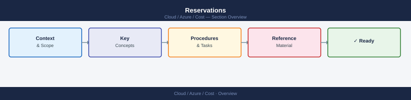
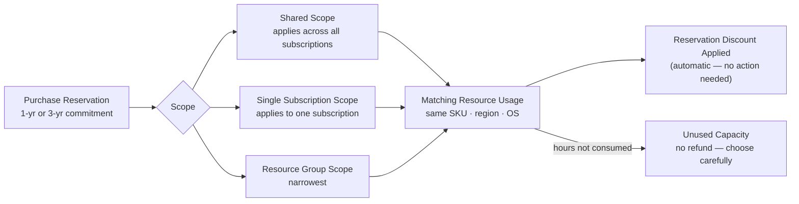

---
tags:
  - azure
---
# Reservations


<div class="kb-summary">
Azure Reserved Instances (RIs) offer significant discounts (up to 72%) over pay-as-you-go pricing in exchange for a 1-year or 3-year commitment. Reservations apply to VMs, SQL Databases, Cosmos DB, Storage, and other services.

*Applies to: Azure*
</div>



```d2
direction: right

center: "Azure" {shape: hexagon}
reservation_discount_application: "Reservation Discount Application" {shape: rectangle}
ri_purchasing: "RI Purchasing" {shape: rectangle}
reservation_scope: "Reservation Scope" {shape: rectangle}
exchange_and_refund: "Exchange and Refund" {shape: rectangle}
utilisation_monitoring: "Utilisation Monitoring" {shape: rectangle}
reservation_best_practices: "Reservation Best Practices" {shape: rectangle}

center -> reservation_discount_application
center -> ri_purchasing
center -> reservation_scope
center -> exchange_and_refund
center -> utilisation_monitoring
center -> reservation_best_practices
```

## Reservation Discount Application



## RI Purchasing

Reservations are purchased at the billing account or subscription level. The reservation scope determines which subscriptions benefit from the discount.

```bash
# List available reservation orders
az reservation reservation-order list \
  --output table

# Show details of a specific reservation order
az reservation reservation-order show \
  --reservation-order-id <order-id>

# List reservations within an order
az reservation reservation list \
  --reservation-order-id <order-id> \
  --output table

# Show a specific reservation
az reservation reservation show \
  --reservation-order-id <order-id> \
  --reservation-id <reservation-id>
```

### Purchase Workflow

Reservations are purchased through the Azure portal or REST API. The CLI is used primarily for post-purchase management (listing, scope changes, exchange/refund).

| Step | Action |
|---|---|
| 1. Identify candidates | Use Advisor recommendations to find VMs suitable for RIs |
| 2. Validate workload | Confirm VM runs 24/7 with consistent SKU requirements |
| 3. Choose term | 1-year (~40% savings) vs 3-year (~72% savings) |
| 4. Choose scope | Shared (all subscriptions) vs single subscription |
| 5. Purchase | Portal → Reservations → Add |
| 6. Monitor utilisation | Check within 7 days; low utilisation = misconfigured scope |

## Reservation Scope

Scope determines which Azure usage the reservation discount is applied to.

| Scope | Description |
|---|---|
| Shared | Applies across all subscriptions in the billing account/enrolment |
| Single subscription | Applies only to the nominated subscription |
| Single resource group | Applies only to VMs in the nominated resource group |
| Management group | Applies to all subscriptions in the management group |

```bash
# Update the scope of an existing reservation
az reservation reservation update \
  --reservation-order-id <order-id> \
  --reservation-id <reservation-id> \
  --applied-scope-type Shared
```

## Exchange and Refund

Reservations can be exchanged for a different SKU or region, or refunded (subject to a 12% early termination fee and $50,000/year refund cap).

```bash
# Get the reservation details needed before an exchange
az reservation reservation show \
  --reservation-order-id <order-id> \
  --reservation-id <reservation-id> \
  --query "{SKU:sku.name, Scope:properties.appliedScopeType, Quantity:properties.quantity, ExpiryDate:properties.expiryDate}"

# Exchanges and refunds are processed via the portal or REST API
# REST endpoint: POST /providers/Microsoft.Capacity/reservationOrders/{orderId}/exchange
```

## Utilisation Monitoring

Low utilisation means the discount is being wasted. Track utilisation and act quickly if it drops below 80%.

```bash
# Get utilisation summary for all reservations
az consumption reservation summary list \
  --reservation-order-id <order-id> \
  --grain daily \
  --output table

# Get detail-level utilisation
az consumption reservation detail list \
  --reservation-order-id <order-id> \
  --start-date 2026-05-01 \
  --end-date 2026-05-07 \
  --output table
```

### Utilisation Thresholds

| Utilisation % | Status | Action |
|---|---|---|
| > 95 % | Healthy | No action |
| 80–95 % | Acceptable | Monitor; consider scope widening |
| 60–80 % | Warning | Review scope or consider exchange |
| < 60 % | Critical | Exchange or refund; investigate misconfiguration |

## Reservation Best Practices

- Purchase RIs only for stable, predictable workloads — not dev/test or auto-scaled services with variable SKUs.
- Start with `Shared` scope to maximise coverage across all subscriptions.
- Set a calendar reminder at 90 days before expiry to decide on renewal or exchange.
- Review Advisor's RI recommendations monthly — it surfaces new candidates as workloads stabilise.
- Track savings using the amortised cost export to quantify RI benefit over pay-as-you-go.
