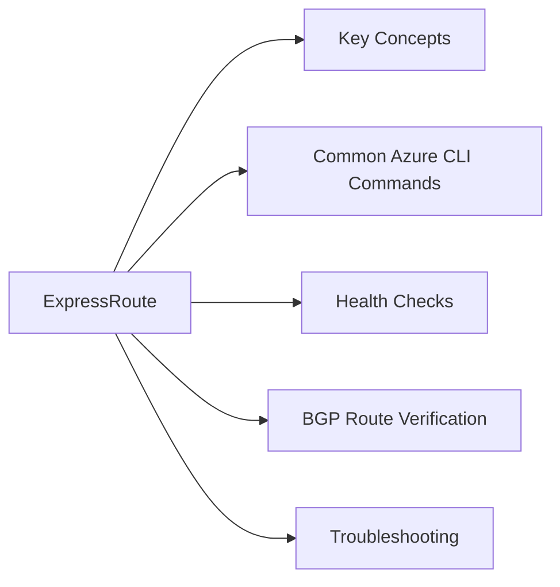

# ExpressRoute

Azure ExpressRoute — private, dedicated network connection between on-premises and Azure, bypassing the public internet.



## Key Concepts

| Concept | Description |
|---|---|
| Circuit | The ExpressRoute connection with a provider (bandwidth: 50 Mbps – 100 Gbps) |
| Peering | BGP session type: Private (to VNets) or Microsoft (to M365 / PaaS) |
| Gateway | Virtual Network Gateway in Azure connecting the VNet to the circuit |
| Direct | ExpressRoute Direct — connect directly into Microsoft network (10/100 Gbps) |
| Global Reach | Connect two on-premises sites through the Microsoft backbone |
| FastPath | Bypass gateway for highest throughput data paths |

## Common Azure CLI Commands

```bash
# List ExpressRoute circuits
az network express-route list -g <rg> \
  --query '[*].{Name:name,SKU:sku.tier,BW:bandwidthInMbps,Provider:serviceProviderProperties.serviceProviderName,State:serviceProviderProvisioningState}' -o table

# Show circuit details and peering state
az network express-route show -g <rg> -n <circuit-name>

# List peerings on a circuit
az network express-route peering list -g <rg> --circuit-name <circuit-name> \
  --query '[*].{Type:peeringType,State:state,PrimaryBGP:primaryPeerAddressPrefix,VlanId:vlanId}' -o table

# Get BGP route table (requires service key and connected peering)
az network express-route list-route-tables -g <rg> \
  --name <circuit-name> \
  --peering-name AzurePrivatePeering \
  --path primary

# List ExpressRoute gateways
az network vnet-gateway list -g <rg> \
  --query '[?gatewayType==`ExpressRoute`].{Name:name,SKU:sku.name,State:provisioningState}' -o table

# Authorise a VNet to connect to an ExpressRoute circuit
az network express-route auth create -g <rg> \
  --circuit-name <circuit-name> \
  --name <auth-name>

# Connect a VNet gateway to an ExpressRoute circuit
az network vpn-connection create -g <rg> -n <conn-name> \
  --vnet-gateway1 <vnet-gw-resource-id> \
  --express-route-circuit2 <circuit-resource-id> \
  --connection-type ExpressRoute \
  --authorization-key <auth-key>
```

## Health Checks

```bash
# Check circuit provisioning state and BGP status
az network express-route show -g <rg> -n <circuit-name> \
  --query '{State:serviceProviderProvisioningState,CircuitState:circuitProvisioningState,Bandwidth:bandwidthInMbps}'

# Get ARP tables (layer 2 reachability)
az network express-route list-arp-tables -g <rg> \
  --name <circuit-name> \
  --peering-name AzurePrivatePeering \
  --path primary
```

## BGP Route Verification

```bash
# Get advertised routes (what Azure sends to on-prem)
az network express-route list-route-tables-summary -g <rg> \
  --name <circuit-name> \
  --peering-name AzurePrivatePeering \
  --path primary

# Get received routes (what on-prem sends to Azure)
az network express-route list-route-tables -g <rg> \
  --name <circuit-name> \
  --peering-name AzurePrivatePeering \
  --path primary
```

## Troubleshooting

| Symptom | Check | Action |
|---|---|---|
| Circuit not connecting | Provider provisioning state | Confirm provider has provisioned the circuit; share service key with provider |
| BGP session down | Peering state / VLAN | Verify VLAN IDs and BGP peer IPs match on both sides |
| Routes not appearing | AS-PATH filtering | Check on-prem BGP policy; verify network is advertised with correct prefix |
| High latency | ARP / route table | Check for asymmetric routing; verify both primary and secondary paths are healthy |
| Connection works then drops | BFD timeout | Enable BFD on ExpressRoute circuit and on-prem CE router for faster failure detection |
