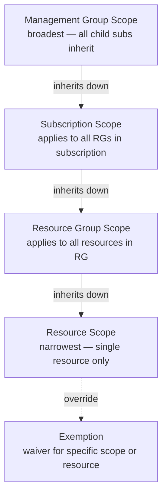

# Policy and Initiative Assignments


<div class="kb-summary">
A policy assignment connects a policy definition or initiative (policy set) to a specific scope in the Azure hierarchy. The assignment is the mechanism that makes a policy active and enforceable.
</div>
```
┌─────────────────────────────────────── Cloud Azure Governance ────────────────────────────────────────┐
│                                                                                                       │
│   ┌───────────────────────────────────────────────────────────────────────────────────────────────┐   │
│   │                             Azure: Cloud Azure Governance platform                            │   │
│   │                                  Protocols: Various protocols                                 │   │
│   │                     Management: Cloud Azure Governance management console                     │   │
│   │                Sections: Architecture · Operations · Security · Troubleshooting               │   │
│   └───────────────────────────────────────────────────────────────────────────────────────────────┘   │
│                                                                                                       │
│    Architecture → Operations → Security → Troubleshooting → Escalation                                │
│                                                                                                       │
│                  ▼                                ▼                                ▼                  │
│                                                                                                       │
│   ┌─────────────────────────────┐  ┌─────────────────────────────┐  ┌─────────────────────────────┐   │
│   │            Layer            │  │          Component          │  │            Notes            │   │
│   │             Core            │  │       Primary service       │  │        Main function        │   │
│   │          Management         │  │        Control plane        │  │         Admin access        │   │
│   │          Monitoring         │  │         Health/perf         │  │      Alerts/dashboards      │   │
│   │           Security          │  │         Auth/encrypt        │  │        Access control       │   │
│   │         Integration         │  │        APIs/plug-ins        │  │         Third-party         │   │
│   └─────────────────────────────┘  └─────────────────────────────┘  └─────────────────────────────┘   │
│                                                                                                       │
│                          ▼                                                 ▼                          │
│                                                                                                       │
│   ┌───────────────────────────────────────────────────────────────────────────────────────────────┐   │
│   │      Layer       │    Component     │      Function     │      Notes       │       Auth       │   │
│   │       Core       │ Primary service  │   Main function   │     See docs     │       RBAC       │   │
│   │    Management    │  Control plane   │    Admin access   │     See docs     │       RBAC       │   │
│   │    Monitoring    │   Health/perf    │  Alerts/dashboard │     See docs     │       RBAC       │   │
│   │     Security     │   Auth/encrypt   │   Access control  │     See docs     │       RBAC       │   │
│   └───────────────────────────────────────────────────────────────────────────────────────────────┘   │
│                                                                                                       │
│    Physical: Cloud Azure Governance infrastructure · management network · monitoring                  │
│                                                                                                       │
│    Key terms:                                                                                         │
│                                                                                                       │
│    Azure              = Cloud Azure Governance platform overview and core concepts                    │
│    Management         = management console and command-line interface for administration              │
│    Monitoring         = health and performance monitoring dashboards and alerting                     │
│    Automation         = REST API, scripting, and pipeline integration capabilities                    │
│    Security           = access control, authentication, and encryption configuration                  │
│    Backup             = backup and recovery procedures and schedule configuration                     │
│    Upgrade            = software version upgrades and firmware patching procedures                    │
│    Troubleshooting    = diagnostic procedures and common issue resolution steps                       │
│    Escalation         = vendor support escalation path and severity triage process                    │
│    Documentation      = vendor knowledge base and official product documentation                      │
│    Change management  = change ticket requirements for production modifications                       │
│    Audit log          = admin action logging for compliance and security review                       │
│                                                                                                       │
└───────────────────────────────────────────────────────────────────────────────────────────────────────┘
```


## Policy Assignment Scope Hierarchy



## Creating a Policy Assignment

```bash
# Assign a built-in policy by definition ID
az policy assignment create \
  --name "deny-public-ip" \
  --policy "9daedab3-fb2d-461e-b861-71790eead4f6" \
  --scope "/subscriptions/<subscription-id>" \
  --description "Deny creation of public IP addresses" \
  --display-name "Deny Public IP Addresses"

# Assign policy at resource group scope
az policy assignment create \
  --name "require-tags-rg" \
  --policy "96670d01-0a4d-4649-9c89-2d3abc0a5025" \
  --scope "/subscriptions/<sub-id>/resourceGroups/rg-production" \
  --params '{"tagName": {"value": "environment"}}'

# Assign policy at management group scope
az policy assignment create \
  --name "audit-storage-https" \
  --policy "404c3081-a854-4457-ae30-26a93ef643f9" \
  --scope "/providers/Microsoft.Management/managementGroups/mg-platform"

# List all assignments on a scope
az policy assignment list \
  --scope "/subscriptions/<subscription-id>" \
  --output table

# Show a specific assignment
az policy assignment show \
  --name "deny-public-ip" \
  --scope "/subscriptions/<subscription-id>"

# Delete an assignment
az policy assignment delete \
  --name "deny-public-ip" \
  --scope "/subscriptions/<subscription-id>"
```

## Assignment Scope

The scope of an assignment determines which resources are evaluated.

| Scope Level | Example | Typical Use |
|---|---|---|
| Management Group | `/providers/Microsoft.Management/managementGroups/<mg>` | Organisation-wide baseline |
| Subscription | `/subscriptions/<sub-id>` | Environment-level controls |
| Resource Group | `/subscriptions/<sub-id>/resourceGroups/<rg>` | Team or workload-specific |
| Resource | Full resource ARM ID | Edge-case single-resource control |

Assignments inherit downward — a policy assigned at MG scope applies to all subscriptions and resource groups within that MG.

## Parameters

Policy parameters allow a single policy definition to be reused across assignments with different configuration values.

```bash
# Assign policy with multiple parameters
az policy assignment create \
  --name "allowed-locations" \
  --policy "e56962a6-4747-49cd-b67b-bf8b01975c4f" \
  --scope "/subscriptions/<subscription-id>" \
  --params '{
    "listOfAllowedLocations": {
      "value": ["uksouth", "ukwest", "northeurope"]
    }
  }'

# View the parameters of an existing assignment
az policy assignment show \
  --name "allowed-locations" \
  --scope "/subscriptions/<subscription-id>" \
  --query "parameters"
```

## Exemptions

Specific resources or resource groups can be excluded from an assignment using exclusions (set at assignment time) or exemptions (created post-assignment).

```bash
# Add an exclusion scope at assignment creation time
az policy assignment create \
  --name "deny-public-ip" \
  --policy "9daedab3-fb2d-461e-b861-71790eead4f6" \
  --scope "/subscriptions/<subscription-id>" \
  --not-scopes "/subscriptions/<sub-id>/resourceGroups/rg-legacy"

# Create an exemption for a specific resource after assignment
az policy exemption create \
  --name "legacy-vm-exemption" \
  --policy-assignment "/subscriptions/<sub-id>/providers/Microsoft.Authorization/policyAssignments/deny-public-ip" \
  --scope "/subscriptions/<sub-id>/resourceGroups/rg-legacy/providers/Microsoft.Compute/virtualMachines/vm-legacy-01" \
  --exemption-category Waiver \
  --expires-on 2026-12-31T00:00:00Z
```

## Assignment Managed Identity

Policies with the `deployIfNotExists` or `modify` effect require a managed identity to perform remediation actions.

```bash
# Assign policy with system-assigned managed identity for remediation
az policy assignment create \
  --name "deploy-diag-settings" \
  --policy "<policy-definition-id>" \
  --scope "/subscriptions/<subscription-id>" \
  --mi-system-assigned \
  --location uksouth

# List assignments that have a managed identity
az policy assignment list \
  --scope "/subscriptions/<subscription-id>" \
  --query "[?identity != null].{Name:name, IdentityType:identity.type}" \
  --output table
```

## Common Assignment Patterns

| Pattern | Description |
|---|---|
| Baseline at MG scope | Apply audit policies to all subscriptions via management group |
| Deny at subscription scope | Block dangerous operations per environment |
| Modify at RG scope | Auto-tag resources on creation within a team's RG |
| Exemption with expiry | Time-bound exception for legacy resources or migration windows |
