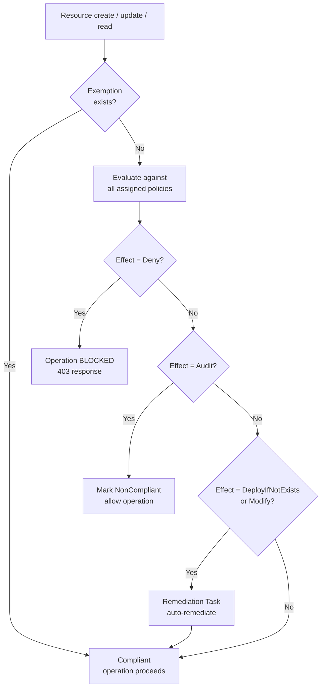

---
tags:
  - azure
---
# Azure Policy

<div class="kb-summary">
Azure Policy evaluates resources against defined rules and enforces organisational standards across your Azure environment. Policies can audit, deny, or automatically remediate non-compliant resources.

*Applies to: Azure*
</div>

## Built-in Policies

Azure provides hundreds of built-in policy definitions covering security, compliance, cost, and operational standards. Use them before authoring custom policies.

```bash
# List all built-in policy definitions
az policy definition list \
  --query "[?policyType=='BuiltIn'].{Name:displayName, ID:name}" \
  --output table

# Search for built-in policies by keyword
az policy definition list \
  --query "[?policyType=='BuiltIn' && contains(displayName, 'tag')]" \
  --output table

# Show details of a specific built-in policy
az policy definition show \
  --name "96670d01-0a4d-4649-9c89-2d3abc0a5025"

# Show the policy rule for a definition
az policy definition show \
  --name "96670d01-0a4d-4649-9c89-2d3abc0a5025" \
  --query "policyRule"
```

### Commonly Used Built-in Policies

| Display Name | Definition ID | Effect |
|---|---|---|
| Require a tag on resources | 96670d01-0a4d-4649-9c89-2d3abc0a5025 | Deny/Modify |
| Allowed locations | e56962a6-4747-49cd-b67b-bf8b01975c4f | Deny |
| Allowed virtual machine SKUs | cccc23c7-8427-4f53-ad12-b6a63eb452b3 | Deny |
| Audit VMs without disaster recovery configured | 0015ea4d-51ff-4ce3-8d8c-f3f8f0179a56 | Audit |
| Storage accounts should use customer-managed keys | 6fac406b-40ca-413b-bf8e-0bf964659c25 | Audit |

## Custom Policy Definitions

When built-in policies do not meet requirements, create custom definitions. Definitions are stored at management group or subscription scope.

```bash
# Create a custom policy definition from a JSON file
az policy definition create \
  --name "deny-non-approved-vm-images" \
  --display-name "Deny non-approved VM images" \
  --description "Ensures only approved marketplace images are used" \
  --rules policy-rules.json \
  --params policy-params.json \
  --mode Indexed \
  --subscription <subscription-id>

# Create at management group scope
az policy definition create \
  --name "require-diagnostics-storage" \
  --display-name "Require diagnostic settings for storage accounts" \
  --rules diag-rules.json \
  --mode Indexed \
  --management-group <mg-id>

# List custom policy definitions
az policy definition list \
  --query "[?policyType=='Custom'].{Name:displayName, ID:name, Mode:mode}" \
  --output table

# Update a custom policy definition
az policy definition update \
  --name "deny-non-approved-vm-images" \
  --rules updated-policy-rules.json

# Delete a custom policy definition
az policy definition delete \
  --name "deny-non-approved-vm-images"
```

## Policy Effects

The effect defines what happens when a resource is evaluated and does not comply.

| Effect | Behaviour | Remediation |
|---|---|---|
| `Audit` | Marks non-compliant; no blocking | Manual |
| `AuditIfNotExists` | Audits if a related resource is missing | Manual |
| `Deny` | Blocks the create/update operation | N/A (preventive) |
| `DeployIfNotExists` | Deploys a related resource if missing | Automatic via task |
| `Modify` | Adds, updates, or removes properties/tags | Automatic via task |
| `Disabled` | Policy is inactive | N/A |
| `Append` | Adds fields to the resource request | N/A |

## Policy Rule Structure

A minimal deny policy rule:

```json
{
  "if": {
    "allOf": [
      {
        "field": "type",
        "equals": "Microsoft.Compute/virtualMachines"
      },
      {
        "field": "location",
        "notIn": "[parameters('allowedLocations')]"
      }
    ]
  },
  "then": {
    "effect": "deny"
  }
}
```

## Evaluating Compliance

```bash
# Trigger a compliance scan (on-demand)
az policy state trigger-scan \
  --subscription <subscription-id>

# List non-compliant resources for a specific policy
az policy state list \
  --filter "policyDefinitionName eq '<definition-name>' and complianceState eq 'NonCompliant'" \
  --output table

# Summarise compliance by policy assignment
az policy state summarize \
  --subscription <subscription-id> \
  --query "value[0].policyAssignments[].{Policy:policyAssignmentId, NonCompliant:results.nonCompliantResources}" \
  --output table
```

## Azure Policy Evaluation Flow



## Policy Lifecycle Management

| Stage | Activity |
|---|---|
| Design | Define scope, effect, parameters, and test in sandbox |
| Deploy as Audit | Baseline non-compliance without blocking operations |
| Remediate | Fix existing non-compliant resources |
| Switch to Deny/Modify | Enforce going forward after remediation sprint |
| Review quarterly | Check for new built-in policies; retire outdated custom policies |
