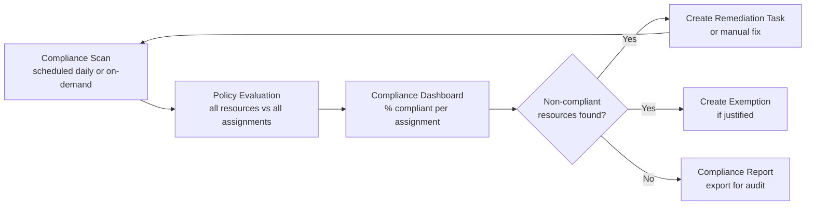

# Compliance Review


<div class="kb-summary">
Azure Policy compliance reviews evaluate the current state of resources against assigned policies and surface non-compliant resources. Regular compliance reviews are essential for maintaining governance standards and preparing for audits.
</div>
```text
┌─────────────────────────────────────── Cloud Azure Governance ────────────────────────────────────────┐
│                                                                                                       │
│   ┌───────────────────────────────────────────────────────────────────────────────────────────────┐   │
│   │                             Azure: Cloud Azure Governance platform                            │   │
│   │                                  Protocols: Various protocols                                 │   │
│   │                     Management: Cloud Azure Governance management console                     │   │
│   │                Sections: Architecture · Operations · Security · Troubleshooting               │   │
│   └───────────────────────────────────────────────────────────────────────────────────────────────┘   │
│                                                                                                       │
│    Architecture → Operations → Security → Troubleshooting → Escalation                                │
│                                                                                                       │
│                  ▼                                ▼                                ▼                  │
│                                                                                                       │
│   ┌─────────────────────────────┐  ┌─────────────────────────────┐  ┌─────────────────────────────┐   │
│   │            Layer            │  │          Component          │  │            Notes            │   │
│   │             Core            │  │       Primary service       │  │        Main function        │   │
│   │          Management         │  │        Control plane        │  │         Admin access        │   │
│   │          Monitoring         │  │         Health/perf         │  │      Alerts/dashboards      │   │
│   │           Security          │  │         Auth/encrypt        │  │        Access control       │   │
│   │         Integration         │  │        APIs/plug-ins        │  │         Third-party         │   │
│   └─────────────────────────────┘  └─────────────────────────────┘  └─────────────────────────────┘   │
│                                                                                                       │
│                          ▼                                                 ▼                          │
│                                                                                                       │
│   ┌───────────────────────────────────────────────────────────────────────────────────────────────┐   │
│   │      Layer       │    Component     │      Function     │      Notes       │       Auth       │   │
│   │       Core       │ Primary service  │   Main function   │     See docs     │       RBAC       │   │
│   │    Management    │  Control plane   │    Admin access   │     See docs     │       RBAC       │   │
│   │    Monitoring    │   Health/perf    │  Alerts/dashboard │     See docs     │       RBAC       │   │
│   │     Security     │   Auth/encrypt   │   Access control  │     See docs     │       RBAC       │   │
│   └───────────────────────────────────────────────────────────────────────────────────────────────┘   │
│                                                                                                       │
│    Physical: Cloud Azure Governance infrastructure · management network · monitoring                  │
│                                                                                                       │
│    Key terms:                                                                                         │
│                                                                                                       │
│    Azure              = Cloud Azure Governance platform overview and core concepts                    │
│    Management         = management console and command-line interface for administration              │
│    Monitoring         = health and performance monitoring dashboards and alerting                     │
│    Automation         = REST API, scripting, and pipeline integration capabilities                    │
│    Security           = access control, authentication, and encryption configuration                  │
│    Backup             = backup and recovery procedures and schedule configuration                     │
│    Upgrade            = software version upgrades and firmware patching procedures                    │
│    Troubleshooting    = diagnostic procedures and common issue resolution steps                       │
│    Escalation         = vendor support escalation path and severity triage process                    │
│    Documentation      = vendor knowledge base and official product documentation                      │
│    Change management  = change ticket requirements for production modifications                       │
│    Audit log          = admin action logging for compliance and security review                       │
│                                                                                                       │
└───────────────────────────────────────────────────────────────────────────────────────────────────────┘
```


## Compliance Review Cycle



## Compliance Dashboard

The compliance dashboard in the portal shows an overall compliance percentage and breaks it down by policy assignment. Use the CLI for scripted reporting.

```bash
# Get overall compliance summary for a subscription
az policy state summarize \
  --subscription <subscription-id>

# Get compliance summary at management group scope
az policy state summarize \
  --management-group <mg-id>

# Trigger an on-demand compliance scan
az policy state trigger-scan \
  --subscription <subscription-id>

# Trigger scan for a specific resource group
az policy state trigger-scan \
  --resource-group rg-production
```

### Compliance State Values

| State | Description |
|---|---|
| Compliant | Resource satisfies all assigned policy conditions |
| NonCompliant | Resource violates at least one policy condition |
| Exempt | Resource has an active policy exemption |
| Conflict | Two policies produce conflicting evaluations |
| Not started | Evaluation has not yet run for this resource |

## Non-Compliant Resources

```bash
# List all non-compliant resources in a subscription
az policy state list \
  --subscription <subscription-id> \
  --filter "complianceState eq 'NonCompliant'" \
  --output table

# Non-compliant resources for a specific policy assignment
az policy state list \
  --filter "policyAssignmentName eq 'deny-public-ip' and complianceState eq 'NonCompliant'" \
  --output table

# Non-compliant resources with reason
az policy state list \
  --subscription <subscription-id> \
  --filter "complianceState eq 'NonCompliant'" \
  --query "[].{Resource:resourceId, Policy:policyDefinitionName, Reason:policyDefinitionReferenceId}" \
  --output table

# Count of non-compliant resources per policy
az policy state summarize \
  --subscription <subscription-id> \
  --query "value[0].policyAssignments[].{Policy:policyAssignmentName, NonCompliant:results.nonCompliantResources}" \
  --output table
```

## Remediation Tasks

Policies with `deployIfNotExists` or `modify` effects can create remediation tasks to bring non-compliant resources into compliance automatically.

```bash
# Create a remediation task for a policy assignment
az policy remediation create \
  --name "remediate-diag-settings" \
  --policy-assignment "/subscriptions/<sub-id>/providers/Microsoft.Authorization/policyAssignments/deploy-diag-settings" \
  --resource-discovery-mode ReEvaluateCompliance

# Create a remediation task for a specific resource group
az policy remediation create \
  --name "remediate-tags-rg" \
  --policy-assignment "/subscriptions/<sub-id>/providers/Microsoft.Authorization/policyAssignments/inherit-env-tag" \
  --resource-group rg-production

# List remediation tasks
az policy remediation list \
  --subscription <subscription-id> \
  --output table

# Show status of a remediation task
az policy remediation show \
  --name "remediate-diag-settings" \
  --subscription <subscription-id>

# Cancel a running remediation task
az policy remediation cancel \
  --name "remediate-diag-settings" \
  --subscription <subscription-id>
```

### Remediation Task States

| State | Description |
|---|---|
| Queued | Task created; waiting to start |
| Running | Actively remediating resources |
| Succeeded | All targeted resources remediated |
| Failed | One or more remediations failed |
| Canceled | Task was manually cancelled |

## Compliance Review Cadence

| Review Type | Frequency | Scope | Owner |
|---|---|---|---|
| Automated scan | Daily (triggered by deployment) | All subscriptions | Platform team |
| Non-compliant triage | Weekly | New non-compliant resources | Governance lead |
| Remediation sprint | Monthly | Backlog of non-compliant resources | All engineering teams |
| Audit preparation | Quarterly | Full compliance posture + exemptions review | Security + Governance |

## Exporting Compliance Data

```bash
# Export all compliance states to JSON for audit reporting
az policy state list \
  --subscription <subscription-id> \
  --output json > compliance-$(date +%Y%m%d).json

# Export non-compliant only
az policy state list \
  --subscription <subscription-id> \
  --filter "complianceState eq 'NonCompliant'" \
  --output json > non-compliant-$(date +%Y%m%d).json
```
