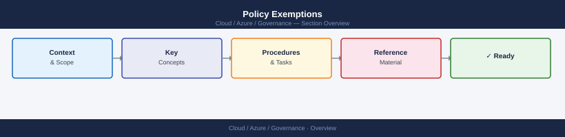
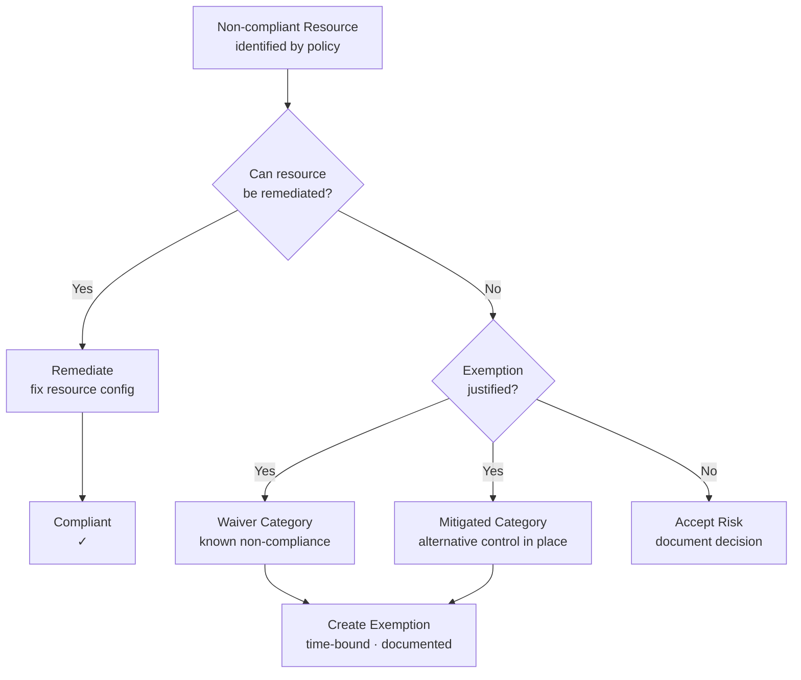

---
tags:
  - azure
---
# Policy Exemptions


<div class="kb-summary">
Policy exemptions allow specific resources, resource groups, or subscriptions to be excluded from policy evaluation. Exemptions are preferred over assignment exclusions because they are auditable, time-bound, and can be reviewed independently.

*Applies to: Azure*
</div>



## Exemption Decision Flow



## Creating Exemptions

```bash
# Create an exemption for a specific resource
az policy exemption create \
  --name "legacy-vm-public-ip-exemption" \
  --policy-assignment "/subscriptions/<sub-id>/providers/Microsoft.Authorization/policyAssignments/deny-public-ip" \
  --scope "/subscriptions/<sub-id>/resourceGroups/rg-legacy/providers/Microsoft.Compute/virtualMachines/vm-legacy-01" \
  --exemption-category Waiver \
  --display-name "Legacy VM - public IP required until migration" \
  --description "This VM requires a public IP until the migration to private endpoint is complete in Q3 2026" \
  --expires-on 2026-09-30T00:00:00Z

# Create an exemption for an entire resource group
az policy exemption create \
  --name "sandbox-rg-exemption" \
  --policy-assignment "/subscriptions/<sub-id>/providers/Microsoft.Authorization/policyAssignments/require-cost-centre-tag" \
  --scope "/subscriptions/<sub-id>/resourceGroups/rg-sandbox" \
  --exemption-category Mitigated \
  --display-name "Sandbox RG - tagging not required" \
  --expires-on 2026-12-31T00:00:00Z

# List all exemptions on a subscription
az policy exemption list \
  --scope "/subscriptions/<subscription-id>" \
  --output table

# Show a specific exemption
az policy exemption show \
  --name "legacy-vm-public-ip-exemption" \
  --scope "/subscriptions/<sub-id>/resourceGroups/rg-legacy/providers/Microsoft.Compute/virtualMachines/vm-legacy-01"

# Delete an exemption
az policy exemption delete \
  --name "legacy-vm-public-ip-exemption" \
  --scope "/subscriptions/<sub-id>/resourceGroups/rg-legacy/providers/Microsoft.Compute/virtualMachines/vm-legacy-01"
```

## Waiver vs Mitigated

The exemption category communicates the rationale for the exemption and is important for audit purposes.

| Category | Meaning | Example |
|---|---|---|
| `Waiver` | The policy intent does not apply to this resource | Deny-public-IP exempted for a bastion jumpbox |
| `Mitigated` | The policy intent is satisfied through an alternative control | No diagnostic settings because logs go to a 3rd-party SIEM instead |

Always choose the correct category — auditors use this field to assess the validity of exemptions.

## Expiry

All exemptions should have an expiry date. Azure evaluates the `expiresOn` field and automatically re-applies policy evaluation when the exemption expires.

```bash
# Update an exemption to extend its expiry
az policy exemption update \
  --name "legacy-vm-public-ip-exemption" \
  --scope "/subscriptions/<sub-id>/resourceGroups/rg-legacy/providers/Microsoft.Compute/virtualMachines/vm-legacy-01" \
  --expires-on 2026-12-31T00:00:00Z

# List exemptions expiring within 30 days (manual filter using query)
az policy exemption list \
  --scope "/subscriptions/<subscription-id>" \
  --query "[?expiresOn != null].{Name:name, Scope:id, Expiry:expiresOn, Category:exemptionCategory}" \
  --output table
```

### Exemption Lifecycle

| Stage | Action |
|---|---|
| Request | Engineer submits exemption request with justification and owner |
| Approval | Governance lead reviews and approves with expiry date |
| Creation | Exemption created via CLI with category, description, and expiry |
| Review | Exemption reviewed at 60-day mark; extended or planned for removal |
| Expiry | Azure automatically removes the exemption; policy re-applies |

## Audit Trail

Exemption creation, updates, and deletions are recorded in the Azure Activity Log. Use this for audit evidence.

```bash
# Query Activity Log for exemption operations
az monitor activity-log list \
  --subscription <subscription-id> \
  --resource-provider "Microsoft.Authorization" \
  --query "[?contains(operationName.value, 'policyExemptions')].{Time:eventTimestamp, Operation:operationName.value, Caller:caller, Status:status.value}" \
  --output table \
  --start-time 2026-05-01T00:00:00Z
```

## Exemption Best Practices

| Practice | Rationale |
|---|---|
| Always set an expiry date | Prevents exemptions from becoming permanent by default |
| Use `Mitigated` where possible | Shows compensating control exists; easier to justify in audit |
| Include ticket/Jira reference in description | Links exemption to an approved work item |
| Review all exemptions quarterly | Catch expired justifications and unnecessary exemptions |
| Scope as narrowly as possible | Resource-level is preferable to resource-group-level |
