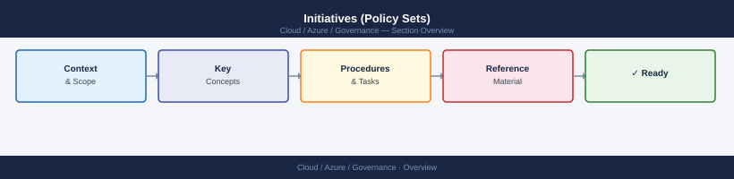
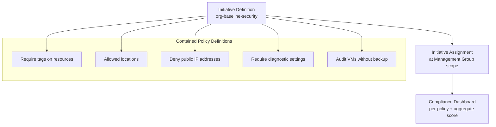

---
tags:
  - azure
---
# Initiatives (Policy Sets)


<div class="kb-summary">
An initiative (formerly called a policy set definition) groups multiple related policy definitions into a single assignable unit. This simplifies governance by allowing you to assign and track a set of related controls as one entity.

*Applies to: Azure*
</div>



## Initiative (Policy Set) Structure



## Creating an Initiative

```bash
# Create a custom initiative from a JSON definition file
az policy set-definition create \
  --name "org-baseline-security" \
  --display-name "Organisation Baseline Security Controls" \
  --description "Core security policies applied to all subscriptions" \
  --definitions initiative-policies.json \
  --params initiative-params.json \
  --management-group <mg-id>

# Create a simpler initiative at subscription scope
az policy set-definition create \
  --name "team-tagging-initiative" \
  --display-name "Team Tagging Standards" \
  --definitions '[
    {
      "policyDefinitionId": "/providers/Microsoft.Authorization/policyDefinitions/96670d01-0a4d-4649-9c89-2d3abc0a5025",
      "policyDefinitionReferenceId": "require-environment-tag",
      "parameters": {"tagName": {"value": "environment"}}
    },
    {
      "policyDefinitionId": "/providers/Microsoft.Authorization/policyDefinitions/96670d01-0a4d-4649-9c89-2d3abc0a5025",
      "policyDefinitionReferenceId": "require-team-tag",
      "parameters": {"tagName": {"value": "team"}}
    }
  ]'

# List all initiative definitions (built-in and custom)
az policy set-definition list \
  --query "[].{Name:displayName, Type:policyType, ID:name}" \
  --output table

# Show a specific initiative
az policy set-definition show \
  --name "org-baseline-security" \
  --management-group <mg-id>

# Update an initiative
az policy set-definition update \
  --name "org-baseline-security" \
  --definitions updated-initiative-policies.json \
  --management-group <mg-id>

# Delete an initiative
az policy set-definition delete \
  --name "org-baseline-security" \
  --management-group <mg-id>
```

## Parameter Mapping

Initiative-level parameters allow a single assignment to pass values into multiple member policies. Define the initiative parameter once and reference it in member policy parameter values.

```json
{
  "allowedLocations": {
    "type": "Array",
    "metadata": {
      "displayName": "Allowed Locations",
      "description": "List of Azure regions that resources may be deployed to"
    }
  }
}
```

Reference initiative parameters from member policies:

```json
{
  "policyDefinitionId": "/providers/Microsoft.Authorization/policyDefinitions/e56962a6-4747-49cd-b67b-bf8b01975c4f",
  "policyDefinitionReferenceId": "allowed-locations-vms",
  "parameters": {
    "listOfAllowedLocations": {
      "value": "[parameters('allowedLocations')]"
    }
  }
}
```

## Assigning an Initiative

```bash
# Assign a custom initiative to a subscription
az policy assignment create \
  --name "baseline-security-assignment" \
  --policy-set-definition "org-baseline-security" \
  --scope "/subscriptions/<subscription-id>" \
  --params '{"allowedLocations": {"value": ["uksouth", "ukwest"]}}'

# Assign a built-in initiative (e.g., CIS Microsoft Azure Foundations Benchmark)
az policy assignment create \
  --name "cis-benchmark" \
  --policy-set-definition "06f19060-9e68-4070-92ca-f15cc126059e" \
  --scope "/subscriptions/<subscription-id>" \
  --mi-system-assigned \
  --location uksouth

# List initiative assignments
az policy assignment list \
  --scope "/subscriptions/<subscription-id>" \
  --query "[?policyDefinitionId != null && contains(policyDefinitionId, 'policySetDefinitions')]" \
  --output table
```

### Common Built-in Initiatives

| Initiative | ID | Purpose |
|---|---|---|
| Azure Security Benchmark | 1f3afdf9-d0c9-4c3d-847f-89da613e70a8 | Microsoft security baseline |
| CIS Azure Foundations Benchmark | 06f19060-9e68-4070-92ca-f15cc126059e | CIS Level 1 controls |
| NIST SP 800-53 Rev. 5 | cf25b9c1-bd23-4eb6-bd2c-f4f3ac644a5f | US federal compliance |
| ISO 27001:2013 | 89c6cddc-1c73-4ac1-b19c-54d1a15a42f9 | ISO 27001 mapping |

## Compliance Rollup

Initiatives aggregate compliance across all member policies. The initiative compliance percentage reflects how many resources satisfy all member policies.

```bash
# Get compliance summary for an initiative assignment
az policy state summarize \
  --subscription <subscription-id> \
  --query "value[0].policyAssignments[?policyAssignmentId=='/subscriptions/<sub-id>/providers/Microsoft.Authorization/policyAssignments/baseline-security-assignment']"

# List non-compliant resources for each member policy in an initiative
az policy state list \
  --filter "policyAssignmentName eq 'baseline-security-assignment' and complianceState eq 'NonCompliant'" \
  --query "[].{Resource:resourceId, MemberPolicy:policyDefinitionReferenceId}" \
  --output table
```
