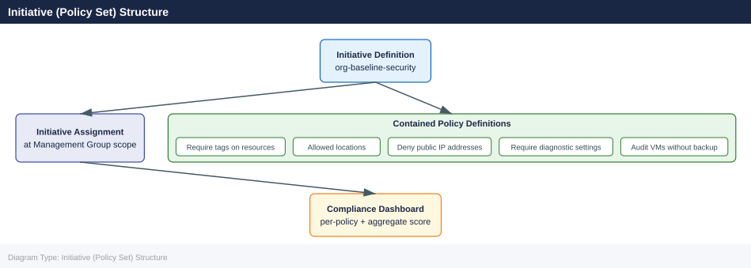

---
tags:
  - azure
description: "An initiative (formerly called a policy set definition) groups multiple related policy definitions into a single assignable unit. This simplifies..."
---
# Initiatives (Policy Sets)

<div class="kb-summary">
An initiative (formerly called a policy set definition) groups multiple related policy definitions into a single assignable unit. This simplifies governance by allowing you to assign and track a set of related controls as one entity.

*Applies to: Azure*
</div>

## Initiative (Policy Set) Structure



## Creating an Initiative

```bash
# Create a custom initiative from a JSON definition file
az policy set-definition create \
  --name "org-baseline-security" \
  --display-name "Organisation Baseline Security Controls" \
  --description "Core security policies applied to all subscriptions" \
  --definitions initiative-policies.json \
  --params initiative-params.json \
  --management-group <mg-id>

# Create a simpler initiative at subscription scope
az policy set-definition create \
  --name "team-tagging-initiative" \
  --display-name "Team Tagging Standards" \
  --definitions '[
    {
      "policyDefinitionId": "/providers/Microsoft.Authorization/policyDefinitions/96670d01-0a4d-4649-9c89-2d3abc0a5025",
      "policyDefinitionReferenceId": "require-environment-tag",
      "parameters": {"tagName": {"value": "environment"}}
    },
    {
      "policyDefinitionId": "/providers/Microsoft.Authorization/policyDefinitions/96670d01-0a4d-4649-9c89-2d3abc0a5025",
      "policyDefinitionReferenceId": "require-team-tag",
      "parameters": {"tagName": {"value": "team"}}
    }
  ]'

# List all initiative definitions (built-in and custom)
az policy set-definition list \
  --query "[].{Name:displayName, Type:policyType, ID:name}" \
  --output table

# Show a specific initiative
az policy set-definition show \
  --name "org-baseline-security" \
  --management-group <mg-id>

# Update an initiative
az policy set-definition update \
  --name "org-baseline-security" \
  --definitions updated-initiative-policies.json \
  --management-group <mg-id>

# Delete an initiative
az policy set-definition delete \
  --name "org-baseline-security" \
  --management-group <mg-id>
```


```text title="Expected output"
{
  "id": "/providers/Microsoft.Management/managementGroups/contoso-mg/providers/Microsoft.Authorization/policySetDefinitions/org-baseline-security",
  "name": "org-baseline-security",
  "displayName": "Organisation Baseline Security Controls",
  "description": "Core security policies applied to all subscriptions",
  "policyType": "Custom",
  "metadata": {
    "createdBy": "admin@contoso.com",
    "createdOn": "2024-01-15T09:42:33.5847392Z",
    "updatedBy": "admin@contoso.com",
    "updatedOn": "2024-01-15T09:42:33.5847392Z"
  }
}
{
  "id": "/subscriptions/12345678-1234-1234-1234-123456789012/providers/Microsoft.Authorization/policySetDefinitions/team-tagging-initiative",
  "name": "team-tagging-initiative",
  "displayName": "Team Tagging Standards",
  "policyType": "Custom"
}
Name                                          Type      ID
──────────────────────────────────────────────────────────────────────────────
Allowed locations                             BuiltIn   allowed-locations
Audit VMs without managed disks                BuiltIn   audit-vm-managed-disks
Organisation Baseline Security Controls       Custom    org-baseline-security
Team Tagging Standards                        Custom    team-tagging-initiative
...
{
  "id": "/providers/Microsoft.Management/managementGroups/contoso-mg/providers/Microsoft.Authorization/policySetDefinitions/org-baseline-security",
  "name": "org-baseline-security",
  "displayName": "Organisation Baseline Security Controls",
  "policyDefinitions": [
    {
      "policyDefinitionId": "/providers/Microsoft.Authorization/policyDefinitions/1e30110a-5ceb-460c-a204-36222dde61d4",
      "policyDefinitionReferenceId": "require-https"
    }
  ]
}
(no output — command completes silently)
(no output — command completes silently)
```

!!! warning "Common errors"
    | Error | Fix |
    |---|---|
    | `BadRequest: The file 'initiative-policies.json' does not exist or is not readable.` | Verify the JSON file path is correct and readable with `cat initiative-policies.json` before running the command. |
    | `AuthorizationFailed: The client 'user@contoso.com' with object id '12345678-...' does not have authorization to perform action 'Microsoft.Authorization/policySetDefinitions/write' over scope '/providers/Microsoft.Management/managementGroups/contoso-mg'.` | Ensure your account has the Policy Contributor or Owner role assigned at the management group scope. |
    | `BadRequest: Invalid policy definition reference ID 'require-environment-tag'. Policy definition reference IDs must be unique within the initiative.` | Use distinct `policyDefinitionReferenceId` values for each policy in the definitions array. |
## Parameter Mapping

Initiative-level parameters allow a single assignment to pass values into multiple member policies. Define the initiative parameter once and reference it in member policy parameter values.

```json
{
  "allowedLocations": {
    "type": "Array",
    "metadata": {
      "displayName": "Allowed Locations",
      "description": "List of Azure regions that resources may be deployed to"
    }
  }
}
```

Reference initiative parameters from member policies:

```json
{
  "policyDefinitionId": "/providers/Microsoft.Authorization/policyDefinitions/e56962a6-4747-49cd-b67b-bf8b01975c4f",
  "policyDefinitionReferenceId": "allowed-locations-vms",
  "parameters": {
    "listOfAllowedLocations": {
      "value": "[parameters('allowedLocations')]"
    }
  }
}
```

## Assigning an Initiative

```bash
# Assign a custom initiative to a subscription
az policy assignment create \
  --name "baseline-security-assignment" \
  --policy-set-definition "org-baseline-security" \
  --scope "/subscriptions/<subscription-id>" \
  --params '{"allowedLocations": {"value": ["uksouth", "ukwest"]}}'

# Assign a built-in initiative (e.g., CIS Microsoft Azure Foundations Benchmark)
az policy assignment create \
  --name "cis-benchmark" \
  --policy-set-definition "06f19060-9e68-4070-92ca-f15cc126059e" \
  --scope "/subscriptions/<subscription-id>" \
  --mi-system-assigned \
  --location uksouth

# List initiative assignments
az policy assignment list \
  --scope "/subscriptions/<subscription-id>" \
  --query "[?policyDefinitionId != null && contains(policyDefinitionId, 'policySetDefinitions')]" \
  --output table
```


```text title="Expected output"
{
  "id": "/subscriptions/a1b2c3d4-e5f6-7890-abcd-ef1234567890/providers/Microsoft.Authorization/policyAssignments/baseline-security-assignment",
  "name": "baseline-security-assignment",
  "type": "Microsoft.Authorization/policyAssignments",
  "displayName": "baseline-security-assignment",
  "policyDefinitionId": "/subscriptions/a1b2c3d4-e5f6-7890-abcd-ef1234567890/providers/Microsoft.Authorization/policySetDefinitions/org-baseline-security",
  "scope": "/subscriptions/a1b2c3d4-e5f6-7890-abcd-ef1234567890",
  "parameters": {
    "allowedLocations": {
      "value": [
        "uksouth",
        "ukwest"
      ]
    }
  },
  "enforcementMode": "Default"
}
{
  "id": "/subscriptions/a1b2c3d4-e5f6-7890-abcd-ef1234567890/providers/Microsoft.Authorization/policyAssignments/cis-benchmark",
  "name": "cis-benchmark",
  "type": "Microsoft.Authorization/policyAssignments",
  "displayName": "cis-benchmark",
  "policyDefinitionId": "/providers/Microsoft.Authorization/policySetDefinitions/06f19060-9e68-4070-92ca-f15cc126059e",
  "scope": "/subscriptions/a1b2c3d4-e5f6-7890-abcd-ef1234567890",
  "identity": {
    "type": "SystemAssigned",
    "principalId": "f7a8b9c0-d1e2-f3a4-b5c6-d7e8f9a0b1c2"
  },
  "enforcementMode": "Default"
}
Name                          Type                      Scope
------------------------------  -------------------------  -----------------------------------------------
baseline-security-assignment  Microsoft.Authorization   /subscriptions/a1b2c3d4-e5f6-7890-abcd-ef1234567890
cis-benchmark                 Microsoft.Authorization   /subscriptions/a1b2c3d4-e5f6-7890-abcd-ef1234567890
```

!!! warning "Common errors"
    | Error | Fix |
    |---|---|
    | `Policy set definition 'org-baseline-security' not found.` | Verify the custom initiative exists in the subscription using `az policy set-definition list` and use the correct definition ID. |
    | `The policy assignment 'baseline-security-assignment' already exists.` | Use a unique assignment name or delete the existing assignment with `az policy assignment delete --name baseline-security-assignment --scope <subscription-id>`. |
    | `Invalid scope format. Scope must start with '/subscriptions/' or '/providers/'.` | Replace `<subscription-id>` with your actual subscription ID (e.g., `/subscriptions/a1b2c3d4-e5f6-7890-abcd-ef1234567890`). |
### Common Built-in Initiatives

| Initiative | ID | Purpose |
|---|---|---|
| Azure Security Benchmark | 1f3afdf9-d0c9-4c3d-847f-89da613e70a8 | Microsoft security baseline |
| CIS Azure Foundations Benchmark | 06f19060-9e68-4070-92ca-f15cc126059e | CIS Level 1 controls |
| NIST SP 800-53 Rev. 5 | cf25b9c1-bd23-4eb6-bd2c-f4f3ac644a5f | US federal compliance |
| ISO 27001:2013 | 89c6cddc-1c73-4ac1-b19c-54d1a15a42f9 | ISO 27001 mapping |

## Compliance Rollup

Initiatives aggregate compliance across all member policies. The initiative compliance percentage reflects how many resources satisfy all member policies.

```bash
# Get compliance summary for an initiative assignment
az policy state summarize \
  --subscription <subscription-id> \
  --query "value[0].policyAssignments[?policyAssignmentId=='/subscriptions/<sub-id>/providers/Microsoft.Authorization/policyAssignments/baseline-security-assignment']"

# List non-compliant resources for each member policy in an initiative
az policy state list \
  --filter "policyAssignmentName eq 'baseline-security-assignment' and complianceState eq 'NonCompliant'" \
  --query "[].{Resource:resourceId, MemberPolicy:policyDefinitionReferenceId}" \
  --output table
```


```text title="Expected output"
[
  {
    "policyAssignmentId": "/subscriptions/a1b2c3d4-e5f6-4789-0abc-def123456789/providers/Microsoft.Authorization/policyAssignments/baseline-security-assignment",
    "policyAssignmentName": "baseline-security-assignment",
    "results": {
      "queryResultsUri": "https://management.azure.com/subscriptions/a1b2c3d4-e5f6-4789-0abc-def123456789/providers/Microsoft.PolicyInsights/policyStates/latest/queryResults?api-version=2019-10-01",
      "nonCompliantResources": 7,
      "compliantResources": 43,
      "policyDefinitions": [
        {
          "policyDefinitionReferenceId": "storageHttpsOnly",
          "nonCompliantResources": 3
        },
        {
          "policyDefinitionReferenceId": "vmEncryptionEnabled",
          "nonCompliantResources": 4
        }
      ]
    }
  }
]

Resource                                                          MemberPolicy
--------------------------------------------------------------  ----------------------
/subscriptions/a1b2c3d4-e5f6-4789-0abc-def123456789/resourceGroups/prod-rg/providers/Microsoft.Storage/storageAccounts/prodstg001  storageHttpsOnly
/subscriptions/a1b2c3d4-e5f6-4789-0abc-def123456789/resourceGroups/prod-rg/providers/Microsoft.Storage/storageAccounts/prodstg002  storageHttpsOnly
/subscriptions/a1b2c3d4-e5f6-4789-0abc-def123456789/resourceGroups/dev-rg/providers/Microsoft.Compute/virtualMachines/devvm-01  vmEncryptionEnabled
/subscriptions/a1b2c3d4-e5f6-4789-0abc-def123456789/resourceGroups/dev-rg/providers/Microsoft.Compute/virtualMachines/devvm-02  vmEncryptionEnabled
/subscriptions/a1b2c3d4-e5f6-4789-0abc-def123456789/resourceGroups/staging-rg/providers/Microsoft.Compute/virtualMachines/stagingvm-03  vmEncryptionEnabled
```

!!! warning "Common errors"
    | Error | Fix |
    |---|---|
    | `No matching assignment found for the given policyAssignmentId` | Verify the subscription ID and policy assignment name are correct using `az policy assignment list --subscription <subscription-id>`. |
    | `The policy state data is not yet available. Please try again in a few moments.` | Wait 5-10 minutes after assigning the policy for compliance evaluation to complete, then retry the command. |