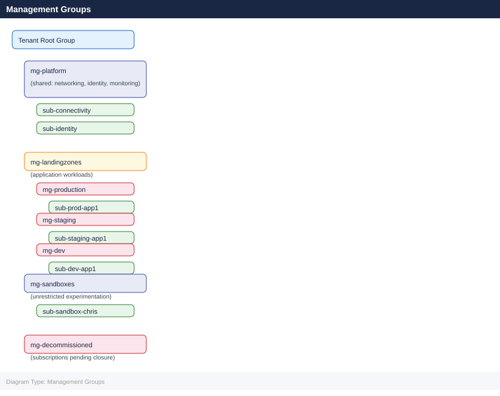

---
tags:
  - azure
---
# Management Groups

<div class="kb-summary">
Management groups provide a level of scope above subscriptions. They enable you to organise subscriptions into a hierarchy and apply governance controls (policies, RBAC) at scale without configuring each subscription individually.

*Applies to: Azure*
</div>

## Azure Resource Hierarchy

```d2
direction: right

tenant: "Azure Tenant\nEntra ID boundary" {shape: rectangle}
mgRoot: "Tenant Root Group\nManagement Group" {shape: rectangle}
mg: "Child Management Group\ne.g. mg-production" {shape: rectangle}
sub: "Subscription\nBilling + quota boundary" {shape: rectangle}
rg: "Resource Group\nLifecycle + RBAC boundary" {shape: rectangle}
resource: "Resource\nVM · Storage · Key Vault · VNet" {shape: rectangle}

tenant -> mgRoot
mgRoot -> mg
mg -> sub
sub -> rg
rg -> resource
```

Governance controls — Azure Policy and RBAC — applied at any level are inherited by all children.

## Hierarchy Design

A well-designed management group hierarchy mirrors your organisational structure and access control requirements. All management groups reside under a single root (Tenant Root Group).

### Reference Hierarchy Pattern



## Azure Landing Zone Topology

```d2
direction: right

tenantRoot: "Tenant Root Group" {shape: rectangle}
mgPlatform: "mg-platform\nConnectivity · Identity · Management" {shape: rectangle}
mgLandingZones: "mg-landingzones\nApplication Workloads" {shape: rectangle}
mgSandbox: "mg-sandboxes\nUnrestricted experimentation" {shape: rectangle}
mgDecom: "mg-decommissioned" {shape: rectangle}
subConn: "sub-connectivity\nExpressRoute · Firewall · DNS" {shape: rectangle}
subIdent: "sub-identity\nEntra ID Connect · ADDS" {shape: rectangle}
mgProd: "mg-production" {shape: rectangle}
mgStaging: "mg-staging" {shape: rectangle}
mgDev: "mg-dev" {shape: rectangle}
subProdApp: "sub-prod-app1\nWorkload A" {shape: rectangle}

tenantRoot -> mgPlatform
mgPlatform -> mgLandingZones
mgLandingZones -> mgSandbox
mgSandbox -> mgDecom
mgPlatform -> subConn
subConn -> subIdent
mgLandingZones -> mgProd
mgProd -> mgStaging
mgStaging -> mgDev
mgProd -> subProdApp
```

## Managing Management Groups

```bash
# List all management groups in the tenant
az account management-group list \
  --output table

# Show a specific management group and its children
az account management-group show \
  --name mg-platform \
  --expand \
  --recurse

# Create a management group
az account management-group create \
  --name mg-new-workloads \
  --display-name "New Workloads" \
  --parent mg-landingzones

# Move a management group under a new parent
az account management-group update \
  --name mg-new-workloads \
  --parent-id mg-platform

# Delete an empty management group
az account management-group delete \
  --name mg-new-workloads

# Add a subscription to a management group
az account management-group subscription add \
  --name mg-production \
  --subscription <subscription-id>

# Remove a subscription from a management group
az account management-group subscription remove \
  --name mg-production \
  --subscription <subscription-id>
```


```text title="Expected output"
Name                DisplayName                 Type
------------------  --------------------------  --------
mg-root             Root Management Group       /subscriptions
mg-platform         Platform Services          /subscriptions
mg-landingzones     Landing Zones              /subscriptions
mg-sandbox          Sandbox                    /subscriptions
mg-decommissioned   Decommissioned Resources   /subscriptions

{
  "id": "/providers/Microsoft.Management/managementGroups/mg-platform",
  "name": "mg-platform",
  "displayName": "Platform Services",
  "parentDisplayNameChain": ["Root Management Group"],
  "children": [
    {
      "id": "/providers/Microsoft.Management/managementGroups/mg-networking",
      "name": "mg-networking",
      "displayName": "Networking"
    },
    {
      "id": "/providers/Microsoft.Management/managementGroups/mg-security",
      "name": "mg-security",
      "displayName": "Security"
    }
  ]
}

{
  "id": "/providers/Microsoft.Management/managementGroups/mg-new-workloads",
  "name": "mg-new-workloads",
  "displayName": "New Workloads",
  "parentId": "/providers/Microsoft.Management/managementGroups/mg-landingzones"
}

{
  "id": "/providers/Microsoft.Management/managementGroups/mg-new-workloads",
  "name": "mg-new-workloads",
  "displayName": "New Workloads",
  "parentId": "/providers/Microsoft.Management/managementGroups/mg-platform"
}

(no output — command completes silently)

(no output — command completes silently)

(no output — command completes silently)
```

!!! warning "Common errors"
    **`ManagementGroupNotFound: Management group 'mg-new-workloads' not found.`** — Verify the management group name exists with `az account management-group list` before attempting operations.
    **`ChildrenOperationNotAllowed: Cannot move management group 'mg-new-workloads' because it contains subscriptions or child groups.`** — Remove all child management groups and subscriptions before moving or deleting a management group.
    **`AuthorizationFailed: The client does not have authorization to perform action 'Microsoft.Management/managementGroups/write' on scope.`** — Ensure your Azure account has Management Group Contributor or Owner role at the tenant root scope.
## Policy Inheritance

Policies assigned at a management group level are automatically inherited by all child management groups and subscriptions.

```bash
# Assign a policy at management group scope
az policy assignment create \
  --name "deny-public-ip-mg" \
  --policy "9daedab3-fb2d-461e-b861-71790eead4f6" \
  --scope "/providers/Microsoft.Management/managementGroups/mg-production"

# List policies assigned at MG scope (and inherited below)
az policy assignment list \
  --scope "/providers/Microsoft.Management/managementGroups/mg-production" \
  --output table

# List policy states for all resources under a management group
az policy state list \
  --management-group mg-production \
  --filter "complianceState eq 'NonCompliant'" \
  --output table
```


```text title="Expected output"
{
  "id": "/providers/Microsoft.Management/managementGroups/mg-production/providers/Microsoft.Authorization/policyAssignments/deny-public-ip-mg",
  "name": "deny-public-ip-mg",
  "type": "Microsoft.Authorization/policyAssignments",
  "displayName": "deny-public-ip-mg",
  "policyDefinitionId": "/subscriptions/12345678-1234-1234-1234-123456789012/providers/Microsoft.Authorization/policyDefinitions/9daedab3-fb2d-461e-b861-71790eead4f6",
  "scope": "/providers/Microsoft.Management/managementGroups/mg-production",
  "notScopes": [],
  "parameters": {},
  "description": null,
  "metadata": {
    "createdBy": "user@contoso.com",
    "createdOn": "2024-01-15T10:32:45.123456Z",
    "updatedBy": "user@contoso.com",
    "updatedOn": "2024-01-15T10:32:45.123456Z"
  },
  "enforcementMode": "Default"
}

Name                          Scope                                                                      Description
------------------------------  -------------------------------------------------------------------------  -----------
deny-public-ip-mg             /providers/Microsoft.Management/managementGroups/mg-production
audit-storage-https           /providers/Microsoft.Management/managementGroups/mg-production
require-tags-mg               /providers/Microsoft.Management/managementGroups/mg-production
...

ResourceId                                                                                    ComplianceState  PolicyAssignmentId
------------------------------------------------------------------------------------------------------  ----------------  -----------------------------------------------
/subscriptions/abc12345-def6-7890-ghij-klmnopqrstuv/resourceGroups/rg-prod-01/providers/Microsoft.Network/publicIPAddresses/pip-app-01  NonCompliant      deny-public-ip-mg
/subscriptions/abc12345-def6-7890-ghij-klmnopqrstuv/resourceGroups/rg-prod-02/providers/Microsoft.Compute/virtualMachines/vm-web-03  NonCompliant      deny-public-ip-mg
/subscriptions/xyz98765-abc4-3210-defg-hijklmnopqrs/resourceGroups/rg-prod-db/providers/Microsoft.Network/publicIPAddresses/pip-db-02  NonCompliant      deny-public-ip-mg
```

!!! warning "Common errors"
    **`The policy definition with ID '9daedab3-fb2d-461e-b861-71790eead4f6' could not be found.`** — Verify the policy definition ID exists in your subscription or use `az policy definition list` to find the correct ID.
    **`The scope '/providers/Microsoft.Management/managementGroups/mg-production' is invalid or you do not have access to this management group.`** — Confirm the management group name is correct and you have Reader or higher permissions on it using `az account management-group show --name mg-production`.
    **`Operation failed with status: 'Forbidden'. The client 'user@contoso.com' with object id 'xxxxxxxx-xxxx-xxxx-xxxx-xxxxxxxxxxxx
### Policy Assignment Hierarchy

| Level Assigned | Applies To |
|---|---|
| Tenant Root Group | All subscriptions in the tenant |
| Platform MG | All subscriptions under mg-platform |
| Production MG | All production subscriptions |
| Individual Subscription | Single subscription only |
| Resource Group | Single resource group only |

## RBAC at Management Group Scope

RBAC assignments at management group scope inherit down to all child subscriptions and resource groups. Use this for platform team access patterns.

```bash
# Assign the Reader role to a group at MG scope
az role assignment create \
  --assignee <group-object-id> \
  --role Reader \
  --scope "/providers/Microsoft.Management/managementGroups/mg-platform"

# Assign Contributor at MG scope (use sparingly)
az role assignment create \
  --assignee <principal-id> \
  --role Contributor \
  --scope "/providers/Microsoft.Management/managementGroups/mg-landingzones"

# List role assignments at MG scope
az role assignment list \
  --scope "/providers/Microsoft.Management/managementGroups/mg-platform" \
  --output table
```


```text title="Expected output"
{
  "canDelegate": false,
  "id": "/providers/Microsoft.Management/managementGroups/mg-platform/providers/Microsoft.Authorization/roleAssignments/a7f3c2e1-9b4d-47e8-b6f2-1c5d8a9e3f2b",
  "name": "a7f3c2e1-9b4d-47e8-b6f2-1c5d8a9e3f2b",
  "principalId": "d4e5f6a7-8b9c-4d1e-9f2a-3b4c5d6e7f8a",
  "principalType": "Group",
  "roleDefinitionId": "/subscriptions/12345678-1234-1234-1234-123456789012/providers/Microsoft.Authorization/roleDefinitions/acdd72a7-3385-48ef-bd42-f606fba81ae7",
  "scope": "/providers/Microsoft.Management/managementGroups/mg-platform",
  "type": "Microsoft.Authorization/roleAssignments"
}
{
  "canDelegate": false,
  "id": "/providers/Microsoft.Management/managementGroups/mg-landingzones/providers/Microsoft.Authorization/roleAssignments/b8g4d3f2-0c5e-48f9-c7g3-2d6e9b0f4g3c",
  "name": "b8g4d3f2-0c5e-48f9-c7g3-2d6e9b0f4g3c",
  "principalId": "e5f6g7h8-9c0d-5e2f-0g3h-4c5d6e7f8g9h",
  "principalType": "ServicePrincipal",
  "roleDefinitionId": "/subscriptions/12345678-1234-1234-1234-123456789012/providers/Microsoft.Authorization/roleDefinitions/b24988ac-6180-42a0-ab88-20f7382dd24c",
  "scope": "/providers/Microsoft.Management/managementGroups/mg-landingzones",
  "type": "Microsoft.Authorization/roleAssignments"
}
RoleAssignmentName                       RoleDefinitionName    Scope
───────────────────────────────────────  ────────────────────  ──────────────────────────────────────────────────────────────
a7f3c2e1-9b4d-47e8-b6f2-1c5d8a9e3f2b    Reader                /providers/Microsoft.Management/managementGroups/mg-platform
c9h5e4g3-1d6f-49g0-d8h4-3e7f0c1g5h4d    Owner                 /providers/Microsoft.Management/managementGroups/mg-platform
d0i6f5h4-2e7g-50h1-e9i5-4f8g1d2h6i5e    Contributor           /providers/Microsoft.Management/managementGroups/mg-platform
```

!!! warning "Common errors"
    **`The provided object identifier <group-object-id
## Management Group Design Principles

| Principle | Guidance |
|---|---|
| Max 6 levels | Azure supports up to 6 levels below root; fewer is easier to reason about |
| Align with policy boundaries | Group subscriptions that share the same policy requirements |
| Don't mirror org chart exactly | Org charts change; build around stable access control boundaries |
| Production always isolated | Production subscriptions should be in a dedicated MG with stricter policies |
| Sandbox group with relaxed policy | Encourages experimentation without polluting production governance |
| Decommissioned group | Move subscriptions here before deletion to prevent orphaned resources |
