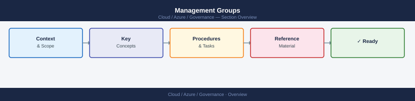
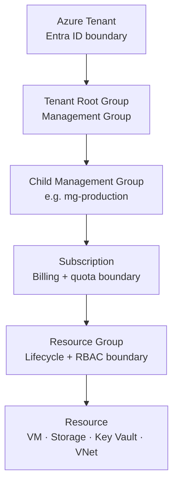
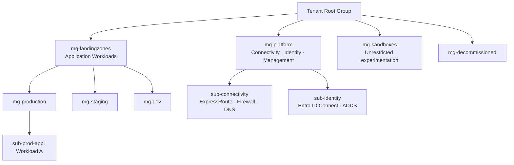

---
tags:
  - azure
---
# Management Groups


<div class="kb-summary">
Management groups provide a level of scope above subscriptions. They enable you to organise subscriptions into a hierarchy and apply governance controls (policies, RBAC) at scale without configuring each subscription individually.

*Applies to: Azure*
</div>



```d2
direction: right

center: "Azure" {shape: hexagon}
azure_resource_hierarchy: "Azure Resource Hierarchy" {shape: rectangle}
hierarchy_design: "Hierarchy Design" {shape: rectangle}
azure_landing_zone_topology: "Azure Landing Zone Topology" {shape: rectangle}
managing_management_groups: "Managing Management Groups" {shape: rectangle}
policy_inheritance: "Policy Inheritance" {shape: rectangle}
rbac_at_management_group_scope: "RBAC at Management Group Scope" {shape: rectangle}

center -> azure_resource_hierarchy
center -> hierarchy_design
center -> azure_landing_zone_topology
center -> managing_management_groups
center -> policy_inheritance
center -> rbac_at_management_group_scope
```

## Azure Resource Hierarchy



Governance controls — Azure Policy and RBAC — applied at any level are inherited by all children.

## Hierarchy Design

A well-designed management group hierarchy mirrors your organisational structure and access control requirements. All management groups reside under a single root (Tenant Root Group).

### Reference Hierarchy Pattern


## Azure Landing Zone Topology



## Managing Management Groups

```bash
# List all management groups in the tenant
az account management-group list \
  --output table

# Show a specific management group and its children
az account management-group show \
  --name mg-platform \
  --expand \
  --recurse

# Create a management group
az account management-group create \
  --name mg-new-workloads \
  --display-name "New Workloads" \
  --parent mg-landingzones

# Move a management group under a new parent
az account management-group update \
  --name mg-new-workloads \
  --parent-id mg-platform

# Delete an empty management group
az account management-group delete \
  --name mg-new-workloads

# Add a subscription to a management group
az account management-group subscription add \
  --name mg-production \
  --subscription <subscription-id>

# Remove a subscription from a management group
az account management-group subscription remove \
  --name mg-production \
  --subscription <subscription-id>
```

## Policy Inheritance

Policies assigned at a management group level are automatically inherited by all child management groups and subscriptions.

```bash
# Assign a policy at management group scope
az policy assignment create \
  --name "deny-public-ip-mg" \
  --policy "9daedab3-fb2d-461e-b861-71790eead4f6" \
  --scope "/providers/Microsoft.Management/managementGroups/mg-production"

# List policies assigned at MG scope (and inherited below)
az policy assignment list \
  --scope "/providers/Microsoft.Management/managementGroups/mg-production" \
  --output table

# List policy states for all resources under a management group
az policy state list \
  --management-group mg-production \
  --filter "complianceState eq 'NonCompliant'" \
  --output table
```

### Policy Assignment Hierarchy

| Level Assigned | Applies To |
|---|---|
| Tenant Root Group | All subscriptions in the tenant |
| Platform MG | All subscriptions under mg-platform |
| Production MG | All production subscriptions |
| Individual Subscription | Single subscription only |
| Resource Group | Single resource group only |

## RBAC at Management Group Scope

RBAC assignments at management group scope inherit down to all child subscriptions and resource groups. Use this for platform team access patterns.

```bash
# Assign the Reader role to a group at MG scope
az role assignment create \
  --assignee <group-object-id> \
  --role Reader \
  --scope "/providers/Microsoft.Management/managementGroups/mg-platform"

# Assign Contributor at MG scope (use sparingly)
az role assignment create \
  --assignee <principal-id> \
  --role Contributor \
  --scope "/providers/Microsoft.Management/managementGroups/mg-landingzones"

# List role assignments at MG scope
az role assignment list \
  --scope "/providers/Microsoft.Management/managementGroups/mg-platform" \
  --output table
```

## Management Group Design Principles

| Principle | Guidance |
|---|---|
| Max 6 levels | Azure supports up to 6 levels below root; fewer is easier to reason about |
| Align with policy boundaries | Group subscriptions that share the same policy requirements |
| Don't mirror org chart exactly | Org charts change; build around stable access control boundaries |
| Production always isolated | Production subscriptions should be in a dedicated MG with stricter policies |
| Sandbox group with relaxed policy | Encourages experimentation without polluting production governance |
| Decommissioned group | Move subscriptions here before deletion to prevent orphaned resources |
