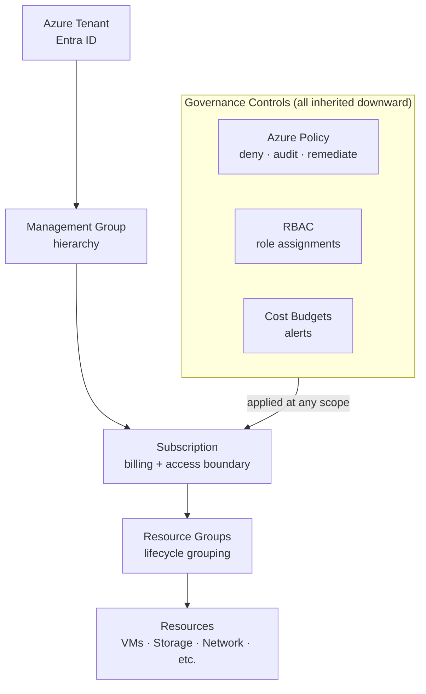

# Subscriptions


<div class="kb-summary">
An Azure subscription is a logical unit of Azure services that links to an Azure account. Subscriptions are the primary billing and access control boundary. Understanding subscription types, limits, and management operations is essential for scalable Azure governance.
</div>
```
┌─────────────────────────────────────── Cloud Azure Governance ────────────────────────────────────────┐
│                                                                                                       │
│   ┌───────────────────────────────────────────────────────────────────────────────────────────────┐   │
│   │                             Azure: Cloud Azure Governance platform                            │   │
│   │                                  Protocols: Various protocols                                 │   │
│   │                     Management: Cloud Azure Governance management console                     │   │
│   │                Sections: Architecture · Operations · Security · Troubleshooting               │   │
│   └───────────────────────────────────────────────────────────────────────────────────────────────┘   │
│                                                                                                       │
│    Architecture → Operations → Security → Troubleshooting → Escalation                                │
│                                                                                                       │
│                  ▼                                ▼                                ▼                  │
│                                                                                                       │
│   ┌─────────────────────────────┐  ┌─────────────────────────────┐  ┌─────────────────────────────┐   │
│   │            Layer            │  │          Component          │  │            Notes            │   │
│   │             Core            │  │       Primary service       │  │        Main function        │   │
│   │          Management         │  │        Control plane        │  │         Admin access        │   │
│   │          Monitoring         │  │         Health/perf         │  │      Alerts/dashboards      │   │
│   │           Security          │  │         Auth/encrypt        │  │        Access control       │   │
│   │         Integration         │  │        APIs/plug-ins        │  │         Third-party         │   │
│   └─────────────────────────────┘  └─────────────────────────────┘  └─────────────────────────────┘   │
│                                                                                                       │
│                          ▼                                                 ▼                          │
│                                                                                                       │
│   ┌───────────────────────────────────────────────────────────────────────────────────────────────┐   │
│   │      Layer       │    Component     │      Function     │      Notes       │       Auth       │   │
│   │       Core       │ Primary service  │   Main function   │     See docs     │       RBAC       │   │
│   │    Management    │  Control plane   │    Admin access   │     See docs     │       RBAC       │   │
│   │    Monitoring    │   Health/perf    │  Alerts/dashboard │     See docs     │       RBAC       │   │
│   │     Security     │   Auth/encrypt   │   Access control  │     See docs     │       RBAC       │   │
│   └───────────────────────────────────────────────────────────────────────────────────────────────┘   │
│                                                                                                       │
│    Physical: Cloud Azure Governance infrastructure · management network · monitoring                  │
│                                                                                                       │
│    Key terms:                                                                                         │
│                                                                                                       │
│    Azure              = Cloud Azure Governance platform overview and core concepts                    │
│    Management         = management console and command-line interface for administration              │
│    Monitoring         = health and performance monitoring dashboards and alerting                     │
│    Automation         = REST API, scripting, and pipeline integration capabilities                    │
│    Security           = access control, authentication, and encryption configuration                  │
│    Backup             = backup and recovery procedures and schedule configuration                     │
│    Upgrade            = software version upgrades and firmware patching procedures                    │
│    Troubleshooting    = diagnostic procedures and common issue resolution steps                       │
│    Escalation         = vendor support escalation path and severity triage process                    │
│    Documentation      = vendor knowledge base and official product documentation                      │
│    Change management  = change ticket requirements for production modifications                       │
│    Audit log          = admin action logging for compliance and security review                       │
│                                                                                                       │
└───────────────────────────────────────────────────────────────────────────────────────────────────────┘
```


## Azure Subscription Governance Model



## Subscription Types

| Type | Description | Use Case |
|---|---|---|
| Pay-As-You-Go | Billed monthly for actual usage | Development, small workloads |
| Enterprise Agreement (EA) | Pre-committed spend with discounts | Large enterprises |
| Microsoft Customer Agreement (MCA) | Modern EA replacement | New enterprise enrolments |
| Visual Studio / Dev/Test | Discounted rates for development | Dev and test environments |
| Free Trial / Azure for Students | Limited credits | Learning and experimentation |

## Managing Subscriptions

```bash
# List all subscriptions accessible to the current account
az account list \
  --output table

# Show details of the current subscription
az account show

# Set a default subscription for CLI commands
az account set \
  --subscription <subscription-id-or-name>

# Rename a subscription
az account subscription rename \
  --id <subscription-id> \
  --name "sub-production-app1"

# Cancel a subscription (irreversible after 90 days)
az account subscription cancel \
  --id <subscription-id>
```

## Moving Resources Between Subscriptions

Resources can be moved between subscriptions as long as the target subscription is in the same tenant and the resource type supports cross-subscription moves.

```bash
# Validate a move operation before executing it
az resource invoke-action \
  --action validateMoveResources \
  --ids "/subscriptions/<source-sub-id>/resourceGroups/<source-rg>" \
  --request-body '{
    "resources": [
      "/subscriptions/<source-sub-id>/resourceGroups/<source-rg>/providers/Microsoft.Compute/virtualMachines/vm-web-01"
    ],
    "targetResourceGroup": "/subscriptions/<target-sub-id>/resourceGroups/<target-rg>"
  }'

# Move resources to a different subscription
az resource move \
  --ids "/subscriptions/<source-sub-id>/resourceGroups/<source-rg>/providers/Microsoft.Compute/virtualMachines/vm-web-01" \
  --destination-group <target-rg> \
  --destination-subscription-id <target-sub-id>
```

### Resource Types That Cannot Be Moved Cross-Subscription

| Resource Type | Move Limitation |
|---|---|
| Azure Active Directory Domain Services | Cannot be moved |
| Azure Backup vaults (with data) | Requires data migration first |
| ExpressRoute circuits | Cannot be moved |
| Azure Kubernetes Service (AKS) | Limited support; check current docs |
| Application Gateway V1 | Cannot be moved |

## Subscription Policies

Policies can be applied directly to subscriptions or inherited from management groups.

```bash
# List all policy assignments on a subscription
az policy assignment list \
  --scope "/subscriptions/<subscription-id>" \
  --output table

# Apply a subscription-level policy
az policy assignment create \
  --name "allowed-regions-sub" \
  --policy "e56962a6-4747-49cd-b67b-bf8b01975c4f" \
  --scope "/subscriptions/<subscription-id>" \
  --params '{"listOfAllowedLocations": {"value": ["uksouth", "ukwest"]}}'

# Move subscription to a management group
az account management-group subscription add \
  --name mg-production \
  --subscription <subscription-id>
```

## Subscription Limits

| Resource | Default Limit | Notes |
|---|---|---|
| Resource groups per subscription | 980 | Can be increased via support request |
| Resources per resource group | 800 per type | Check per-type limits |
| VNets per subscription | 1,000 | |
| Public IP addresses | 1,000 | |
| Role assignments | 4,000 | Hard limit; cannot be increased |
| Policy assignments | 200 | Per scope |

```bash
# Check current usage against subscription limits
az network list-usages \
  --location uksouth \
  --output table

az compute list-usage \
  --location uksouth \
  --output table
```

## Subscription Tagging

Tag subscriptions themselves to enable filtering and reporting in cost management.

```bash
# Tag a subscription
az tag create \
  --resource-id "/subscriptions/<subscription-id>" \
  --tags environment=production team=platform cost-centre=CC-1001

# List tags on a subscription
az tag list \
  --resource-id "/subscriptions/<subscription-id>"
```
