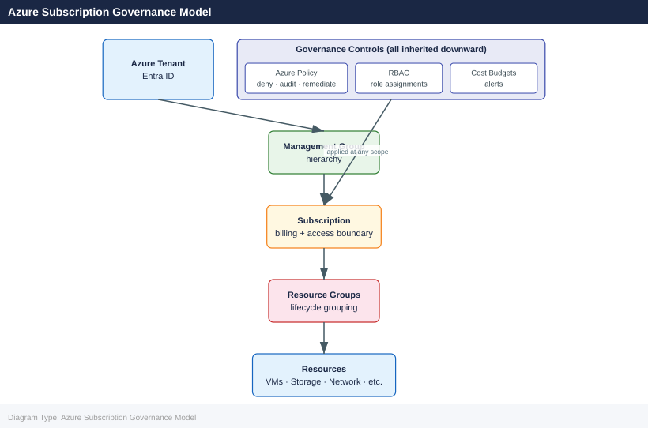

---
tags:
  - azure
description: "An Azure subscription is a logical unit of Azure services that links to an Azure account. Subscriptions are the primary billing and access control..."
---
# Subscriptions

<div class="kb-summary">
An Azure subscription is a logical unit of Azure services that links to an Azure account. Subscriptions are the primary billing and access control boundary. Understanding subscription types, limits, and management operations is essential for scalable Azure governance.

*Applies to: Azure*
</div>

## Azure Subscription Governance Model



## Subscription Types

| Type | Description | Use Case |
|---|---|---|
| Pay-As-You-Go | Billed monthly for actual usage | Development, small workloads |
| Enterprise Agreement (EA) | Pre-committed spend with discounts | Large enterprises |
| Microsoft Customer Agreement (MCA) | Modern EA replacement | New enterprise enrolments |
| Visual Studio / Dev/Test | Discounted rates for development | Dev and test environments |
| Free Trial / Azure for Students | Limited credits | Learning and experimentation |

## Managing Subscriptions

```bash
# List all subscriptions accessible to the current account
az account list \
  --output table

# Show details of the current subscription
az account show

# Set a default subscription for CLI commands
az account set \
  --subscription <subscription-id-or-name>

# Rename a subscription
az account subscription rename \
  --id <subscription-id> \
  --name "sub-production-app1"

# Cancel a subscription (irreversible after 90 days)
az account subscription cancel \
  --id <subscription-id>
```


```text title="Expected output"
Name                                    CloudName    SubscriptionId                        TenantId                              State
──────────────────────────────────────  ───────────  ────────────────────────────────────  ────────────────────────────────────  ───────
Production-Primary                      AzureCloud   a1b2c3d4-e5f6-7890-abcd-ef1234567890  f9e8d7c6-b5a4-3210-fedc-ba9876543210  Enabled
Development-Team                        AzureCloud   b2c3d4e5-f6a7-8901-bcde-f12345678901  f9e8d7c6-b5a4-3210-fedc-ba9876543210  Enabled
Staging-Internal                        AzureCloud   c3d4e5f6-a7b8-9012-cdef-123456789012  f9e8d7c6-b5a4-3210-fedc-ba9876543210  Enabled

{
  "environmentName": "AzureCloud",
  "homeTenantId": "f9e8d7c6-b5a4-3210-fedc-ba9876543210",
  "id": "a1b2c3d4-e5f6-7890-abcd-ef1234567890",
  "isDefault": true,
  "name": "Production-Primary",
  "state": "Enabled",
  "tenantId": "f9e8d7c6-b5a4-3210-fedc-ba9876543210",
  "user": {
    "name": "admin@contoso.onmicrosoft.com",
    "type": "user"
  }
}

(no output — command completes silently)

{
  "displayName": "sub-production-app1",
  "id": "/subscriptions/b2c3d4e5-f6a7-8901-bcde-f12345678901",
  "subscriptionId": "b2c3d4e5-f6a7-8901-bcde-f12345678901",
  "tenantId": "f9e8d7c6-b5a4-3210-fedc-ba9876543210"
}

{
  "billingScope": "/subscriptions/c3d4e5f6-a7b8-9012-cdef-123456789012",
  "displayName": "Staging-Internal",
  "id": "/subscriptions/c3d4e5f6-a7b8-9012-cdef-123456789012",
  "state": "Warned"
}
```

!!! warning "Common errors"
    | Error | Fix |
    |---|---|
    | `Subscription 'invalid-sub-id' not found.` | Verify the subscription ID or name exists in your tenant by running `az account list`. |
    | `The user does not have permission to perform action 'Microsoft.Subscription/subscriptions/write' on scope '/subscriptions/<id>'.` | Ensure your account has Owner or Subscription Admin role on the target subscription. |
    | `The subscription cannot be cancelled because it is in 'Disabled' state.` | Contact Azure Support to re-enable the subscription before attempting cancellation. |
## Moving Resources Between Subscriptions

Resources can be moved between subscriptions as long as the target subscription is in the same tenant and the resource type supports cross-subscription moves.

```bash
# Validate a move operation before executing it
az resource invoke-action \
  --action validateMoveResources \
  --ids "/subscriptions/<source-sub-id>/resourceGroups/<source-rg>" \
  --request-body '{
    "resources": [
      "/subscriptions/<source-sub-id>/resourceGroups/<source-rg>/providers/Microsoft.Compute/virtualMachines/vm-web-01"
    ],
    "targetResourceGroup": "/subscriptions/<target-sub-id>/resourceGroups/<target-rg>"
  }'

# Move resources to a different subscription
az resource move \
  --ids "/subscriptions/<source-sub-id>/resourceGroups/<source-rg>/providers/Microsoft.Compute/virtualMachines/vm-web-01" \
  --destination-group <target-rg> \
  --destination-subscription-id <target-sub-id>
```


```text title="Expected output"
{
  "error": null,
  "properties": null
}

ResourceId: /subscriptions/a7f3c2e1-9d4b-4f8a-b2c5-e6d7f8a9b0c1/resourceGroups/prod-rg/providers/Microsoft.Compute/virtualMachines/vm-web-01
Name: vm-web-01
Type: Microsoft.Compute/virtualMachines
Location: eastus
MovedResources:
  - /subscriptions/a7f3c2e1-9d4b-4f8a-b2c5-e6d7f8a9b0c1/resourceGroups/prod-rg/providers/Microsoft.Compute/virtualMachines/vm-web-01

ProvisioningState: Succeeded
```

!!! warning "Common errors"
    | Error | Fix |
    |---|---|
    | `InvalidResourceId.IncorrectSegmentLengths : The provided URI has an invalid number of segments.` | Verify the resource ID format matches `/subscriptions/<sub-id>/resourceGroups/<rg>/providers/<namespace>/<type>/<name>` exactly. |
    | `MissingMoveDependencies : The resource cannot be moved because it has dependent resources that are not included in the move.` | Include all dependent resources (network interfaces, disks, NSGs) in the resources array of the validateMoveResources call. |
    | `TargetResourceGroupNotFound : The target resource group does not exist in the destination subscription.` | Create the target resource group in the destination subscription before attempting the move operation. |
### Resource Types That Cannot Be Moved Cross-Subscription

| Resource Type | Move Limitation |
|---|---|
| Azure Active Directory Domain Services | Cannot be moved |
| Azure Backup vaults (with data) | Requires data migration first |
| ExpressRoute circuits | Cannot be moved |
| Azure Kubernetes Service (AKS) | Limited support; check current docs |
| Application Gateway V1 | Cannot be moved |

## Subscription Policies

Policies can be applied directly to subscriptions or inherited from management groups.

```bash
# List all policy assignments on a subscription
az policy assignment list \
  --scope "/subscriptions/<subscription-id>" \
  --output table

# Apply a subscription-level policy
az policy assignment create \
  --name "allowed-regions-sub" \
  --policy "e56962a6-4747-49cd-b67b-bf8b01975c4f" \
  --scope "/subscriptions/<subscription-id>" \
  --params '{"listOfAllowedLocations": {"value": ["uksouth", "ukwest"]}}'

# Move subscription to a management group
az account management-group subscription add \
  --name mg-production \
  --subscription <subscription-id>
```


```text title="Expected output"
Name                          Type                Enforcement Mode
------------------------------  ------------------  ------------------
allowed-regions-sub           Microsoft.Authorization/policyAssignments  Default
inherited-compliance-policy   Microsoft.Authorization/policyAssignments  DoNotEnforce
audit-storage-encryption      Microsoft.Authorization/policyAssignments  Default

{
  "id": "/subscriptions/12a34b5c-d6e7-8f9a-0b1c-2d3e4f5a6b7c/providers/Microsoft.Authorization/policyAssignments/allowed-regions-sub",
  "name": "allowed-regions-sub",
  "type": "Microsoft.Authorization/policyAssignments",
  "properties": {
    "displayName": "allowed-regions-sub",
    "policyDefinitionId": "/subscriptions/12a34b5c-d6e7-8f9a-0b1c-2d3e4f5a6b7c/providers/Microsoft.Authorization/policyDefinitions/e56962a6-4747-49cd-b67b-bf8b01975c4f",
    "scope": "/subscriptions/12a34b5c-d6e7-8f9a-0b1c-2d3e4f5a6b7c",
    "enforcementMode": "Default"
  }
}

Subscription 12a34b5c-d6e7-8f9a-0b1c-2d3e4f5a6b7c moved to management group mg-production.
```

!!! warning "Common errors"
    | Error | Fix |
    |---|---|
    | `Policy definition 'e56962a6-4747-49cd-b67b-bf8b01975c4f' not found.` | Verify the policy definition ID exists in your subscription or use `az policy definition list` to find the correct ID. |
    | `The subscription is already assigned to a management group.` | Remove the subscription from its current management group first using `az account management-group subscription remove`. |
    | `Invalid scope format. Scope must be in the format /subscriptions/{subscriptionId}.` | Ensure the subscription ID is correctly formatted and wrapped in the full scope path without angle brackets. |
## Subscription Limits

| Resource | Default Limit | Notes |
|---|---|---|
| Resource groups per subscription | 980 | Can be increased via support request |
| Resources per resource group | 800 per type | Check per-type limits |
| VNets per subscription | 1,000 | |
| Public IP addresses | 1,000 | |
| Role assignments | 4,000 | Hard limit; cannot be increased |
| Policy assignments | 200 | Per scope |

```bash
# Check current usage against subscription limits
az network list-usages \
  --location uksouth \
  --output table

az compute list-usage \
  --location uksouth \
  --output table
```


```text title="Expected output"
Name                                    CurrentValue    Limit
--------------------------------------  --------------  -------
Virtual Networks                        12              1000
Subnets                                 24              10000
Network Interfaces                      47              65000
Public IP Addresses                     8               20
Network Security Groups                 15              5000
Load Balancers                          3               100
Application Gateways                    1               25
VPN Gateways                            0               10
Express Route Circuits                  0               10

Name                                    CurrentValue    Limit
--------------------------------------  --------------  -------
Availability Sets                       4               2500
Virtual Machines                        18              25000
Virtual Machine Cores                   72              350
Standard Storage Accounts               6               250
Premium Storage Accounts                2               250
Storage Account Capacity (GB)           4096            2097152
Managed Disks                           42              50000
```

!!! warning "Common errors"
    | Error | Fix |
    |---|---|
    | `ERROR: The subscription of type 'Free Trial' is not permitted to query usages for location 'uksouth'.` | Switch to a paid subscription or use a supported region like `eastus` or `westeurope`. |
    | `ERROR: No registered resource provider found for location 'uksouth'.` | Run `az provider register --namespace Microsoft.Compute` and `az provider register --namespace Microsoft.Network` to enable the resource providers. |
## Subscription Tagging

Tag subscriptions themselves to enable filtering and reporting in cost management.

```bash
# Tag a subscription
az tag create \
  --resource-id "/subscriptions/<subscription-id>" \
  --tags environment=production team=platform cost-centre=CC-1001

# List tags on a subscription
az tag list \
  --resource-id "/subscriptions/<subscription-id>"
```


```text title="Expected output"
{
  "id": "/subscriptions/12a4b5c6-d7e8-4f9a-b0c1-2d3e4f5a6b7c/providers/Microsoft.Resources/tags/default",
  "name": "default",
  "properties": {
    "tags": {
      "environment": "production",
      "team": "platform",
      "cost-centre": "CC-1001"
    }
  },
  "type": "Microsoft.Resources/tags"
}
{
  "id": "/subscriptions/12a4b5c6-d7e8-4f9a-b0c1-2d3e4f5a6b7c/providers/Microsoft.Resources/tags/default",
  "name": "default",
  "properties": {
    "tags": {
      "environment": "production",
      "team": "platform",
      "cost-centre": "CC-1001"
    }
  },
  "type": "Microsoft.Resources/tags"
}
```

!!! warning "Common errors"
    | Error | Fix |
    |---|---|
    | `The client 'user@contoso.com' with object id '3a4b5c6d-7e8f-9a0b-1c2d-3e4f5a6b7c8d' does not have authorization to perform action 'Microsoft.Resources/tags/write'` | Ensure your user or service principal has the Owner or Contributor role on the subscription. |
    | `Invalid resource ID format. Resource ID should start with '/subscriptions/'` | Verify the subscription ID is correctly formatted and wrapped in quotes if containing special characters. |