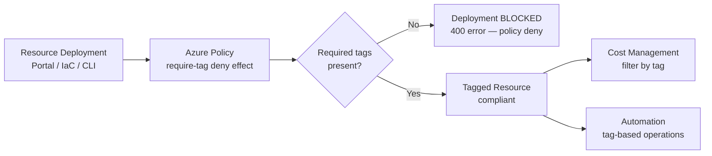

# Tagging Standards

Azure resource tags are key-value pairs applied to resources and resource groups for organisation, cost attribution, automation, and governance. A consistent tagging standard is the foundation of effective cloud management.

## Tag Governance Flow



## Required Tags

Define a small, stable set of mandatory tags. Every resource and resource group must carry all required tags.

| Tag Key | Description | Example Values | Owner |
|---|---|---|---|
| `environment` | Lifecycle stage | prod, staging, dev, sandbox | Platform team |
| `team` | Owning team | platform, data, frontend, security | All teams |
| `project` | Associated project or workload | project-alpha, shared-infra | All teams |
| `cost-centre` | Finance cost centre code | CC-1001, CC-2030 | Finance |
| `owner` | Primary contact email | chris.a@example.com | All teams |
| `managed-by` | Provisioning method | terraform, bicep, manual | All teams |

## Applying Tags via CLI

```bash
# Apply required tags to a resource group
az group update \
  --name rg-project-alpha-prod \
  --tags environment=prod team=platform project=project-alpha cost-centre=CC-1001 owner=chris.a@example.com managed-by=terraform

# Apply tags to an individual resource
az resource tag \
  --ids /subscriptions/<sub-id>/resourceGroups/rg-project-alpha-prod/providers/Microsoft.Compute/virtualMachines/vm-app-01 \
  --tags environment=prod team=platform project=project-alpha

# Update a single tag on a resource (merge, not replace)
az resource tag \
  --ids <resource-id> \
  --tags owner=new.owner@example.com

# Remove all tags from a resource
az tag delete \
  --resource-id <resource-id>
```

## Tag Enforcement with Policy

Use Azure Policy to enforce tag presence and prevent resource creation without required tags.

```bash
# Assign "Require a tag on resources" policy for each required tag
for TAG in environment team project cost-centre owner managed-by; do
  az policy assignment create \
    --name "require-tag-${TAG}" \
    --policy "96670d01-0a4d-4649-9c89-2d3abc0a5025" \
    --scope "/subscriptions/<subscription-id>" \
    --params "{\"tagName\": {\"value\": \"${TAG}\"}}"
done

# Assign "Allowed tag values" policy for environment tag
az policy assignment create \
  --name "allowed-environment-values" \
  --policy "d1cf8b34-ac74-4cdf-9ef7-13f9de23ea3c" \
  --scope "/subscriptions/<subscription-id>" \
  --params '{
    "tagName": {"value": "environment"},
    "tagValue": {"value": ["prod", "staging", "dev", "sandbox"]}
  }'

# Check compliance for tag policies
az policy state list \
  --filter "policyAssignmentName eq 'require-tag-environment' and complianceState eq 'NonCompliant'" \
  --query "[].{Resource:resourceId, RG:resourceGroup}" \
  --output table
```

## Tag Inheritance

Tags on resource groups are not automatically inherited by child resources. Use the `Inherit a tag from the resource group if missing` built-in policy to propagate tags.

```bash
# Assign tag inheritance policy for environment and team tags
az policy assignment create \
  --name "inherit-tag-environment" \
  --policy "96670d01-0a4d-4649-9c89-2d3abc0a5025" \
  --scope "/subscriptions/<subscription-id>"

# Use Modify effect policy for automatic tag inheritance
az policy assignment create \
  --name "inherit-environment-from-rg" \
  --policy "9be884c0-2312-4049-b562-7e7cd8cc6bb2" \
  --scope "/subscriptions/<subscription-id>" \
  --params '{"tagName": {"value": "environment"}}' \
  --mi-system-assigned \
  --location uksouth
```

## Reporting on Tag Coverage

```bash
# Find resources missing the cost-centre tag
az resource list \
  --query "[?tags.\"cost-centre\" == null].{Name:name, RG:resourceGroup, Type:type}" \
  --output table

# Find resources with no tags at all
az resource list \
  --query "[?tags == null || tags == {}].{Name:name, RG:resourceGroup}" \
  --output table

# Export all resource tags to JSON for audit
az resource list \
  --query "[].{Name:name, RG:resourceGroup, Type:type, Tags:tags}" \
  --output json > resource-tags-$(date +%Y%m%d).json

# Count resources per team value
az resource list \
  --query "sort_by([?tags.team != null].{Team:tags.team, Name:name}, &Team)" \
  --output table
```

## Tag Naming Conventions

| Convention | Recommendation |
|---|---|
| Case | Lowercase with hyphens (`cost-centre`, not `CostCentre`) |
| Special characters | Avoid — can break automation and policy matching |
| Max tag keys | Azure supports 50 tags per resource; stay under 15 for manageability |
| Tag key consistency | Use the same key names across all resources (no aliases) |
| Automation tags | Prefix automation-specific tags (e.g., `auto-shutdown: 19:00`) |
