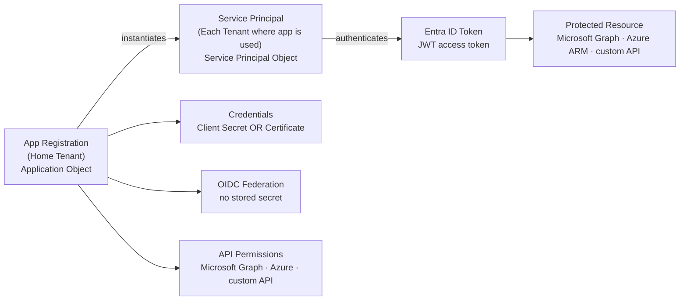

# App Registrations


<div class="kb-summary">
An app registration in Microsoft Entra ID creates an identity for an application that needs to authenticate with Azure AD or access Azure resources and APIs. It is the foundation for service principals, OAuth2 flows, and API permissions.
</div>
```
┌──────────────────────────────────────── Cloud Azure Identity ─────────────────────────────────────────┐
│                                                                                                       │
│   ┌───────────────────────────────────────────────────────────────────────────────────────────────┐   │
│   │                              Azure: Cloud Azure Identity platform                             │   │
│   │                                  Protocols: Various protocols                                 │   │
│   │                      Management: Cloud Azure Identity management console                      │   │
│   │                Sections: Architecture · Operations · Security · Troubleshooting               │   │
│   └───────────────────────────────────────────────────────────────────────────────────────────────┘   │
│                                                                                                       │
│    Architecture → Operations → Security → Troubleshooting → Escalation                                │
│                                                                                                       │
│                  ▼                                ▼                                ▼                  │
│                                                                                                       │
│   ┌─────────────────────────────┐  ┌─────────────────────────────┐  ┌─────────────────────────────┐   │
│   │            Layer            │  │          Component          │  │            Notes            │   │
│   │             Core            │  │       Primary service       │  │        Main function        │   │
│   │          Management         │  │        Control plane        │  │         Admin access        │   │
│   │          Monitoring         │  │         Health/perf         │  │      Alerts/dashboards      │   │
│   │           Security          │  │         Auth/encrypt        │  │        Access control       │   │
│   │         Integration         │  │        APIs/plug-ins        │  │         Third-party         │   │
│   └─────────────────────────────┘  └─────────────────────────────┘  └─────────────────────────────┘   │
│                                                                                                       │
│                          ▼                                                 ▼                          │
│                                                                                                       │
│   ┌───────────────────────────────────────────────────────────────────────────────────────────────┐   │
│   │      Layer       │    Component     │      Function     │      Notes       │       Auth       │   │
│   │       Core       │ Primary service  │   Main function   │     See docs     │       RBAC       │   │
│   │    Management    │  Control plane   │    Admin access   │     See docs     │       RBAC       │   │
│   │    Monitoring    │   Health/perf    │  Alerts/dashboard │     See docs     │       RBAC       │   │
│   │     Security     │   Auth/encrypt   │   Access control  │     See docs     │       RBAC       │   │
│   └───────────────────────────────────────────────────────────────────────────────────────────────┘   │
│                                                                                                       │
│    Physical: Cloud Azure Identity infrastructure · management network · monitoring                    │
│                                                                                                       │
│    Key terms:                                                                                         │
│                                                                                                       │
│    Azure              = Cloud Azure Identity platform overview and core concepts                      │
│    Management         = management console and command-line interface for administration              │
│    Monitoring         = health and performance monitoring dashboards and alerting                     │
│    Automation         = REST API, scripting, and pipeline integration capabilities                    │
│    Security           = access control, authentication, and encryption configuration                  │
│    Backup             = backup and recovery procedures and schedule configuration                     │
│    Upgrade            = software version upgrades and firmware patching procedures                    │
│    Troubleshooting    = diagnostic procedures and common issue resolution steps                       │
│    Escalation         = vendor support escalation path and severity triage process                    │
│    Documentation      = vendor knowledge base and official product documentation                      │
│    Change management  = change ticket requirements for production modifications                       │
│    Audit log          = admin action logging for compliance and security review                       │
│                                                                                                       │
└───────────────────────────────────────────────────────────────────────────────────────────────────────┘
```


## App Registration to Service Principal Model



## Creating an App Registration

```bash
# Create an app registration
az ad app create \
  --display-name "my-api-app" \
  --sign-in-audience AzureADMyOrg

# Create with a redirect URI (for web apps)
az ad app create \
  --display-name "my-web-app" \
  --web-redirect-uris "https://app.example.com/auth/callback" \
  --sign-in-audience AzureADMyOrg

# List all app registrations in the tenant
az ad app list \
  --output table

# Show a specific app registration
az ad app show \
  --id <app-id-or-object-id>

# Update the display name
az ad app update \
  --id <app-id> \
  --display-name "my-api-app-v2"

# Delete an app registration
az ad app delete \
  --id <app-id>
```

## Client Secrets

Client secrets are password credentials used by confidential clients (server-side applications) to authenticate.

```bash
# Add a client secret to an app registration
az ad app credential reset \
  --id <app-id> \
  --years 1 \
  --append

# List credentials on an app (shows key IDs and expiry — not secret values)
az ad app credential list \
  --id <app-id> \
  --output table

# Delete a specific credential
az ad app credential delete \
  --id <app-id> \
  --key-id <key-id>
```

### Secret Rotation Checklist

| Step | Action |
|---|---|
| 1 | Create a new secret on the app registration |
| 2 | Update all consuming services with the new secret |
| 3 | Validate authentication works with the new secret |
| 4 | Delete the old secret |

## Certificates

Certificates are preferred over client secrets for production workloads — they are harder to leak and support key rotation without value exposure.

```bash
# Upload a certificate to an app registration
az ad app credential reset \
  --id <app-id> \
  --cert "@/path/to/certificate.pem" \
  --append

# Generate a self-signed cert and upload in one step
az ad app credential reset \
  --id <app-id> \
  --create-cert \
  --cert "my-app-cert" \
  --keyvault <keyvault-name> \
  --append
```

## API Permissions

App registrations request permissions to other APIs (Microsoft Graph, Azure Resource Manager, custom APIs) through the `requiredResourceAccess` manifest field.

```bash
# Add Microsoft Graph User.Read permission (delegated)
az ad app permission add \
  --id <app-id> \
  --api 00000003-0000-0000-c000-000000000000 \
  --api-permissions e1fe6dd8-ba31-4d61-89e7-88639da4683d=Scope

# Add Microsoft Graph Directory.Read.All (application, requires admin consent)
az ad app permission add \
  --id <app-id> \
  --api 00000003-0000-0000-c000-000000000000 \
  --api-permissions 7ab1d382-f21e-4acd-a863-ba3e13f7da61=Role

# Grant admin consent for all permissions on the app
az ad app permission admin-consent \
  --id <app-id>

# List permissions on an app
az ad app permission list \
  --id <app-id> \
  --output table
```

### Common API Permission Types

| Permission Type | Description | Consent |
|---|---|---|
| Delegated (Scope) | App acts on behalf of a signed-in user | User or admin |
| Application (Role) | App acts as itself, no user context | Admin only |

## Application Manifest

The manifest is the full JSON representation of the app registration. Edit it for advanced configuration (app roles, optional claims, token configuration).

```bash
# Export the manifest to a file
az ad app show \
  --id <app-id> \
  --query "@" \
  --output json > app-manifest.json

# Update the app using a modified manifest
az ad app update \
  --id <app-id> \
  --set appRoles=@app-roles.json
```

## Service Principal

Every app registration has an associated service principal (enterprise application) in the tenant. Use the service principal for role assignments.

```bash
# Create service principal for an existing app registration
az ad sp create \
  --id <app-id>

# Show the service principal
az ad sp show \
  --id <app-id>

# Assign Contributor role to the service principal on a subscription
az role assignment create \
  --assignee <app-id> \
  --role Contributor \
  --scope "/subscriptions/<subscription-id>"
```

## Common App Registration Patterns

| Pattern | Description |
|---|---|
| Server-to-server daemon | Client credentials flow with certificate auth |
| Web app with user sign-in | Auth code flow with redirect URI |
| API exposing scopes | Defines `oauth2Permissions` for consuming apps |
| Automation service principal | App registration + role assignment to resource group |
