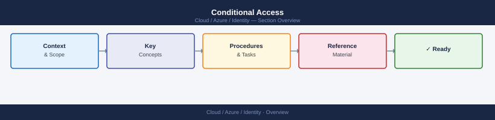
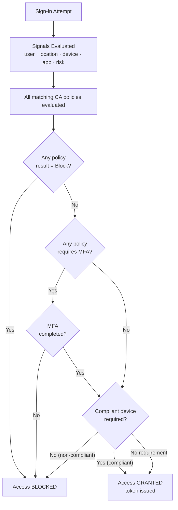

---
tags:
  - azure
---
# Conditional Access


<div class="kb-summary">
Conditional Access (CA) policies are the enforcement engine of Zero Trust in Microsoft Entra ID. They evaluate signals (user, location, device, app, risk) and grant, block, or require additional controls (MFA, compliant device) before granting access.

*Applies to: Azure*
</div>



## Conditional Access Evaluation Flow



## CA Policy Creation

Conditional Access policies are primarily managed through the Entra ID portal or Microsoft Graph API. The `az` CLI covers some operations via the `az ad` extension and `az rest`.

```bash
# List all Conditional Access policies via Microsoft Graph
az rest \
  --method GET \
  --url "https://graph.microsoft.com/v1.0/identity/conditionalAccess/policies" \
  --query "value[].{Name:displayName, State:state, ID:id}" \
  --output table

# Get details of a specific CA policy
az rest \
  --method GET \
  --url "https://graph.microsoft.com/v1.0/identity/conditionalAccess/policies/<policy-id>"

# Create a CA policy (require MFA for all users)
az rest \
  --method POST \
  --url "https://graph.microsoft.com/v1.0/identity/conditionalAccess/policies" \
  --body '{
    "displayName": "Require MFA for all users",
    "state": "enabledForReportingButNotEnforced",
    "conditions": {
      "users": {"includeUsers": ["All"]},
      "applications": {"includeApplications": ["All"]}
    },
    "grantControls": {
      "operator": "OR",
      "builtInControls": ["mfa"]
    }
  }'

# Enable a CA policy (change state to enabled)
az rest \
  --method PATCH \
  --url "https://graph.microsoft.com/v1.0/identity/conditionalAccess/policies/<policy-id>" \
  --body '{"state": "enabled"}'

# Delete a CA policy
az rest \
  --method DELETE \
  --url "https://graph.microsoft.com/v1.0/identity/conditionalAccess/policies/<policy-id>"
```

## Conditions

Conditions define the context in which a policy applies. Multiple conditions can be combined with AND logic.

| Condition | Options | Example Use |
|---|---|---|
| Users and groups | Include/exclude users, groups, roles, guests | Exclude break-glass accounts |
| Cloud apps | Include/exclude specific apps or all apps | Target Office 365 only |
| Locations | Named locations, trusted IPs, countries | Block access from outside approved countries |
| Device platforms | Windows, iOS, Android, macOS, Linux | Require compliant device for mobile |
| Client apps | Browser, mobile/desktop apps, legacy auth | Block legacy authentication clients |
| Sign-in risk | Low, medium, high (requires Entra ID P2) | Require MFA when sign-in risk is high |
| User risk | Low, medium, high (requires Entra ID P2) | Block sign-in when user risk is high |

## Grant Controls

Grant controls define what is required for access to be granted when conditions are met.

| Control | Description |
|---|---|
| Require MFA | User must complete multi-factor authentication |
| Require compliant device | Device must be Intune-compliant |
| Require hybrid Azure AD joined device | Device must be hybrid joined |
| Require approved client app | App must be on the approved list |
| Require app protection policy | App must have Intune MAM policy |
| Block access | Deny all access when conditions match |

```bash
# Create a policy to block legacy authentication
az rest \
  --method POST \
  --url "https://graph.microsoft.com/v1.0/identity/conditionalAccess/policies" \
  --body '{
    "displayName": "Block legacy authentication",
    "state": "enabled",
    "conditions": {
      "users": {"includeUsers": ["All"]},
      "applications": {"includeApplications": ["All"]},
      "clientAppTypes": ["exchangeActiveSync", "other"]
    },
    "grantControls": {
      "operator": "OR",
      "builtInControls": ["block"]
    }
  }'
```

## Named Locations

Named locations represent trusted IP ranges or countries/regions used in Conditional Access conditions.

```bash
# Create a named location (IP range)
az rest \
  --method POST \
  --url "https://graph.microsoft.com/v1.0/identity/conditionalAccess/namedLocations" \
  --body '{
    "@odata.type": "#microsoft.graph.ipNamedLocation",
    "displayName": "Office Network",
    "isTrusted": true,
    "ipRanges": [
      {"@odata.type": "#microsoft.graph.iPv4CidrRange", "cidrAddress": "203.0.113.0/24"}
    ]
  }'

# List named locations
az rest \
  --method GET \
  --url "https://graph.microsoft.com/v1.0/identity/conditionalAccess/namedLocations" \
  --query "value[].{Name:displayName, Type:\"@odata.type\", ID:id}" \
  --output table
```

## Report-Only Mode

Always deploy new policies in `enabledForReportingButNotEnforced` (report-only) state first. This allows you to see sign-in impact in logs before enforcing.

| State | Description |
|---|---|
| `enabled` | Policy is enforced |
| `disabled` | Policy is inactive |
| `enabledForReportingButNotEnforced` | Policy evaluates but does not enforce; logs impact |

### Sign-in Log Review

```bash
# Check CA policy impact in sign-in logs via Graph
az rest \
  --method GET \
  --url "https://graph.microsoft.com/v1.0/auditLogs/signIns?\$filter=createdDateTime ge 2026-05-01T00:00:00Z&\$select=userPrincipalName,appDisplayName,conditionalAccessStatus,appliedConditionalAccessPolicies" \
  --query "value[?conditionalAccessStatus != 'notApplied'][].{User:userPrincipalName, App:appDisplayName, Status:conditionalAccessStatus}"
```

## CA Policy Deployment Checklist

| Step | Action |
|---|---|
| 1 | Identify break-glass accounts and exclude from all CA policies |
| 2 | Create policy in report-only mode |
| 3 | Review sign-in logs for 48–72 hours |
| 4 | Confirm no legitimate access is blocked |
| 5 | Switch policy to `enabled` |
| 6 | Monitor sign-in failure rates for 24 hours post-enable |
