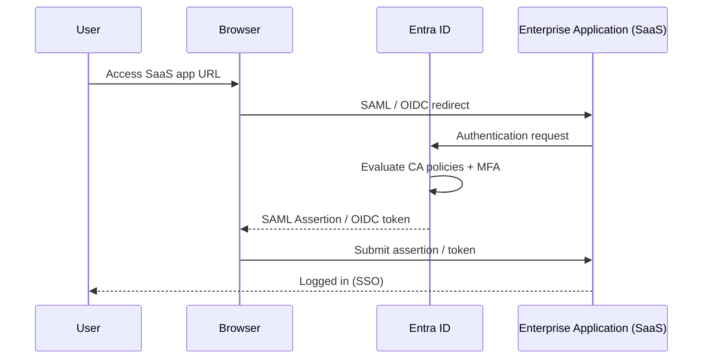

---
tags:
  - azure
description: "Enterprise applications in Microsoft Entra ID represent the service principal for an application within your tenant. They are created automatically when..."
---
# Enterprise Applications

<div class="kb-summary">
Enterprise applications in Microsoft Entra ID represent the service principal for an application within your tenant. They are created automatically when an app registration is made or when a third-party SaaS app is added from the gallery.

*Applies to: Azure*
</div>

## Enterprise Application SSO Flow



## Viewing and Managing Enterprise Applications

```bash
# List enterprise applications (service principals) in the tenant
az ad sp list \
  --all \
  --query "[?servicePrincipalType=='Application'].{Name:displayName, AppId:appId, ID:id}" \
  --output table

# Show a specific enterprise application by app ID
az ad sp show \
  --id <app-id>

# Show by display name
az ad sp list \
  --display-name "my-api-app" \
  --output table

# Update the homepage URL
az ad sp update \
  --id <app-id> \
  --set homepage="https://app.example.com"

# Delete an enterprise application (service principal)
az ad sp delete \
  --id <app-id>
```


```text title="Expected output"
Name                          AppId                                 ID
------------------------------  ------------------------------------  ------------------------------------
my-api-app                    a1b2c3d4-e5f6-47a8-9b0c-1d2e3f4a5b6c  f7g8h9i0-j1k2-43l4-m5n6-o7p8q9r0s1t2
auth-service                  b2c3d4e5-f6g7-48h9-0i1j-2k3l4m5n6o7p  g8h9i0j1-k2l3-44m5-n6o7-p8q9r0s1t2u3v
reporting-engine              c3d4e5f6-g7h8-49i0-1j2k-3l4m5n6o7p8q  h9i0j1k2-l3m4-45n6-o7p8-q9r0s1t2u3v4w
...
Name                          AppId                                 ID
------------------------------  ------------------------------------  ------------------------------------
my-api-app                    a1b2c3d4-e5f6-47a8-9b0c-1d2e3f4a5b6c  f7g8h9i0-j1k2-43l4-m5n6-o7p8q9r0s1t2
(no output — command completes silently)
```

!!! warning "Common errors"
    | Error | Fix |
    |---|---|
    | `The following arguments are required: --id` | Provide the app ID or object ID using `--id <app-id>` instead of `<app-id>` placeholder. |
    | `Service principal not found with id '<app-id>'.` | Verify the app ID is correct by listing all service principals with `az ad sp list --all` and confirm the ID exists in your tenant. |
    | `Authorization_RequestDenied: Insufficient privileges to complete the operation.` | Ensure your Azure AD account has Application Administrator or Global Administrator role assigned. |
## SSO Configuration

Single Sign-On (SSO) for enterprise applications can be configured as SAML, OIDC, or password-based. SAML SSO and OIDC are managed through the portal or Microsoft Graph.

```bash
# Get the SSO configuration for an enterprise application
az rest \
  --method GET \
  --url "https://graph.microsoft.com/v1.0/servicePrincipals/<sp-object-id>?$select=preferredSingleSignOnMode,samlSingleSignOnSettings,replyUrls"

# Set preferred SSO mode to SAML
az rest \
  --method PATCH \
  --url "https://graph.microsoft.com/v1.0/servicePrincipals/<sp-object-id>" \
  --body '{"preferredSingleSignOnMode": "saml"}'
```


```text title="Expected output"
{
  "id": "a1b2c3d4-e5f6-7890-abcd-ef1234567890",
  "appId": "12345678-1234-1234-1234-123456789012",
  "displayName": "Salesforce",
  "preferredSingleSignOnMode": "saml",
  "samlSingleSignOnSettings": {
    "relayState": "https://company.salesforce.com/setup/security/LoginPage.apexp"
  },
  "replyUrls": [
    "https://company.salesforce.com/services/oauth2/callback",
    "https://company.my.salesforce.com/services/oauth2/callback"
  ]
}
{
  "id": "a1b2c3d4-e5f6-7890-abcd-ef1234567890",
  "preferredSingleSignOnMode": "saml"
}
```

!!! warning "Common errors"
    | Error | Fix |
    |---|---|
    | `Authorization_RequestDenied: Insufficient privileges to complete the operation.` | Ensure the service principal running the command has Directory.ReadWrite.All or Application.ReadWrite.All permissions in Azure AD. |
    | `Invalid object identifier '<sp-object-id>'.` | Replace `<sp-object-id>` with the actual service principal object ID from `az ad sp list --display-name "AppName" --query "[0].id"`. |
    | `Unsupported patch document. The property 'preferredSingleSignOnMode' cannot be patched.` | Use the Azure Portal or `az ad app update` command instead, as some SSO properties are read-only via Graph API PATCH. |
### SSO Mode Comparison

| SSO Mode | Protocol | Typical Use |
|---|---|---|
| OIDC (OpenID Connect) | OAuth 2.0 / OIDC | Modern apps, first-party integrations |
| SAML | SAML 2.0 | Legacy enterprise SaaS apps |
| Password-based | Form fill | Apps without federated SSO support |
| Linked | Redirect to existing SSO URL | Apps already SSO-configured elsewhere |

## User Assignment

User assignment to enterprise applications controls who can sign in or access the application. When `assignmentRequired` is true, only assigned users and groups can use the app.

```bash
# Require user assignment for an enterprise application
az ad sp update \
  --id <app-id> \
  --set appRoleAssignmentRequired=true

# Assign a user to an enterprise application (default role)
az rest \
  --method POST \
  --url "https://graph.microsoft.com/v1.0/servicePrincipals/<sp-object-id>/appRoleAssignments" \
  --body '{
    "principalId": "<user-object-id>",
    "resourceId": "<sp-object-id>",
    "appRoleId": "00000000-0000-0000-0000-000000000000"
  }'

# List users assigned to an enterprise application
az rest \
  --method GET \
  --url "https://graph.microsoft.com/v1.0/servicePrincipals/<sp-object-id>/appRoleAssignedTo" \
  --query "value[].{User:principalDisplayName, Role:appRoleId}" \
  --output table
```


```text title="Expected output"
(no output — command completes silently)

{
  "id": "a1b2c3d4-e5f6-7890-abcd-ef1234567890",
  "principalId": "f9e8d7c6-b5a4-3210-fedc-ba9876543210",
  "resourceId": "a1b2c3d4-e5f6-7890-abcd-ef1234567890",
  "appRoleId": "00000000-0000-0000-0000-000000000000",
  "creationTimestamp": "2024-01-15T10:32:45Z"
}

User                          Role
------------------------------  ------------------------------------
alice.johnson@contoso.com      00000000-0000-0000-0000-000000000000
bob.smith@contoso.com          00000000-0000-0000-0000-000000000000
carol.white@contoso.com        00000000-0000-0000-0000-000000000000
```

!!! warning "Common errors"
    | Error | Fix |
    |---|---|
    | `Request_BadRequest: Invalid object identifier '<app-id>'.` | Verify the app-id is a valid UUID and exists in your Azure AD tenant using `az ad sp list --filter "appId eq '<app-id>'"`. |
    | `Authorization_RequestDenied: Insufficient privileges to complete the operation.` | Ensure your Azure CLI account has Application Administrator or Global Administrator role in the tenant. |
    | `Request_ResourceNotFound: Resource '<sp-object-id>' does not exist or one of its queried reference properties is not available.` | Confirm the service principal object ID is correct by running `az ad sp show --id <app-id> --query id`. |
## Provisioning

Entra ID supports automatic user provisioning (SCIM) to SaaS applications. Provisioning configuration is managed through the portal but can be monitored via CLI.

```bash
# Get provisioning job status for an application
az rest \
  --method GET \
  --url "https://graph.microsoft.com/v1.0/servicePrincipals/<sp-object-id>/synchronization/jobs" \
  --query "value[].{ID:id, Status:status.code, LastSync:status.lastSuccessfulExecution.activityIdentifier}"
```


```text title="Expected output"
[
  {
    "ID": "aaaa1111-bbbb-2222-cccc-3333dddd4444",
    "Status": "Completed",
    "LastSync": "2024-01-15T09:47:32.156Z"
  },
  {
    "ID": "bbbb2222-cccc-3333-dddd-4444eeee5555",
    "Status": "Quarantined",
    "LastSync": "2024-01-14T14:22:18.903Z"
  }
]
```

!!! warning "Common errors"
    | Error | Fix |
    |---|---|
    | `Authorization_RequestDenied` | Ensure the service principal has `Directory.Read.All` or `Application.ReadWrite.All` permissions in Microsoft Graph API. |
    | `ResourceNotFound` | Verify the `<sp-object-id>` is correct by running `az ad sp list --query "[].{name:displayName, id:id}"` to confirm the object ID exists. |
### Provisioning Modes

| Mode | Description |
|---|---|
| Automatic | Azure creates/updates/deletes users in the target app via SCIM |
| Manual | Admins manage user accounts in the target app directly |

## App Roles

App roles define the roles that can be assigned to users, groups, or other applications for a given enterprise application.

```bash
# List app roles defined on a service principal
az ad sp show \
  --id <app-id> \
  --query "appRoles[].{ID:id, DisplayName:displayName, Value:value, Enabled:isEnabled}" \
  --output table

# Add an app role via manifest update
az ad app update \
  --id <app-id> \
  --set appRoles=@app-roles.json
```


```text title="Expected output"
ID                                   DisplayName              Value                 Enabled
------------------------------------  -----------------------  --------------------  ---------
550e8400-e29b-41d4-a716-446655440000  Admin                    admin                 True
550e8400-e29b-41d4-a716-446655440001  User                     user                  True
550e8400-e29b-41d4-a716-446655440002  Viewer                   viewer                True
550e8400-e29b-41d4-a716-446655440003  Editor                   editor                True

(no output — command completes silently)
```

!!! warning "Common errors"
    | Error | Fix |
    |---|---|
    | `Application with identifier '<app-id>' was not found in the directory` | Verify the app ID exists in your tenant with `az ad app list --query "[].appId"` and use the correct value. |
    | `Invalid JSON in file 'app-roles.json': Expecting value: line 1 column 1` | Ensure the JSON file is valid and properly formatted; validate with `jq . app-roles.json` before applying. |
    | `Insufficient privileges to complete the operation` | Request Application Administrator or Global Administrator role to modify app roles. |
## Audit Logs

All sign-in and provisioning activity for enterprise applications is recorded in Entra ID audit logs.

```bash
# Get audit log entries for a specific application
az rest \
  --method GET \
  --url "https://graph.microsoft.com/v1.0/auditLogs/directoryAudits?\$filter=targetResources/any(t:t/id eq '<sp-object-id>')" \
  --query "value[].{Date:activityDateTime, Operation:activityDisplayName, Status:result, Actor:initiatedBy.user.userPrincipalName}" \
  --output table

# Get sign-in logs for an application
az rest \
  --method GET \
  --url "https://graph.microsoft.com/v1.0/auditLogs/signIns?\$filter=appId eq '<app-id>'" \
  --query "value[].{Date:createdDateTime, User:userPrincipalName, Status:status.errorCode, IP:ipAddress}" \
  --output table
```


```text title="Expected output"
Date                          Operation                    Status  Actor
------------------------------  ---------------------------  ------  --------------------------------
2024-01-15T14:32:18.5432109Z  Add owner to application    Success  admin@contoso.onmicrosoft.com
2024-01-14T09:17:45.2156789Z  Update application          Success  devops@contoso.onmicrosoft.com
2024-01-13T16:48:22.8901234Z  Remove user assignment      Success  admin@contoso.onmicrosoft.com
2024-01-12T11:05:33.4567890Z  Grant admin consent         Success  approver@contoso.onmicrosoft.com

Date                          User                        Status  IP
------------------------------  ---------------------------  ------  ----------------
2024-01-15T14:28:12.1234567Z  john.doe@contoso.com        0       203.0.113.45
2024-01-15T13:45:09.9876543Z  jane.smith@contoso.com      0       198.51.100.78
2024-01-15T12:19:44.5432109Z  bob.wilson@contoso.com      0       192.0.2.156
2024-01-15T11:33:27.2109876Z  alice.johnson@contoso.com   50058   203.0.113.89
```

!!! warning "Common errors"
    | Error | Fix |
    |---|---|
    | `Authorization_RequestDenied: Insufficient privileges to complete the operation.` | Ensure your Azure account has the Directory.Read.All or AuditLog.Read.All permission in Microsoft Graph. |
    | `Invalid filter clause syntax: Invalid expression` | Replace `<sp-object-id>` and `<app-id>` with actual values and verify the filter syntax matches Microsoft Graph API documentation. |