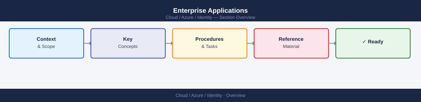
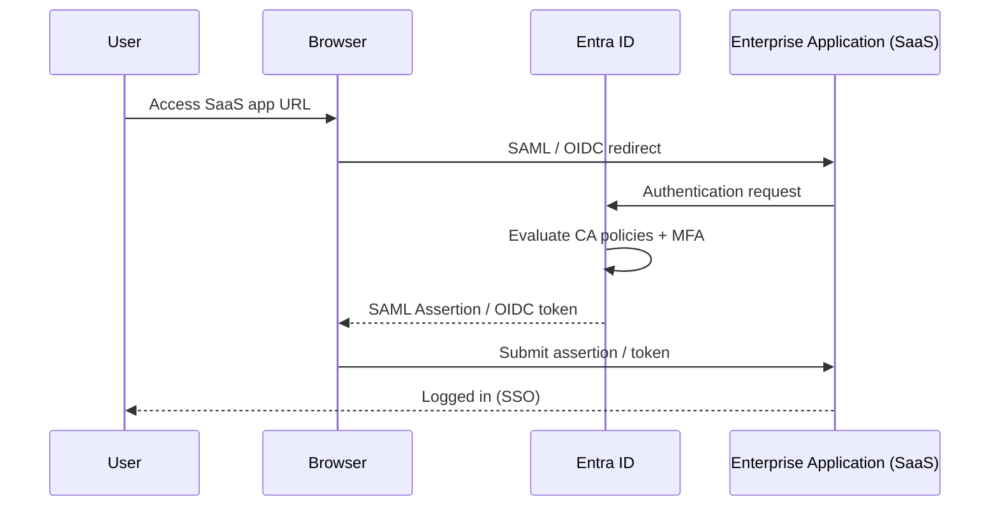

---
tags:
  - azure
---
# Enterprise Applications


<div class="kb-summary">
Enterprise applications in Microsoft Entra ID represent the service principal for an application within your tenant. They are created automatically when an app registration is made or when a third-party SaaS app is added from the gallery.

*Applies to: Azure*
</div>



## Enterprise Application SSO Flow



## Viewing and Managing Enterprise Applications

```bash
# List enterprise applications (service principals) in the tenant
az ad sp list \
  --all \
  --query "[?servicePrincipalType=='Application'].{Name:displayName, AppId:appId, ID:id}" \
  --output table

# Show a specific enterprise application by app ID
az ad sp show \
  --id <app-id>

# Show by display name
az ad sp list \
  --display-name "my-api-app" \
  --output table

# Update the homepage URL
az ad sp update \
  --id <app-id> \
  --set homepage="https://app.example.com"

# Delete an enterprise application (service principal)
az ad sp delete \
  --id <app-id>
```

## SSO Configuration

Single Sign-On (SSO) for enterprise applications can be configured as SAML, OIDC, or password-based. SAML SSO and OIDC are managed through the portal or Microsoft Graph.

```bash
# Get the SSO configuration for an enterprise application
az rest \
  --method GET \
  --url "https://graph.microsoft.com/v1.0/servicePrincipals/<sp-object-id>?$select=preferredSingleSignOnMode,samlSingleSignOnSettings,replyUrls"

# Set preferred SSO mode to SAML
az rest \
  --method PATCH \
  --url "https://graph.microsoft.com/v1.0/servicePrincipals/<sp-object-id>" \
  --body '{"preferredSingleSignOnMode": "saml"}'
```

### SSO Mode Comparison

| SSO Mode | Protocol | Typical Use |
|---|---|---|
| OIDC (OpenID Connect) | OAuth 2.0 / OIDC | Modern apps, first-party integrations |
| SAML | SAML 2.0 | Legacy enterprise SaaS apps |
| Password-based | Form fill | Apps without federated SSO support |
| Linked | Redirect to existing SSO URL | Apps already SSO-configured elsewhere |

## User Assignment

User assignment to enterprise applications controls who can sign in or access the application. When `assignmentRequired` is true, only assigned users and groups can use the app.

```bash
# Require user assignment for an enterprise application
az ad sp update \
  --id <app-id> \
  --set appRoleAssignmentRequired=true

# Assign a user to an enterprise application (default role)
az rest \
  --method POST \
  --url "https://graph.microsoft.com/v1.0/servicePrincipals/<sp-object-id>/appRoleAssignments" \
  --body '{
    "principalId": "<user-object-id>",
    "resourceId": "<sp-object-id>",
    "appRoleId": "00000000-0000-0000-0000-000000000000"
  }'

# List users assigned to an enterprise application
az rest \
  --method GET \
  --url "https://graph.microsoft.com/v1.0/servicePrincipals/<sp-object-id>/appRoleAssignedTo" \
  --query "value[].{User:principalDisplayName, Role:appRoleId}" \
  --output table
```

## Provisioning

Entra ID supports automatic user provisioning (SCIM) to SaaS applications. Provisioning configuration is managed through the portal but can be monitored via CLI.

```bash
# Get provisioning job status for an application
az rest \
  --method GET \
  --url "https://graph.microsoft.com/v1.0/servicePrincipals/<sp-object-id>/synchronization/jobs" \
  --query "value[].{ID:id, Status:status.code, LastSync:status.lastSuccessfulExecution.activityIdentifier}"
```

### Provisioning Modes

| Mode | Description |
|---|---|
| Automatic | Azure creates/updates/deletes users in the target app via SCIM |
| Manual | Admins manage user accounts in the target app directly |

## App Roles

App roles define the roles that can be assigned to users, groups, or other applications for a given enterprise application.

```bash
# List app roles defined on a service principal
az ad sp show \
  --id <app-id> \
  --query "appRoles[].{ID:id, DisplayName:displayName, Value:value, Enabled:isEnabled}" \
  --output table

# Add an app role via manifest update
az ad app update \
  --id <app-id> \
  --set appRoles=@app-roles.json
```

## Audit Logs

All sign-in and provisioning activity for enterprise applications is recorded in Entra ID audit logs.

```bash
# Get audit log entries for a specific application
az rest \
  --method GET \
  --url "https://graph.microsoft.com/v1.0/auditLogs/directoryAudits?\$filter=targetResources/any(t:t/id eq '<sp-object-id>')" \
  --query "value[].{Date:activityDateTime, Operation:activityDisplayName, Status:result, Actor:initiatedBy.user.userPrincipalName}" \
  --output table

# Get sign-in logs for an application
az rest \
  --method GET \
  --url "https://graph.microsoft.com/v1.0/auditLogs/signIns?\$filter=appId eq '<app-id>'" \
  --query "value[].{Date:createdDateTime, User:userPrincipalName, Status:status.errorCode, IP:ipAddress}" \
  --output table
```
