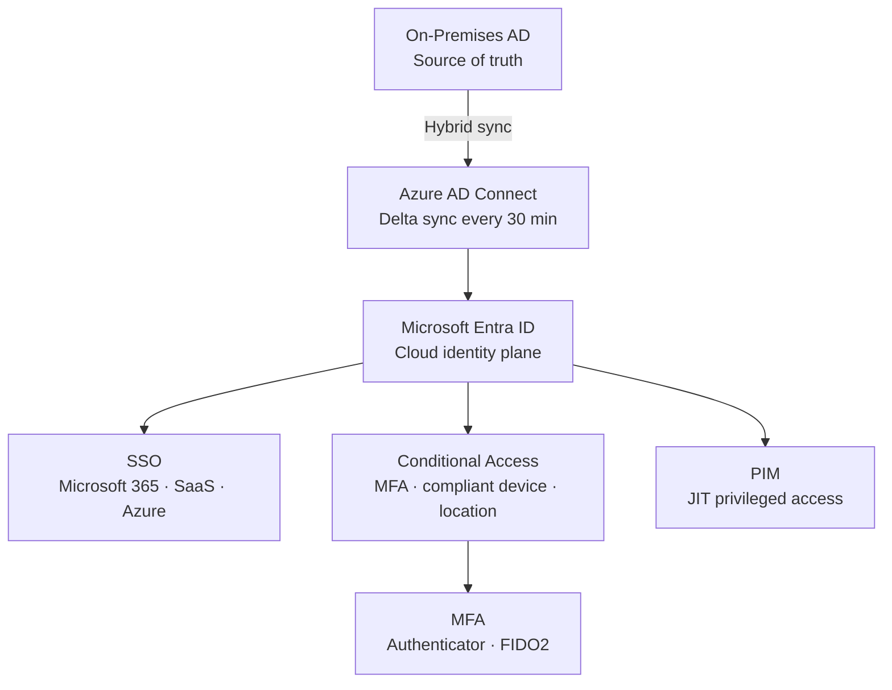

# Microsoft Entra ID


<div class="kb-summary">
Microsoft Entra ID (formerly Azure Active Directory) is the cloud-based identity and access management service. It provides authentication, authorisation, and directory services for Azure resources, Microsoft 365, and integrated SaaS applications.
</div>

## Entra ID Identity Architecture



## Tenant Overview

```bash
# Show current tenant details
az account show \
  --query "{TenantID:tenantId, SubscriptionID:id, Name:name}"

# List all tenants accessible to the logged-in account
az account tenant list \
  --output table

# Show Entra ID tenant configuration
az rest \
  --method GET \
  --url "https://graph.microsoft.com/v1.0/organization" \
  --query "value[0].{TenantID:id, DisplayName:displayName, Domain:verifiedDomains[0].name}"
```

## User Management

```bash
# Create a new user
az ad user create \
  --display-name "Chris Anastasiadis" \
  --user-principal-name chris.a@example.com \
  --password "TempP@ssw0rd!" \
  --force-change-password-next-sign-in true

# List all users in the tenant
az ad user list \
  --output table

# Show a specific user
az ad user show \
  --id chris.a@example.com

# Update user display name
az ad user update \
  --id chris.a@example.com \
  --display-name "Christos Anastasiadis"

# Disable a user account
az ad user update \
  --id chris.a@example.com \
  --account-enabled false

# Delete a user
az ad user delete \
  --id chris.a@example.com

# List user's group memberships
az ad user get-member-groups \
  --id chris.a@example.com \
  --output table
```

### User Types

| User Type | Description |
|---|---|
| Member | Internal users created in the tenant |
| Guest (B2B) | External users invited via Azure AD B2B |
| Service Principal | Application identity, not a human user |
| Managed Identity | Azure-managed service identity |

## Group Management

```bash
# Create a security group
az ad group create \
  --display-name "sg-platform-engineers" \
  --mail-nickname "sg-platform-engineers"

# List all groups
az ad group list \
  --output table

# Add a member to a group
az ad group member add \
  --group sg-platform-engineers \
  --member-id <user-object-id>

# List group members
az ad group member list \
  --group sg-platform-engineers \
  --output table

# Check if a user is a member of a group
az ad group member check \
  --group sg-platform-engineers \
  --member-id <user-object-id>

# Remove a member from a group
az ad group member remove \
  --group sg-platform-engineers \
  --member-id <user-object-id>
```

## Hybrid Identity and Connect Sync

For organisations with on-premises Active Directory, Azure AD Connect or Entra Connect Sync synchronises identities to Entra ID.

| Hybrid Component | Purpose |
|---|---|
| Entra Connect Sync | Sync on-prem AD objects to Entra ID |
| Entra Connect Cloud Sync | Lightweight agent-based sync (replaces Connect for most scenarios) |
| Password Hash Sync (PHS) | Sync password hashes for cloud authentication |
| Pass-Through Authentication (PTA) | Authenticate against on-prem AD directly |
| Federation (ADFS) | On-prem STS issues tokens; Entra ID trusts federation |

```bash
# View sync status (on-prem Entra Connect server — PowerShell)
# Get-ADSyncScheduler
# Start-ADSyncSyncCycle -PolicyType Delta

# Verify last directory sync time via Graph
az rest \
  --method GET \
  --url "https://graph.microsoft.com/v1.0/organization?$select=onPremisesLastSyncDateTime,onPremisesSyncEnabled" \
  --query "value[0].{LastSync:onPremisesLastSyncDateTime, SyncEnabled:onPremisesSyncEnabled}"
```

## Domain Management

```bash
# List verified domains in the tenant
az rest \
  --method GET \
  --url "https://graph.microsoft.com/v1.0/domains" \
  --query "value[].{Domain:id, IsDefault:isDefault, IsVerified:isVerified}" \
  --output table
```

## Entra ID Licence Tiers

| Feature | Free | P1 | P2 |
|---|---|---|---|
| Basic user/group management | Yes | Yes | Yes |
| Conditional Access | No | Yes | Yes |
| MFA | Basic | Yes | Yes |
| Identity Protection | No | No | Yes |
| Privileged Identity Management | No | No | Yes |
| Access Reviews | No | No | Yes |
| Risk-based Conditional Access | No | No | Yes |
