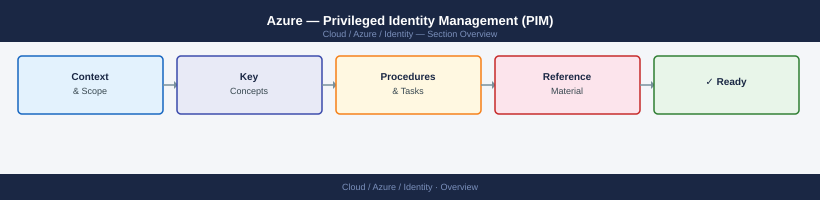
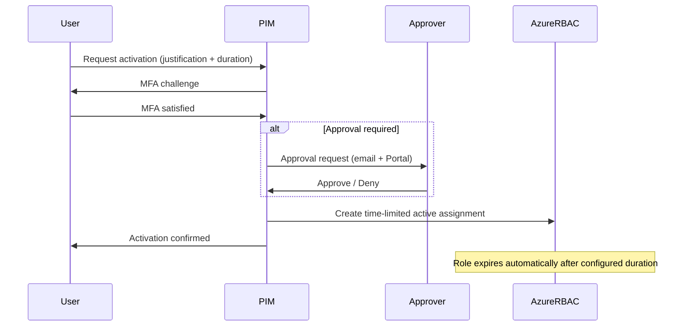
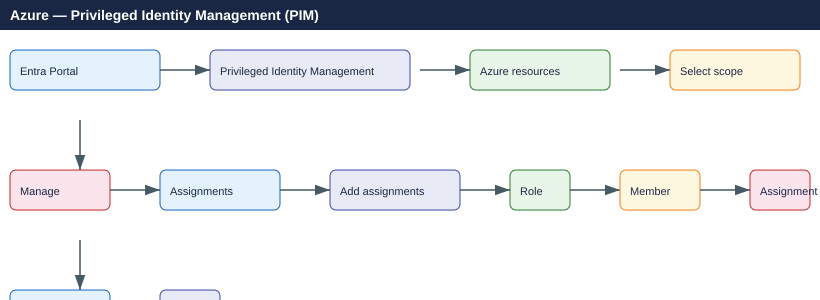

---
tags:
  - azure
---
# Azure — Privileged Identity Management (PIM)


<div class="kb-summary">
PIM provides just-in-time (JIT) privileged access to Azure resources and Entra ID roles, with time-bound activation, approval workflows, and audit logging. Requires **Entra ID P2**.

*Applies to: Azure*
</div>



```d2
direction: right

center: "Azure" {shape: hexagon}
access_model: "Access Model" {shape: rectangle}
pim_scope: "PIM Scope" {shape: rectangle}
activation_workflow: "Activation Workflow" {shape: rectangle}
managing_eligible_assignments: "Managing Eligible Assignments" {shape: rectangle}
pim_role_settings_per_role: "PIM Role Settings (per role)" {shape: rectangle}
pim_for_groups: "PIM for Groups" {shape: rectangle}

center -> access_model
center -> pim_scope
center -> activation_workflow
center -> managing_eligible_assignments
center -> pim_role_settings_per_role
center -> pim_for_groups
```

## Access Model

```text
Without PIM:  Principal → [Permanent assignment] → Role → Resource
With PIM:     Principal → [Eligible assignment] → Activate (JIT, time-limited) → Role → Resource
```

**Eligible** — user can request the role but must activate it (MFA + justification + optional approval).  
**Active** — user currently holds the role. Can be permanent or time-limited.

## PIM Scope

| Domain | Roles managed |
|---|---|
| **Entra ID roles** | Global Administrator, User Administrator, etc. |
| **Azure resources** | Owner, Contributor, custom roles at subscription/RG/resource scope |

## Activation Workflow



## Managing Eligible Assignments

### Portal



### PowerShell

```powershell
Connect-AzAccount

# List eligible assignments at a subscription
Get-AzRoleEligibilitySchedule -Scope /subscriptions/<sub-id>

# Activate an eligible role (self-activation)
$expiration = New-Object Microsoft.Azure.Commands.Resources.Models.Authorization.ExpirationInfo
$expiration.Type = "AfterDuration"
$expiration.Duration = "PT4H"   # 4 hours

$schedule = New-Object Microsoft.Azure.Commands.Resources.Models.Authorization.ScheduleInfo
$schedule.StartDateTime = Get-Date
$schedule.Expiration = $expiration

New-AzRoleAssignmentScheduleRequest `
  -Name (New-Guid) `
  -Scope /subscriptions/<sub-id> `
  -PrincipalId <your-object-id> `
  -RoleDefinitionId /subscriptions/<sub-id>/providers/Microsoft.Authorization/roleDefinitions/<role-id> `
  -RequestType SelfActivate `
  -ScheduleInfo $schedule `
  -Justification "Maintenance window — patching prod servers"
```

## PIM Role Settings (per role)

Configure via: **PIM → Azure resources → scope → Settings → select role → Edit**

| Setting | Recommendation |
|---|---|
| Maximum activation duration | 4–8 h for Contributor; 1–2 h for Owner |
| Require MFA on activation | Always enable |
| Require justification | Always enable |
| Require approval | Enable for Owner and high-privilege roles |
| Notification on activation | Enable — alerts security team |
| Eligible assignment expiry | 12 months (force annual review) |
| Prevent permanent active assignments | Enable for privileged roles |

## PIM for Groups

PIM can manage group membership using the same JIT model. Assign users as eligible for group membership — useful when group membership controls access to non-Azure systems.

```text
PIM → Groups → select group → Manage → Assignments → Add assignments → Eligible member
```

## Audit and Access Reviews

```text
PIM → Audit history — all activations, approvals, and denials with timestamps and IP addresses

PIM → Access reviews → New access review → scope eligible/active assignments for periodic review
```

## Common Issues

| Symptom | Cause | Resolution |
|---|---|---|
| Activation button greyed out | No eligible assignment at this scope | Check: PIM → My roles → Azure resources |
| Activation fails with MFA error | MFA not registered or Conditional Access blocking | Complete MFA registration; check CA policies targeting PIM |
| Approval notification not received | Approver email not configured or inbox filtering | Check PIM role settings → Approvers; check spam; use Portal notifications |
| Role not visible after activation | RBAC propagation delay | Wait up to 5 minutes; log out and back in to refresh token |
| Eligible assignment expired unexpectedly | No expiry notification configured | Enable expiry notification in PIM role settings |
